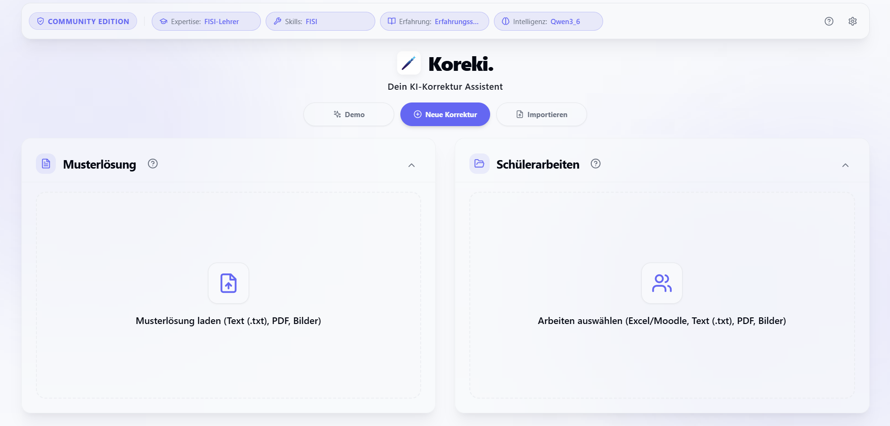
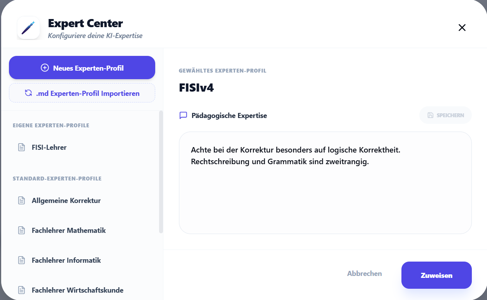
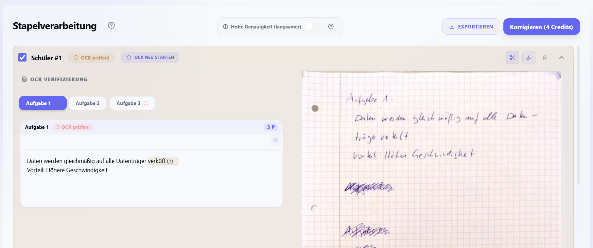

# Koreki 🏮
### KI-gestützte Korrektur für Lehrkräfte | Sicher. Pädagogisch. Präzise.



Koreki ist das hochprofessionelle Werkzeug zur Korrektur von Klassenarbeiten, das pädagogische Expertise mit modernster KI-Intelligenz vereint. Es transformiert den Korrekturprozess von Stunden auf Minuten, ohne die fachliche Kontrolle aus der Hand zu geben.

---

## 🏛️ Die drei Säulen von Koreki

Koreki passt sich Ihrer Infrastruktur an – nicht umgekehrt.

| Edition | Zielgruppe | Status | Deployment |
| :--- | :--- | :--- | :--- |
| **Koreki Desktop** | Einzellehrer | **Verfügbar** | Windows & macOS App (Tauri) |
| **Koreki Community** | Schulen & IT-Beauftragte | **Verfügbar** | Self-Hosted (Docker) |
| **Koreki SaaS** | Schulen & Institutionen | **Public Trial** | Managed Cloud (koreki.org) |

> [!CAUTION]
> **SaaS-Trial:** Die SaaS-Version dient aktuell ausschließlich zu Evaluationszwecken. Es dürfen **keine echten Schülerdaten** hochgeladen werden. Für den produktiven Einsatz mit Klardaten nutzen Sie bitte die **Desktop** oder **Community** Edition.

---

## ✨ Hauptfunktionen

- **Expert Center**: Verwalte pädagogische Korrektur-Profile (z.B. "Informatik-Fokus", "Milde Bewertung") und weise sie mit einem Klick zu.
- **Intelligente Stapelverarbeitung**: Lade ganze Klassenordner als PDF, TXT oder Bilder hoch. Koreki verarbeitet sie parallel.
- **Transparente KI-Verlässlichkeit**: Jedes Ergebnis enthält einen **Confidence-Score**. Ergebnisse mit geringer Konfidenz werden sofort zur manuellen Prüfung markiert (**"Review empfohlen!"**).
- **Datenhoheit**: Volle Unterstützung für **lokale KI-Modelle** (via Ollama). Nutzen Sie optimierte Presets für **Qwen 2.5/2.2**, **Mistral Small** und **Gemma 4** oder binden Sie **beliebige benutzerdefinierte Modelle** (Custom Models) ein.
- **Privatsphäre-Garantie**: Die Community Edition enthält **keine Telemetrie** und baut keine ungefragten Verbindungen zu Koreki-Servern auf ("No Phoning Home").

### Einblicke
| Expert Center | Intelligente OCR |
| :--- | :--- |
|  |  |

---

## 🏮 Koreki Community Edition (Self-Hosted)

Die Community Edition ist für Schulen optimiert, die maximale Datenhoheit wünschen und Koreki auf eigenen Servern betreiben möchten.

### Schnellstart in 60 Sekunden (1-Befehl-Setup)
Voraussetzung: [Docker](https://www.docker.com/) & Docker Compose.

**Für Windows (PowerShell):**
```powershell
iwr -useb https://get.koreki.org | iex
```

**Für Linux / macOS (Terminal):**
```bash
curl -fsSL https://raw.githubusercontent.com/koreki-org/koreki/main/scripts/install/install.sh | bash
```

*Der interaktive Setup-Wizard führt Sie automatisch durch die Auswahl (Single-User, Multi-User mit Keycloak oder SaaS) und startet den Stack sofort.*

---

## 💻 Koreki Desktop App

Für die maximale Privatsphäre direkt auf dem eigenen Rechner.
- Läuft komplett lokal (optional mit Ollama).
- Kein Internet-Upload von Schülerdaten notwendig bei Nutzung lokaler Modelle.
- [Download Releases](https://github.com/koreki-org/koreki/releases)

---

## 🤝 Partnerschaften & Kommerzielle Nutzung

Koreki verfolgt eine klare **Open-Core & Dual-Licensing** Strategie:

1.  **Für Lehrkräfte & Schulen (Nicht-Kommerziell)**: Die Nutzung der Community & Desktop Edition ist für den eigenen pädagogischen Gebrauch vollkommen kostenlos (siehe [Polyform Non-Commercial License 1.0.0](LICENSE)).
2.  **Für IT-Dienstleister (Hosting-Partner)**: 
    > [!IMPORTANT]
    > **Wir suchen Partner!** Sie sind ein IT-Dienstleister für Schulen und möchten Koreki als Managed Service (SaaS/On-Prem) anbieten? 
    > Wir bieten attraktive **White-Label- und Hosting-Lizenzen** sowie Support-Pakete an. Eine kommerzielle Nutzung ohne entsprechende Lizenzvereinbarung ist untersagt.
    *   **Kontakt**: [info@koreki.org](mailto:info@koreki.org) oder via GitHub Issues.

---

## 🛠️ Technik-Stack
- **Frontend**: Next.js 15+ (React 19) & Tailwind CSS
- **KI-Kern**: Mistral AI (API) & Ollama (Local)
- **Datenbank**: PostgreSQL / SQLite (via Prisma)
- **Desktop**: Rust / Tauri Framework

---

## 📄 Dokumentation
- [Technisches Architektur-Dokument](docs/technical/architecture.md)
- [Datenschutz & Datenfluss](docs/technical/privacy-data-flow.md)
- [Contributing Guidelines & CLA](CONTRIBUTING.md)
- [Sicherheitsrichtlinie](SECURITY.md)
- [Quickstart Guide für Lehrer](docs/user-guides/quickstart.md)

---

## ⚖️ Rechtlicher Hinweis & Haftungsausschluss

**WICHTIG:** Koreki ist ein Werkzeug zur *Unterstützung* des Korrekturprozesses. Die finale pädagogische Verantwortung und die Notengebung liegen ausschließlich bei der Lehrkraft.

1. **Haftung**: Die Software wird "wie besehen" (AS IS) zur Verfügung gestellt. Der Entwickler übernimmt keine Haftung für Schäden, Datenverlust oder Fehlbewertungen, die durch die Nutzung der Software entstehen.
2. **Datenschutz (DSGVO)**: Bei Nutzung der Community oder Desktop Edition liegt die Verantwortung für den datenschutzkonformen Betrieb (inkl. Abschluss notwendiger AVVs mit Drittanbietern wie Mistral) beim jeweiligen Betreiber (Schule/Lehrkraft). 
3. **Keine Rechtsberatung**: Die bereitgestellten Informationen zur DSGVO stellen keine Rechtsberatung dar.

---
*Koreki – Entwickelt mit ❤️ und KI-Unterstützung für Lehrkräfte, die mehr Zeit für ihre Schüler und weniger für das Rotstiftschwingen haben wollen.*
