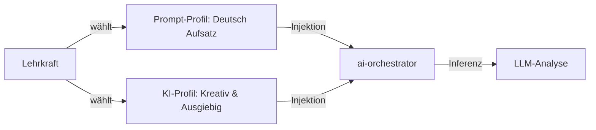

# ADR 001: Entkoppelte Profile für KI-Modell-Hyperparameter (Inferenz-Profile)

## 1. Executive Summary & Kontext
> [!NOTE]
> **Zusammenfassung:** Um dem Benutzer ein konsistentes Gefühl bei der Konfiguration der KI zu geben, führen wir eigenständige, benannte **KI-Parameter-Profile** (Inferenz-Profile) ein. Diese werden strikt von den pädagogischen Prompt-Profilen entkoppelt, nutzen jedoch dieselbe hybride Persistierungs-Architektur (Datenbank/LocalStorage).
> **Zielgruppe:** @principal_architect, Entwickler, @database_expert, @ui_expert

Bisher waren KI-Inferenz-Parameter (wie Temperatur, Top P und Deep Reasoning) flache Laufzeitwerte. Es gab den Wunsch, diese Einstellungen genau wie die Prompt-Profile (Lehrer-Personas) zu speichern. 

Wir haben zwei Ansätze untersucht:
1. **Feste Kopplung:** Integration der Parameter direkt in das Modell `PromptProfile`.
2. **Entkoppelte Profile:** Eigenständige Profile für KI-Parameter, die sich flexibel mit jedem Prompt-Profil kombinieren lassen.

Diese Architekturentscheidung dokumentiert die Wahl des entkoppelten Ansatzes (Ansatz 2) und legt den Implementierungsfahrplan fest.

---

## 2. Architektur & Systemdesign
Durch die Trennung vermeiden wir eine kombinatorische Explosion von Profilen (z. B. müsste man sonst für jeden Fachprompt eine „Präzise“-, „Kreativ“- und „Standard“-Kopie erstellen). 

### 2.1 Das relationale Datenmodell
In SaaS- und Multi-User-Umgebungen (Community) wird eine neue Tabelle `AiProfile` in Prisma eingeführt:

```prisma
model AiProfile {
  id                    String   @id @default(cuid())
  name                  String
  temperature           Float    @default(0.2)
  topP                  Float    @default(0.8)
  maxTokens             Int      @default(32768)
  presencePenalty       Float    @default(0.0)
  enableThinking        Boolean  @default(true)
  
  // --- Vision/OCR-Parameter ---
  visionTemperature     Float    @default(0.2)
  visionTopP            Float    @default(0.8)
  visionMaxTokens       Int      @default(4000)
  visionPresencePenalty Float    @default(0.0)
  
  userId                String?
  user                  User?    @relation(fields: [userId], references: [id], onDelete: Cascade)
  createdAt             DateTime @default(now())

  @@unique([name, userId])
}
```

### 2.2 Der Client-Datenfluss


---

## 3. Implementierung & Nutzung
* **Desktop-App (Tauri) / Local Single-User:**
  Die KI-Profile werden als JSON-Array in `localStorage` unter dem Key `koreki_local_ai_profiles` persistiert (analog zu `koreki_local_profiles` bei Prompt-Profilen). Das gewährt Offline-Fähigkeit ohne Datenbank-Overhead.
* **SaaS / Community Server:**
  Die Daten werden über die API `/api/user/ai-profiles` in der PostgreSQL-Datenbank abgelegt.

### Nutzung im Frontend:
```typescript
interface AppSettings {
  activeAiProfileId?: string;
  // ... flache Inferenz-Parameter dienen weiterhin als sitzungsaktive Werte
}
```

---

## 4. Security & Compliance
> [!IMPORTANT]
> KI-Profile enthalten ausschließlich mathematische Steuerparameter und Konfigurationswerte. Sie verarbeiten keine personenbezogenen Daten (PII).

* **Datenverarbeitung:** DSGVO-neutral, da keine Schülerdaten oder Klarnamen in KI-Inferenz-Profilen gespeichert werden.
* **Access-Control:** Benutzer können nur auf ihre eigenen KI-Profile (`userId`) sowie auf die schreibgeschützten globalen System-Standards zugreifen.

---

## 5. Testing & Referenzen
* **Verwandte Dokumente:**
  * [Design-Spezifikation (ai_fine_tuning_proposal.md)](../../brain/b56b2d0a-8a18-4c86-adcc-1700ce88ce0e/ai_fine_tuning_proposal.md)
  * [Datenbank-Schnittstelle (schema.prisma)](../prisma/schema.prisma)
* **Test-Coverage:**
  * Unit-Tests müssen das reaktive Laden und Hydrieren der Profile im Zustandsspeicher absichern.
