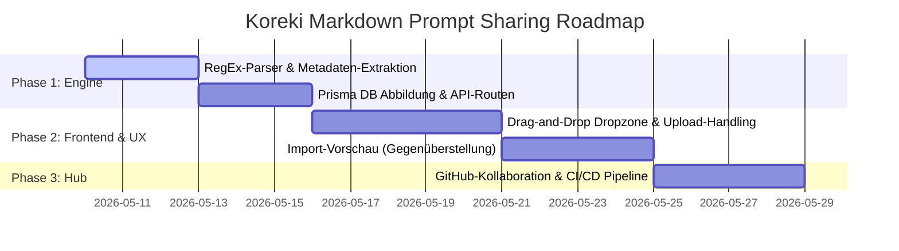

# Koreki Community Profile Exchange Blueprint

## 1. Executive Summary & Kontext
> [!NOTE]
> **Zusammenfassung:** Um Koreki als führendes Open-Source-Korrekturwerkzeug zu etablieren, benötigen Lehrkräfte eine einfache, lesbare Möglichkeit, ihre hochoptimierten Prompts auszutauschen. Anstatt starre und unlesbare JSON-Formate zu exportieren, nutzt Koreki standardmäßig **Markdown (.md) mit YAML Frontmatter**. Dies ermöglicht erstklassige menschliche Lesbarkeit, volle Git-Kompatibilität und die optionale Einbettung empfohlener KI-Parameter.
> **Zielgruppe:** Gesamtes Koreki-Entwicklungsteam, Fachexperten und Open-Source-Community.

### Warum Markdown statt JSON? (The "Why" by `@product_manager`)
Pädagogische Prompts sind hochstrukturierter Freitext (mit Absätzen, Beispielen, Listen). In JSON-Dateien müssen Zeilenumbrüche mit `\n` codiert und Anführungszeichen mit `\"` escapen werden – ein Albtraum für menschliche Editoren. Markdown ist der weltweite Open-Source-Standard für Prompts (wie auch in Open Claw AI oder LangChain). Lehrkräfte können so Prompts direkt in Texteditoren schreiben, auf GitHub verwalten und via Drag-and-Drop in Koreki importieren.

---

## 2. Das Technische Design (The "How" by `@principal_architect`)

### 2.1 Das Unified Schema (`.koreki-prompt.md`)
Wir nutzen das **Koreki Exchange Profile Markdown v1 (KEP-MD-1)** Format. Metadaten und optionale KI-Parameterempfehlungen stehen im YAML Frontmatter; der eigentliche Prompt ist reines, unescapetes Markdown.

```markdown
---
name: "Physik Sek II (Sokratisch)"
description: "Leitet Schüler sokratisch an, Rechenfehler selbst zu beheben."
author: "@stefan_physiklehrer"
version: "1.0.0"
tags: ["Physik", "Sekundarstufe II", "Sokratisch"]
# Optionale Parameterempfehlung für optimale Ausführung
recommended_temperature: 0.15
recommended_thinking: true
---

# Physik Sek II (Sokratisch)

Du bist ein erfahrener Physiklehrer. Korrigiere die Einreichung auf physikalische Präzision, aber formuliere dein Feedback sokratisch:

* Stelle präzise, leitende Fragen zu fehlerhaften Rechenschritten.
* Sage niemals das Endergebnis direkt voraus.
* Erkläre physikalische Zusammenhänge anschaulich anhand von Analogien.
```

### 2.2 Der Clientseitige Parser (Leichtgewichtig & Unabhängig)
Koreki benötigt keine schweren externen npm-Pakete zum Parsen. Ein einfacher regulärer Ausdruck trennt das Frontmatter vom Prompt-Inhalt:

```typescript
export function parseMarkdownProfile(content: string) {
    const match = content.match(/^---\r?\n([\s\S]*?)\r?\n---\r?\n([\s\S]*)$/);
    if (!match) {
        // Fallback: Keine Metadaten vorhanden, gesamte Datei als Prompt einlesen
        return {
            metadata: { name: "Importierter Prompt" },
            correctionPrompt: content.trim()
        };
    }
    
    const yamlBlock = match[1];
    const promptContent = match[2].trim();
    
    // Einfacher, robuster Key-Value-Parser für Frontmatter
    const metadata: Record<string, any> = {};
    yamlBlock.split(/\r?\n/).forEach(line => {
        const colonIdx = line.indexOf(':');
        if (colonIdx > -1) {
            const key = line.slice(0, colonIdx).trim();
            let val = line.slice(colonIdx + 1).trim().replace(/^['"]|['"]$/g, '');
            
            // Automatische Typkonvertierung
            if (val === 'true') metadata[key] = true;
            else if (val === 'false') metadata[key] = false;
            else if (!isNaN(Number(val))) metadata[key] = Number(val);
            else metadata[key] = val;
        }
    });
    
    return {
        metadata,
        correctionPrompt: promptContent
    };
}
```

---

## 3. Die 3 Säulen der Sharing-Infrastruktur

### Säule 1: Dezentraler Datei-Austausch (`.md` drag-and-drop)
* **Konzept:** Serverloser Export im Profil-Menü als `.md` Datei. Empfänger ziehen diese einfach per Drag-and-Drop in die Anwendung.
* **Vorteil:** Uneingeschränkte Privatsphäre, offline-fähig für die Desktop-App (Tauri).

### Säule 2: One-Click URL Sharing (Compressed Base64)
* **Konzept:** Komprimierte Speicherung des Profils in einer URL:
  `https://app.koreki.de/import#profile=eyJuYW1lIjoiTWF...`
* **Vorteil:** Schnelles Teilen auf Social Media und Messenger-Diensten mit direkter Vorschau im Browser.

### Säule 3: Der GitHub-Backed "Community Hub"
* **Konzept:** Ein offenes GitHub-Repository (`koreki-org/community-profiles`).
* **Vorteil:** Kollaboratives Einreichen per Pull Request. Keine Serverkosten, extrem resilient und gemeinschaftlich moderiert. Jede eingereichte `.md` Datei wird auf GitHub sofort ansprechend gerendert.

---

## 4. Rollen-spezifische Feedback-Schleife (The Unified Team)

### 🎨 UI & UX Integration (`@ui_expert`)
> [!TIP]
> **Premium UX:** Wir fügen ein Dropzone-Element mit einem feinen Micro-Animation-Effekt hinzu (z.B. glühendes Border-Highlighting). Der Nutzer sieht vor dem Import eine saubere Gegenüberstellung des Prompts und der Metadaten aus dem YAML-Block.

### 💾 Daten-Modellierung (`@database_expert`)
Wir behalten die vorteilhafte Trennung von `PromptProfile` und `AiProfile` in Prisma bei. Beim Importieren legen wir das `PromptProfile` an und schlagen dem Nutzer vor, ein passendes `AiProfile` zuzuordnen oder die im Frontmatter empfohlenen Parameter (wie `recommended_temperature`) als neues Parameter-Profil zu importieren.

### 🛡️ Security & Compliance (`@security_officer`)
* **Datenschutz (GDPR):** Clientseitige Schwärzung von personenbezogenen Daten (PII) vor dem Export.
* **Malicious Prompts:** Sichere String-Verarbeitung, um unbefugtes Ausführen von clientseitigem Code zu verhindern.

### 🧪 Quality Assurance & Testing (`@qa_engineer`)
* Unit-Tests validieren den RegEx-basierten Parser gegen verschiedene Frontmatter-Formate (z.B. mit/ohne Anführungszeichen, leere Zeilen).
* E2E Playwright-Tests simulieren den Upload einer `.md` Datei und prüfen die persistierte Repräsentation im UI.

---

## 5. Implementierungs-Roadmap



---
*Dokument freigegeben zur technischen Umsetzung.*
