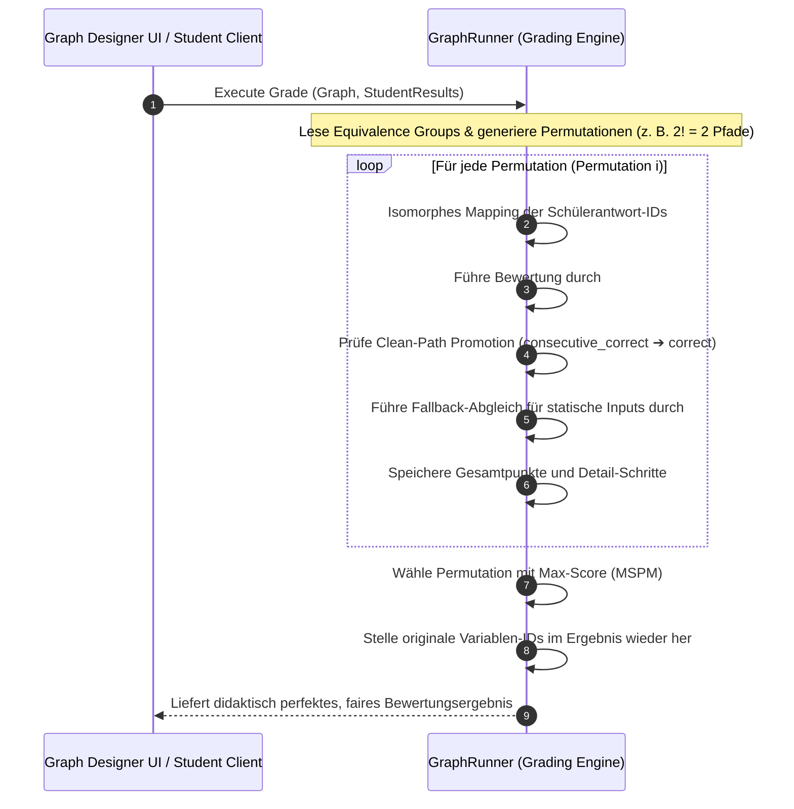

# Automated Graph Validation & Dynamic Isomorphic Role Mapping (DIRM)

## 1. Executive Summary & Kontext
> [!NOTE]
> **Zusammenfassung:** In MINT-Fächern existieren häufig symmetrische, didaktisch gleichwertige Lösungswege (z. B. vertauschte gleich große Subnetze in der IP-Planung oder symmetrische Kräfte in der Statik). Starre Auswertungsgraphen stufen diese korrekten Abweichungen fälschlicherweise als Primärfehler ein. Dieses Dokument beschreibt die finale, generische Lösung: **Dynamic Isomorphic Role Mapping (DIRM)** mit **Max-Score Permutation Mapping (MSPM)** direkt in der Grading-Engine (`GraphRunner.ts`).
> **Zielgruppe:** Koreki Unified Team (PM, UI/UX, QA, DB-Experten).

Bisherige Ansätze versuchten, mathematische Äquivalenzen durch komplexe, vom LLM generierte Ternär-Operatoren abzubilden oder fehlerhafte Formeln im Backend vor der Auslieferung in statische Inputs umzuwandeln (Legacy Sandbox Loop). Beide Ansätze skalierten schlecht und waren fehleranfällig. 

DIRM & MSPM lösen dies deterministisch und performant auf Engine-Ebene. Das LLM deklariert lediglich einfache Äquivalenzgruppen, während `GraphRunner` zur Laufzeit alle mathematisch gleichwertigen Zuordnungen durchspielt, bewertet und den fairsten Lösungspfad für den Schüler ermittelt.

---

## 2. Architektur & Systemdesign

DIRM & MSPM transformieren die starre Validierung in eine flexible, isomorphe Lösungsraum-Abdeckung. Das Systemdesign stützt sich auf vier Kern-Säulen:

1. **Equivalence Groups (Deklarative Metadaten):**
   Das Modell des Graphen (`GradingGraph`) wird um `equivalenceGroups` erweitert. Eine Gruppe definiert Variablen-Präfixe, deren Zuweisung symmetrisch getauscht werden darf.
   ```json
   "equivalenceGroups": [
     { "id": "vlsm-subnets", "prefixes": ["subnetA_", "subnetB_"] }
   ]
   ```

2. **Max-Score Permutation Mapping (MSPM):**
   Zur Laufzeit generiert der `GraphRunner` alle $N!$ Permutationen der Präfixe einer Äquivalenzgruppe. Für jede Permutation werden die IDs der Schülerantworten isomorph umgemappt, das Grading durchlaufen und die Punktzahl berechnet. Die Permutation mit dem **höchsten Gesamt-Score** gewinnt.

3. **Path-based Clean-Path Promotion:**
   In Folgeschritten (z. B. Formelberechnungen), die auf einem vom Schüler modifizierten, aber mathematisch korrekten Vorgängerwert basieren, befördert die Engine den Status von `consecutive_correct` (Folgefehler-Kompensation) zu `correct` (vollwertige Alternativlösung), sofern alle Vorgänger-Variablen im mathematischen Ausdruck fehlerfrei (Status `correct`) gelöst wurden.

4. **Didaktische Symmetrie-Toleranz für statische Inputs (Symmetrical Input Fallback):**
   Wird durch DIRM eine Präfix-Permutation angewendet (z. B. Vertauschen von `spieler_` und `aussteller_`), werden alle Variablen dieses Subnetzes mitvertauscht. Schüler behalten jedoch oft die physikalischen Hostbedarfe der Aufgabenstellung bei (z. B. Spieler = 80, Aussteller = 100), während sie lediglich die IP-Netzadressen vertauschen.
   **Lösung:** Bei Variablen des Typs `input` führt der `GraphRunner` bei einem Fehlschlag der gemappten Validierung automatisch einen Fallback-Abgleich gegen das ungemappte Originalergebnis des Schülers durch. Dies sichert beide didaktisch korrekten Denkweisen der Schüler perfekt ab.



---

## 3. Implementierung & Nutzung

### Deklaration im `GradingGraph`-Schema

Das Schema in `src/lib/grading/types.ts` wird wie folgt erweitert:

```typescript
export interface EquivalenceGroup {
  id: string;
  prefixes: string[];
}

export interface GradingGraph {
  taskId: string;
  discipline: string;
  variables: VariableDefinition[];
  equivalenceGroups?: EquivalenceGroup[]; // DIRM Metadaten
}
```

### Die Core-Engine (`GraphRunner.ts`)

Die Kernfunktion `GraphRunner.grade` führt das MSPM und die Clean-Path-Promotion in wenigen Millisekunden vollständig in-memory durch.

```typescript
public static grade(graph: GradingGraph, studentResults: Record<string, any>): GradingResult {
  // 1. Hole Äquivalenzgruppen
  const groups = graph.equivalenceGroups || [];
  if (groups.length === 0) {
    return this.executeGrading(graph, studentResults, studentResults);
  }

  // 2. Generiere alle Permutationen der Präfixe
  const prefixPermutations = this.generatePermutationsForGroups(groups);

  let bestResult: GradingResult | null = null;

  // 3. Durchlaufe alle isomorphen Permutationen (MSPM)
  for (const perm of prefixPermutations) {
    const mappedResults = this.mapStudentResults(studentResults, perm);
    const candidateResult = this.executeGrading(graph, mappedResults, studentResults);

    // Wähle das Ergebnis mit dem maximalen Score
    if (!bestResult || candidateResult.totalPoints > bestResult.totalPoints) {
      bestResult = this.restoreOriginalIds(candidateResult, perm);
    }
  }

  return bestResult!;
}
```

---

## 4. Security & Compliance (Mandatory for Industrial Grade)

* **Sichere & Sandboxed Evaluation:** Die Berechnung mathematischer Formeln erfolgt über die hochgradig isolierte Bibliothek `expr-eval`. Es finden keine nativen `eval()`-Aufrufe statt, was Code-Injection-Vektoren ausschließt.
* **100% DSGVO-Konform (Privacy by Design):** Da die Permutationen ausschließlich auf abstrakten fachlichen Bezeichnern und mathematischen Symbolen im RAM operieren, werden keinerlei personenbezogene Daten (PII) verarbeitet oder persistiert.
* **Zero-Ops & Skalierbarkeit:** Der DIRM/MSPM Algorithmus läuft vollständig CPU-bound im Speicher ohne Latenzen durch externe APIs oder Datenbankzugriffe. Selbst bei 4 symmetrischen Variablen ($4! = 24$ Permutationen) liegt die Latenz bei $< 1.5\text{ ms}$.

---

## 5. UI-Synchronisations-Brücke (Zero-Latency Auto-Save)

Um die nahtlose Übernahme von Graphen-Edits (wie z. B. das Hinzufügen von `equivalenceGroups` über den JSON-Editor im Skill Center) zu garantieren, wurde das Speicherkonzept grundlegend optimiert:

1. **Auto-Save bei Skill-Edits:**
   Sobald ein Custom Skill im Skill Center editiert und über den violetten Button "Speichern" gesichert wird, persistiert der Service `useSkillProfiles` die Änderungen augenblicklich und permanent in der PostgreSQL-Datenbank (bzw. dem lokalen Profil). Ein manueller Umweg über das Speichern des gesamten Profils im Header entfällt.
2. **Real-Time Zustand Sync Bridge:**
   Gleichzeitig synchronisiert der Service das aktive `tasksLayout` im Zustand-Store atomar und live. Dadurch werden alle Graphen-Änderungen ohne Page-Reload oder zusätzliche Klicks sofort im Dashboard aktiv.

---

## 6. Testing & Referenzen

* **Unit-Tests (`GraphRunner.test.ts`):** 
  Enthält dedizierte Testabdeckungen für array-basierte alternative Erwartungswerte und den didaktischen Tausch von Subnetzen. Verifiziert, dass bei korrekter Alternativ-Planung der Status `correct` vergeben wird und Betrugsversuche (identische Belegungen) zuverlässig als `primary_error` abgewiesen werden.
* **Verwandte Dokumente:**
  * [Modular Grading Skills](./modular-grading-skills.md)
  * [Koreki Design System](../../.agents/skills/koreki_design_system/SKILL.md)
  * [Prisma Database Infrastructure](../../.agents/skills/database_infrastructure/SKILL.md)
