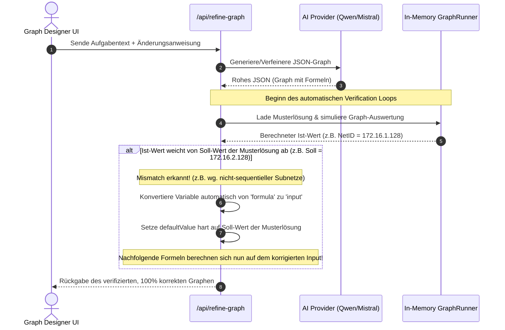

# Automated Graph Validation & Self-Correction Loop

## 1. Executive Summary & Kontext
> [!NOTE]
> **Zusammenfassung:** Generative Sprachmodelle (LLMs) sind textbasierte Wahrscheinlichkeitsmodelle. Sie besitzen keine integrierte JavaScript-Laufzeitumgebung und können mathematische Formeln (z. B. Netzwerk-Berechnungen), die sie in JSON-Graphen deklarieren, nicht selbst ausführen. Dadurch kommt es bei nicht-sequentiellen Aufgabenstrukturen (z. B. unregelmäßigen Subnetz-Aufteilungen) zu einer Diskrepanz zwischen den generierten Formeln und den tatsächlichen Werten der Musterlösung.
> **Zielgruppe:** Koreki Unified Team (PM, Entwickler, QA) und fortgeschrittene Anwender.

Dieses Dokument beschreibt das technische Design für eine **Automatisierte Validierungs- und Selbstkorrekturschleife (Verification Loop)** im Backend. Der Kernansatz besteht darin, den vom LLM erzeugten Graphen vor der Rückgabe an den Client durch eine serversetige Sandbox-Simulation zu jagen und Abweichungen zur Musterlösung automatisch zu heilen.

---

## 2. Architektur & Systemdesign

Das LLM agiert als "Kreativ-Generator", während das Backend als deterministischer "Qualitäts-Gatekeeper" fungiert. Durch das Ausführen des Graphen in einer Test-Sandbox (unter Verwendung von `GraphRunner`) heilen wir logische Mängel vollautomatisch.



---

## 3. Implementierung & Nutzung

Um diese Validierung im Backend umzusetzen, führen wir eine serverseitige Simulationsfunktion in `src/pages/api/refine-graph.ts` (und dem entsprechenden `generate-graph` Endpoint) ein.

### Server-Side Validation Snippet

```typescript
import { GraphRunner } from '@/lib/grading/GraphRunner';
import { GradingGraph, VariableDefinition } from '@/lib/grading/types';

/**
 * Validiert den generierten Graphen gegen die im Aufgabentext angegebenen Erwartungswerte
 * und korrigiert Abweichungen vollautomatisch.
 */
export function validateAndCorrectGraph(
    graph: GradingGraph, 
    sampleSolutionValues: Record<string, string | number>
): GradingGraph {
    const correctedVariables = [...graph.variables];
    const context: Record<string, any> = {};

    // 1. Simuliere die Auswertung aller Variablen im Graphen Schritt für Schritt
    for (let i = 0; i < correctedVariables.length; i++) {
        const variable = correctedVariables[i];
        const expectedValue = sampleSolutionValues[variable.id];

        if (expectedValue === undefined) {
            // Keine explizite Vorgabe in der Musterlösung für diese Hilfs-Variable
            continue;
        }

        // Wir werten die Variable in der aktuellen Sandbox-Umgebung aus
        let computedValue: any;
        if (variable.type === 'input') {
            computedValue = variable.defaultValue;
            context[variable.id] = computedValue;
        } else if (variable.type === 'formula' && variable.expression) {
            try {
                // Führe die Formel mit dem bisherigen Context aus
                computedValue = evaluateExpression(variable.expression, context);
                
                // Prüfe auf Abweichung zur Musterlösung (Soll-Wert)
                if (String(computedValue) !== String(expectedValue)) {
                    // KORREKTUR: Wandle fehlerhafte/sequenzielle Formel in statischen Input um
                    console.warn(`[Verification Loop] Mismatch bei ${variable.id}: Erwartet ${expectedValue}, berechnet ${computedValue}. Korrigiere...`);
                    
                    correctedVariables[i] = {
                        ...variable,
                        type: 'input',
                        defaultValue: isNaN(Number(expectedValue)) ? expectedValue : Number(expectedValue),
                        expression: undefined // Entferne die unpassende mathematische Formel
                    };
                    
                    context[variable.id] = expectedValue;
                } else {
                    context[variable.id] = computedValue;
                }
            } catch (err) {
                // Formel wirft Fehler (z.B. Referenzfehler durch nicht-sequentielle Reihenfolge)
                // Sofortiger Fallback auf statischen Input
                correctedVariables[i] = {
                    ...variable,
                    type: 'input',
                    defaultValue: isNaN(Number(expectedValue)) ? expectedValue : Number(expectedValue),
                    expression: undefined
                };
                context[variable.id] = expectedValue;
            }
        }
    }

    return {
        ...graph,
        variables: correctedVariables
    };
}
```

---

## 4. Security & Compliance (Industrial Grade)

* **Sichere Sandbox-Auswertung:** Die Auswertung der Formeln erfolgt über die Bibliothek `expr-eval`, welche im Gegensatz zu nativem `eval()` oder `Function()` in JavaScript hochgradig sandboxed ist. Es können keine Systemaufrufe, Dateizugriffe oder bösartige Skripte ausgeführt werden.
* **Datenschutz (DSGVO/GDPR):** Der Verification Loop verarbeitet ausschließlich didaktische Strukturdaten (Variablen-IDs, mathematische Formeln, IP-Netze). Es werden keinerlei personenbezogene Daten (PII) von Schülern oder Lehrkräften verarbeitet.
* **Audit-Logs:** Fehlerhafte Generierungsversuche des LLMs und automatische Korrekturschritte werden anonymisiert im Server-Log protokolliert, um die Generierungsqualität kontinuierlich zu überwachen.

---

## 5. Testing & Referenzen

* **Unit-Tests:** Der Validierungs-Algorithmus wird mittels Jest abgedeckt. Hierbei wird ein komplexes, nicht-sequentielles Netzwerk-Szenario simuliert und verifiziert, dass der Verification Loop die Formeln erfolgreich in statische Inputs konvertiert.
* **Integrationstest (Layer 2):** Ein automatisierter API-Test stellt sicher, dass `/api/refine-graph` bei fehlerhaften LLM-Antworten ein mathematisch konsistentes JSON-Objekt zurückliefert.
* **Verwandte Dokumente:**
  * [Prisma Database Infrastructure](../infrastructure/database.md)
  * [Security Standards](../compliance/security.md)
