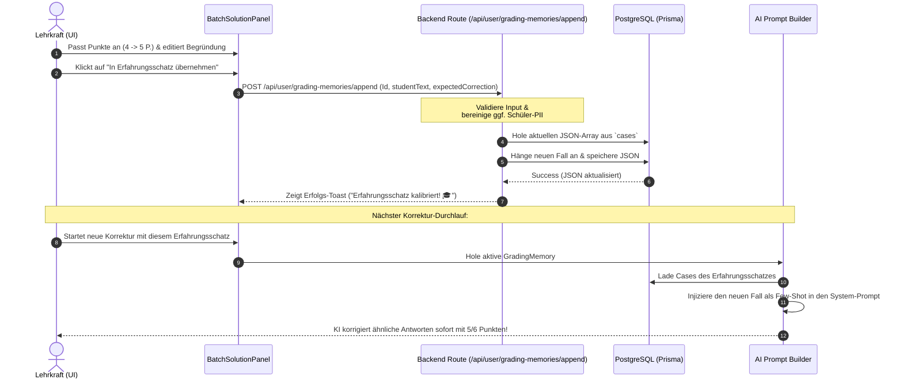

# Direkte Übernahme unbefriedigender Korrekturen in den Erfahrungsschatz

## 1. Executive Summary & Kontext
> [!NOTE]
> **Zusammenfassung:** Dieses Konzept beschreibt die nahtlose Integration einer „In Erfahrungsschatz übernehmen“-Schaltfläche direkt in die Bewertungsansicht des Lehrer-Dashboards. Weicht die automatische KI-Korrektur von der pädagogischen Erwartung ab (z. B. wenn die KI fälschlicherweise Punkte für korrekte Zuordnungen abzieht), kann die korrigierte Fassung der Lehrkraft mit einem Klick als Few-Shot-Referenz im aktiven Erfahrungsschatz gespeichert werden.
> **Zielgruppe:** @product_manager (Sizing & Roadmap), @ui_expert (Frontend-Komponenten), @database_expert (REST-Schnittstellen & Prisma-Mutationen).

### Der konkrete Anwendungsfall
In der Praxis bewertet ein Schüler eine Aufgabe zu USV-Typen (unterbrechungsfreie Stromversorgung):
* **Lösung des Schülers:** Nennung der Begriffe „Offline USV“, „Inline USV“ und „Online USV“ inklusive jeweils korrekter technischer Anwendungsbereiche (PC, Server, Rechenzentrum/Krankenhaus).
* **Automatisierte KI-Korrektur:** Die KI bemängelt den Begriff „Inline USV“ (Korrekt wäre „Line-Interactive USV“) und zieht 2 Punkte ab (**4 / 6 Punkte**), obwohl die didaktische Zuordnung und das technische Verständnis tadellos nachgewiesen wurden.
* **Revision der Lehrkraft:** Die Lehrkraft korrigiert die Punkte auf **5 / 6 Punkte** hoch und schreibt das Feedback um, um die richtige Zuordnung zu loben, aber begründet den winzigen Abzug für den Fachbegriff.
* **Das Problem:** Damit die KI diesen kulanten, anwendungsorientierten Bewertungsstil lernt, müsste die Lehrkraft diesen Fall manuell kopieren, in das Einstellungs-Menü navigieren, das GradingMemory-Modal öffnen, dort einen neuen Fall anlegen und die Daten manuell einfügen. Dieser Medienbruch verhindert die aktive Nutzung des Erfahrungsschatzes.

---

## 2. Systemdesign & User Flow
Um diese Lücke zu schließen, etablieren wir den **Loop-Closing Feedback-Kanal** (Korrekturschleife $\rightarrow$ Few-Shot-Injektion).

### UI-Integration (Dashboard-Ansicht)
Rechts neben dem Punktefeld (`/ 6 P`) und dem Textfeld der bearbeitbaren Einschätzung platzieren wir eine kleine, smarte Schaltfläche:

```
+-------------------------------------------------------------+
|  Aufgabe 1a - KI-Vertrauen: 100%                 [ 5 ] / 6 P|
|  [ Zwei USV-Typen korrekt benannt...                       ]|
|  [                                                         ]|
|                                                             |
|  [🎓 In Erfahrungsschatz übernehmen]                        |
+-------------------------------------------------------------+
```

Beim Klick auf **„In Erfahrungsschatz übernehmen“** öffnet sich ein kleiner, elegante Popover-Dialog:
1. **Ziel-Auswahl:** Dropdown mit allen verfügbaren Erfahrungsschätzen des Nutzers (standardmäßig ist der aktuell im Header aktive vorausgewählt).
2. **Datenschutz-Prüfung (PII Scrubbing):** Optionale Checkbox zur Anonymisierung von Eigennamen (z. B. Ersetzung von Schülernamen im Text durch Platzhalter).
3. **Bestätigen:** Schaltfläche `„Anlernen & Speichern“`.

### System-Interaktion
Das folgende Sequenzdiagramm verdeutlicht den Datenfluss von der manuellen Anpassung bis zum nächsten automatisierten Durchlauf:



---

## 3. Implementierung & Nutzung

### 1. API Route: `POST /api/user/grading-memories/append`
Unter `/src/pages/api/user/grading-memories/append.ts` erstellen wir einen neuen Endpunkt zur performanten Mutation des JSON-Arrays:

```typescript
import { NextApiRequest, NextApiResponse } from 'next';
import { prisma } from '../../../../lib/prisma';
import { getSessionUser } from '../../../../lib/auth-util';
import { z } from 'zod';

const appendCaseSchema = z.object({
  gradingMemoryId: z.string().cuid(),
  studentText: z.string().min(1),
  expectedCorrection: z.string().min(1),
  taskContext: z.string().optional() // Optionale Aufgabenstellung für Kontextschärfung
});

export default async function handler(req: NextApiRequest, res: NextApiResponse) {
  if (req.method !== 'POST') return res.status(405).json({ error: 'Method not allowed' });

  try {
    const user = await getSessionUser(req);
    if (!user) return res.status(401).json({ error: 'Unauthorized' });

    const { gradingMemoryId, studentText, expectedCorrection, taskContext } = appendCaseSchema.parse(req.body);

    // Eignerschaft prüfen
    const memory = await prisma.gradingMemory.findFirst({
      where: { id: gradingMemoryId, userId: user.id }
    });
    if (!memory) return res.status(404).json({ error: 'Grading Memory nicht gefunden' });

    // Aktuelle Fälle laden und parsen
    const currentCases = Array.isArray(memory.cases) ? (memory.cases as any[]) : [];
    
    // Neuer Kalibrierungs-Fall
    const newCase = {
      id: `case_${Date.now()}_${Math.random().toString(36).substring(2, 7)}`,
      studentText: studentText.trim(),
      expectedCorrection: expectedCorrection.trim(),
      taskContext: taskContext?.trim() || "",
      createdAt: new Date().toISOString()
    };

    // DB Update (Prisma JSON Mutation)
    await prisma.gradingMemory.update({
      where: { id: gradingMemoryId },
      data: {
        cases: [...currentCases, newCase]
      }
    });

    return res.status(200).json({ success: true, caseId: newCase.id });
  } catch (error) {
    console.error('Failed to append GradingMemory case:', error);
    return res.status(500).json({ error: 'Interner Serverfehler' });
  }
}
```

---

## 4. Security, Compliance & Data Privacy
Da Schülerarbeiten verarbeitet werden, gelten strenge Datenschutzanforderungen gemäß **DSGVO / GDPR**.

* **Personenbezogene Daten (PII):** Schülerlösungen können Namen oder spezifische Lehreranreden enthalten. 
  * *Gegenmaßnahme:* Ein clientseitiger Regex-Filter sucht vor der Übermittlung nach typischen Namensmustern (z. B. „Name: [X]“ oder „Klasse [Y]“) und ersetzt diese durch anonymisierte Platzhalter (`[Schüler]`).
  * *Sicherheitswarnung:* Der Popover-Dialog zeigt der Lehrkraft eine Vorschau der Daten und bittet sie, den Text freizugeben.
* **Access Control (Mandantentrennung):** 
  * Der Endpunkt prüft über Prisma strikt, ob das gewählte `gradingMemoryId` dem authentifizierten `userId` (oder seiner freigegebenen Workspace-Organisation) gehört. Es ist unmöglich, Fälle in fremde Accounts zu injizieren.
* **Audit-Trail:** Jede On-the-Fly-Hinzufügung wird im Audit-Log unter der Aktion `ADD_GRADING_MEMORY_CASE` protokolliert.

---

## 5. Testing- & Referenzen

* **Layer 1 (Unit Testing):** 
  * Testfälle zur automatischen Anonymisierung (PII Scrubbing Regex).
  * Validierung der JSON-Struktur des neuen Cases im Array-Format.
* **Layer 2 (Integration Testing):** 
  * Integrationstest der Route `/api/user/grading-memories/append` inklusive unbefugter Zugriffsversuche (Fremde IDs $\rightarrow$ 404/403).
* **Layer 3 (E2E Testing):** 
  * Ein Playwright-Test simuliert die Abgabe einer Note im Dashboard, klickt auf „In Erfahrungsschatz übernehmen“, wählt ein Ziel-Memory, speichert und verifiziert, dass der Fall im Einstellungen-Panel aufgelistet wird.

---
> **Nächster Schritt:** Nach Freigabe dieses Konzepts durch den `@product_manager` und den `@principal_architect` kann der `@database_expert` die API-Route aufbauen und der `@ui_expert` die entsprechende Schaltfläche in `BatchSolutionPanel.tsx` integrieren.
