# Architektonische Evaluation: Koreki Graph-Skill-System vs. OpenClaw AI

## 1. Executive Summary & Kontext
> [!NOTE]
> **Zusammenfassung:** Diese interne Dokumentation evaluiert die begrifflichen und architektonischen Gemeinsamkeiten sowie Unterschiede zwischen dem in Koreki implementierten **Graph-Skill-System (PANG Engine)** und dem **Skill-/Plugin-System von OpenClaw AI**. Ziel ist es, begriffliche Klarheit im Team zu schaffen und didaktische wie technische Transferpotenziale für zukünftige Entwicklungszyklen aufzudecken.
> **Zielgruppe:** Core-Entwickler, @product_manager (Produktvision & Roadmap) und @ui_expert (für zukünftige UI-Builder-Konzepte).

Im Rahmen der Weiterentwicklung von Koreki evaluieren wir kontinuierlich modernste KI- und Agenten-Architekturen. Da OpenClaw AI ebenfalls ein System aus "Skills" und "Plugins" zur Erweiterung von LLM-Fähigkeiten nutzt, analysiert dieses Dokument die architektonischen Paradigmen beider Systeme. Während Koreki auf **deterministische Fehlerbaum-Grading-Graphen** fokussiert, stellt OpenClaw AI ein **probabilistisches, prozedurales Agenten-Workflow-System** dar.

---

## 2. Architektur & Systemdesign

Die beiden Systeme arbeiten auf unterschiedlichen Abstraktionsebenen und nutzen völlig differente Kontrollflüsse zur Ausführung ihrer "Skills":

```mermaid
graph TD
    subgraph Koreki_PANG_Engine ["Koreki PANG Engine (Deterministisch)"]
        K_Start["Schülerantwort (Freitext/Tabelle)"] --> K_Ext["1. Isomorphe Extraktion (LLM/Regex)"]
        K_Ext -->|Student Values| K_Runner["2. GraphRunner.ts (Interpreter)"]
        K_Graph["GradingGraph (Topologischer Baum)"] --> K_Runner
        K_Runner -->|Formelauswertung| K_Plugins["3. Rechen-Plugins (plugins.ts: math, network)"]
        K_Plugins -->|Kompensation| K_Final["Didaktisch korrektes Folgefehler-Feedback"]
    end

    subgraph OpenClaw_Agent ["OpenClaw AI Framework (Probabilistisch)"]
        O_Start["Benutzer-Prompt / Event"] --> O_Agent["1. Agenten-Loop (ReAct / LLM-Kern)"]
        O_Skill["SKILL.md (Instruktions-Playbook)"] -->|Kontext-Einspeisung| O_Agent
        O_Agent -->|Tool-Call| O_Tools["2. Tools Execution (CLI, Files, Web Search)"]
        O_Tools -->|Beobachtung| O_Agent
        O_Agent --> O_Final["Autonome Systemaktion"]
    end
```



### Gegenüberstellung der Kernkomponenten:

1. **Die Ausführungs-Engine:**
   * **Koreki:** Nutzt einen klassischen deterministischen Interpreter (`GraphRunner.ts`). Variablenabhängigkeiten werden topologisch sortiert. Die Evaluierung erfolgt durch echten TypeScript-Code in den Plugins.
   * **OpenClaw AI:** Nutzt einen probabilistischen LLM-Agenten-Loop (z. B. ReAct-Pattern). Der Agent entscheidet zur Laufzeit selbstständig, wann er welches Tool ausführt.
   
2. **Die Skill-Definition:**
   * **Koreki:** Ein **Graph Skill** ist eine strukturierte JSON-Deklaration (`GradingGraph`) von Extraktionsvariablen, erwarteten Werten, mathematischen Formeln und didaktischen Gewichtungen.
   * **OpenClaw AI:** Ein **Skill** ist ein prozedurales Dokument in verständlichem Markdown (`SKILL.md`), das dem LLM Schritt für Schritt erklärt, wie es eine Aufgabe manuell mit Tools löst.

3. **Die Rolle von "Plugins":**
   * **Koreki:** Plugins sind fachspezifische mathematische Bibliotheken (`networkPlugin`), die formelbasierte Zwischenergebnisse berechnen.
   * **OpenClaw AI:** Plugins sind System-Erweiterungen (z. B. WhatsApp/Discord-Kanal-Konnektoren oder neue AI-Provider-Schnittstellen).

---

## 3. Implementierung & Nutzung

### 3.1 Das Koreki Graph-Skill-Paradigma
Ein typischer Koreki Graph Skill wird über unseren AI-Assisted Generator (`graph-generator.ts`) deklariert. Ein Ausschnitt eines solchen Graphen für ein Subnetting-Szenario sieht wie folgt aus:

```json
{
  "taskId": "subnetting-task-1",
  "discipline": "computer-science-networking",
  "variables": [
    {
      "id": "hosts_required",
      "type": "input",
      "defaultValue": 30,
      "validationType": "exact"
    },
    {
      "id": "subnet_mask",
      "type": "formula",
      "expression": "network.calculateMask(hosts_required)",
      "validationType": "exact",
      "maxPoints": 1
    },
    {
      "id": "subnet_size",
      "type": "formula",
      "expression": "network.calculateSize(subnet_mask)",
      "validationType": "exact",
      "maxPoints": 1
    }
  ]
}
```

Die Funktionen der Domänen-Bibliotheken werden in `src/lib/grading/plugins.ts` imperativ abgesichert:

```typescript
export const networkPlugin = {
  calculateMask(hosts: number): string {
    const requiredSize = hosts + 2;
    let power = 0;
    while (Math.pow(2, power) < requiredSize) {
      power++;
    }
    return `/${32 - power}`;
  },
  calculateSize(mask: string): number {
    const cleanMask = parseInt(mask.replace('/', ''), 10);
    return Math.pow(2, 32 - cleanMask);
  }
};
```

### 3.2 Das OpenClaw AI Skill-Paradigma
Im Vergleich dazu ist ein OpenClaw Skill eine rein instruktive Markdown-Datei, die dem Agenten Handlungsanweisungen gibt:

```markdown
---
name: "Server Debugging Skill"
description: "Workflow zur Behebung von Server-Ausfällen"
tools: ["exec", "read_file", "search_web"]
---

# Server Debugging Anleitung

1. Lies die Log-Datei unter `/var/log/nginx/error.log` mithilfe des `read_file` Tools.
2. Wenn du einen Datenbank-Fehler siehst, führe `systemctl status postgresql` über `exec` aus.
3. Suche bei unbekannten Fehlermeldungen im Web nach Lösungen.
```

---

## 4. Architektonische Schwachstellen & Potenziale zur Vereinfachung

Eine kritische Analyse unseres aktuellen Codes zeigt, dass wir die Kernprozesse (Generierung rein über die Musterlösung und LLM-gestützte Regelauswertung) bereits hervorragend und weitestgehend automatisiert umgesetzt haben. Dennoch gibt es einen **fundamentalen technischen Flaschenhals** bei der Erstellung neuer Fachdisziplinen, bei dem wir massiv vereinfachen können:

### 1. Der Flaschenhals: Hardcodierte Fach-Plugins in TypeScript (`plugins.ts`)
*   **Der Ist-Zustand:** 
    Aktuell sind unsere Berechnungsregeln (z. B. `networkPlugin`) fest im TypeScript-Code einprogrammiert. Möchte das LLM einen Bewertungsgraphen für ein neues Fachgebiet (z. B. Physik mit dem Ohmschen Gesetz oder Wirtschaft mit Zinsrechnung) generieren, scheitert dies: Unser Parser in `graph-generator.ts` muss alle Ausdrücke, die nicht in `plugins.ts` fest hinterlegt sind, aus Sicherheitsgründen **strikte verwerfen und überspringen**, um Runtime-Crashes zu verhindern.
    >
    > **Nachtrag (2026-08-05):** Für den Fall "eine Formel, ein Zielwert mit Einheit" (Physik, Wirtschaft, allgemeine Mathematik) wurde dieser Flaschenhals durch CalcTrace bereits aufgelöst — dort wertet eine unitbewusste `mathjs`-Sandbox freie Rechenwege ohne Domänen-Plugin aus (siehe [calc-trace-engine.md](../technical/calc-trace-engine.md)). Der hier beschriebene Flaschenhals betrifft PANG nur noch dort, wo echte strukturelle Mehrfach-Slot-Abhängigkeiten mit nicht-numerischen Werten nötig sind (aktuell: `network`/VLSM) — dafür bleibt echter TypeScript-Code nötig, ein generischer Formel-Parser würde z. B. eine Broadcast-Adresse nicht berechnen können.
*   **Die Vereinfachung (Deklaratives Dynamic Sandboxing):**
    Wir sollten die Notwendigkeit, neue Domänen-Plugins in TypeScript zu kompilieren, komplett auflösen. 
    *   **Konzept:** Wir führen einen leichtgewichtigen, sicheren Formel-Parser (z. B. über eine sandboxed Math-Bibliothek) im `GraphRunner.ts` ein. 
    *   **Nutzung:** Das LLM kann bei der Analyse der Musterlösung freie, mathematische Standard-Ausdrücke direkt im Graphen definieren (z. B. `"expression": "voltage / current"`).
    *   **Vorteil:** Das System wird mit einem Schlag universell einsetzbar. Lehrkräfte und die KI können für **jedes beliebige MINT-Fachgebiet** (Physik, Chemie, BWL) sofort Graph-Skills erstellen, ohne dass ein Entwickler ein neues Plugin im Code registrieren muss.

### 2. Korrektur-Feedback: Tabellarische Matrix statt Text-Erklärungen
*   **Kritik an langen Text-Erklärungen („sprechende Rechenwege“):**
    Das Generieren von langen, ausformulierten Fließtexten zur Erklärung von Folgefehlern erweist sich in der Praxis als **didaktisch ineffizient und kognitiv überlastend**. Lehrkräfte müssen Textwüsten lesen, um die Fehlerquelle zu finden.
*   **Die Vereinfachung:**
    Wir verwerfen textbasierte Feedback-Erklärungen für deterministische Aufgaben. Wir forcieren stattdessen unser **2D-Tabellen-Rendering** (VLSM-Matrix) mit den kompakten, farbcodierten Indikatoren:
    *   `[r]` (Richtig - Grün)
    *   `[f]` (Primärfehler - Rot)
    *   `[FF]` (Folgefehler - Blau)
    Das ist didaktisch unschlagbar, in einer Sekunde visuell erfasst und spart dem Lehrer das Lesen langer KI-Erklärungen.

### 3. Beibehaltung der schlanken Generierungs-UX
Da unser System bereits darauf ausgelegt ist, den Grading-Graphen vollautomatisch im Hintergrund allein aus der hochgeladenen Text-Musterlösung zu generieren, halten wir an dieser „Zero-Configuration UX“ fest. Der manuelle Graph-Designer (`GradingGraphModal.tsx`) bleibt eine reine Experten-Ansicht für Edge-Cases und wird im Standard-Korrekturflow für Lehrer nicht aktiv eingeblendet.

---

## 5. Security & Compliance (Industrial Grade)
> [!IMPORTANT]
> Da Koreki im sensiblen Bildungssektor operiert und OpenClaw im lokalen System-Management agiert, ergeben sich fundamentale Unterschiede in der Risikobewertung.

*   **Datenverarbeitung & DSGVO (Koreki):**
    Unsere Graph-Skills verarbeiten ausschließlich anonymisierte fachliche Datenpunkte (Zahlenwerte, IP-Adressen). Es werden standardmäßig **keine personenbezogenen Daten (PII)** verarbeitet. Auf Tauri-Desktop-Systemen erfolgt die gesamte Auswertung zudem zu 100 % lokal (isomorphe Offline-Sicherheit).
*   **Shadow AI & Systemprivilegien (OpenClaw):**
    OpenClaw AI benötigt weitreichende Lese- und Schreibrechte auf dem Host-System (ausführbare Shell-Commands `exec`, Dateizugriffe). Die Installation von Drittanbieter-Skills aus öffentlichen Registern (wie *ClawHub*) birgt immense Sicherheitsrisiken (z. B. Schadcode-Ausführung unter Benutzerrechten).
*   **Write-Protection & Injection-Schutz (Koreki):**
    System-Presets sind in Koreki streng schreibgeschützt. Versucht eine Lehrkraft, einen Custom-Graph in einem System-Preset zu manipulieren, erzwingt das System ein lokales Klonen in ein Custom-Profil. Da unsere Plugins kompilierter TypeScript-Code sind, besteht keine Gefahr von Prompt-Injections in die Berechnungslogik.

---

## 6. Testing & Referenzen
*   **Verwandte Dokumente:**
    *   [PANG Engine & Grading Graph Architecture](../technical/pang-engine.md)
    *   [Modulare AI Grading-Skills](../concepts/modular-grading-skills.md)
*   **Implementierungsdateien:**
    *   [src/lib/grading/plugins.ts](../../src/lib/grading/plugins.ts) (Rechen-Plugins)
    *   [src/lib/grading/graph-generator.ts](../../src/lib/grading/graph-generator.ts) (AI-Assisted Graph-Creator)
    *   [src/lib/grading/GraphRunner.ts](../../src/lib/grading/GraphRunner.ts) (Engine-Ausführung)
*   **Test-Coverage:**
    *   Unit-Tests für die mathematischen Rechenketten sind in `tests/unit/lib/GraphRunner.test.ts` implementiert.
    *   Integrationstests für die Custom-Skill-Zuweisung befinden sich in `tests/integration/ModelSolutionCard.integration.test.tsx`.
