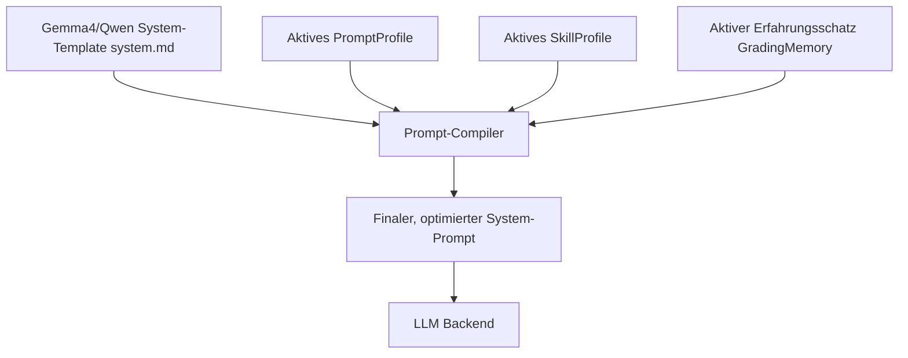

# Modulare AI Grading-Skills für präzise, föderale & fachspezifische Korrekturen

## 1. Executive Summary & Kontext
> [!NOTE]
> **Zusammenfassung:** Dieses Konzept beschreibt die Modularisierung von Korekis Prompting-Architektur durch die Einführung von **„Grading Skills“**. Anstatt komplexe, schwer zu wartende Freitexte pro Lehrer-Profil zu verwalten, führen wir eine standardisierte Registrierung von atomaren Korrektur-Kompetenzen ein. Diese können von Lehrkräften flexibel kombiniert und per UI-Schalter aktiviert werden.
> **Zielgruppe:** @product_manager (Sizing & Roadmap), @ui_expert (Frontend-Komponenten), @database_expert (Prisma-Modellierung & API-Integration).

### Die didaktische Herausforderung (Föderalismus & Fachspezifika)
Die Anforderungen an schulische Korrekturen in Deutschland weichen stark voneinander ab:
1. **Bundesland-Spezifika (Föderalismus):** Jedes Bundesland nutzt eigene Regelungen für Korrekturzeichen (z. B. bayerische Symbole `R`, `Gr`, `Z`, `Sb` im Gegensatz zu den NRW-Klassikern `Orth`, `Synt`, `Lex`).
2. **Fachspezifische Kernlogiken:** 
   * In **Mathematik und Physik** ist das präzise Erkennen und faire Bewerten von **Folgefehlern** (consecutive errors) die größte Herausforderung für Sprachmodelle.
   * **Reichweite des Skills (Stand 03.09.2026):** `skill-consecutive-errors` ist eine Anweisung an das Modell und wirkt deshalb nur bei Kriterien mit `source: 'llm'`. Wo für eine Rechenaufgabe ein Rechenziel hinterlegt ist, entscheidet die Sandbox über `proofB` und `proofValues` allein — dort trägt seit dem 03.09.2026 die Engine selbst die Folgefehler-Erkennung, siehe [CalcTrace Engine, Abschnitt 3.6](../technical/calc-trace-engine.md). Beide Wege greifen nebeneinander; der Skill bleibt für alle rein sprachlich bewerteten Aufgaben maßgeblich.
   * In **Naturwissenschaften** führt das Fehlen von physikalischen Einheiten (z. B. `m/s`, `kg`) oft zu systematischen Teilabzügen.
   * In **Sprachen/Geisteswissenschaften** muss zwischen inhaltlicher Substanz, korrekten Zitationen und sprachlicher/grammatikalischer Qualität differenziert werden.
3. **Pädagogische Feedback-Kultur:** Unterschiedliche Schulen verlangen andere Feedback-Methoden (z. B. das strukturierte „Sandwich-Feedback“ oder „Growth-Mindset-Kommentare“).

### Unsere Vision: Der „Skill-Baukasten“
Statt einer einzigen, starren `correctionPrompt`-Zeile pro Profil, etablieren wir ein System von modular aktivierbaren **Korrektur-Skills**. Lehrkräfte können sich so z. B. folgendes Profil konfigurieren:
* **Profil-Name:** *Klassenarbeit Mathe 8b (Bayern)*
* **Basis-Ausrichtung:** `Mathe & Logik` (Modell: *Gemma 4* / *Qwen 3.6*)
* **Aktivierte Skills:** 
  * `skill-consecutive-errors` (Folgefehler-Tracking)
  * `skill-marks-bayern` (Korrekturzeichen nach BayEUG)
  * `skill-feedb## 2. Systemdesign & User Flow

Um die Konsistenz und Symmetrie des Gesamtsystems gemäß dem **Koreki Style Guide** und der **Systemarchitektur** zu wahren, führen wir das neue Modell **`SkillProfile`** (Skill-Profil) ein. 

Dieses verhält sich technisch und funktional absolut **analog zu den Prompt-Profilen** (`PromptProfile`):
* **Symmetrische 4-Säulen-Persistierung:** Der Nutzer besitzt nun vier konfigurierbare Säulen, die jeweils eigenständig persistiert werden (aktive IDs in der `User`-Tabelle: `activePromptProfileId`, `activeSkillProfileId`, `activeGradingMemoryId`, `activeAiProfileId`).
* **Symmetrische UI-Konvention:** Jede Säule besitzt ihr eigenes, dediziertes Modal. Das neue **„Skills Center“** (`SkillsSettingsModal`) hat exakt das gleiche Layout wie das **„Expert Center“** (`PromptSettingsModal`):
  * **Linke Spalte (Sidebar):** Auswahl von gespeicherten Skill-Profilen (System-Vorlagen & eigene Profile) sowie Import von `.md`-Dateien via Drag & Drop.
  * **Rechte Spalte (Editor):** Das interaktive Auswahlgitter der aktivierten Skills.

### Der Prompt-Assembly Flow (Prompt-Engine-Ebene)
Der `PromptBuilder` lädt das aktive `SkillProfile` und kompiliert die darin aktivierten Skill-IDs in den System-Prompt:



---

## 3. Technische Spezifikationen & Datenhaltung (Rolle: `@database_expert`)

### 1. Erweiterung des Prisma-Schemas ([schema.prisma](../../prisma/schema.prisma))
Wir definieren das Modell `SkillProfile` und verknüpfen es mit dem Nutzer:

```prisma
model User {
  id                    String   @id @default(cuid())
  // ... bisherige Felder ...
  activePromptProfileId String?
  activeSkillProfileId  String?  // Zeiger auf das aktuell gewählte Skill-Profil
  activeGradingMemoryId String?
  activeAiProfileId     String?
  
  skillProfiles         SkillProfile[]
}

model SkillProfile {
  id             String   @id @default(cuid())
  name           String
  activeSkillIds Json     @default("[]") // Plattformübergreifendes JSON-Array (z.B. ["skill-consecutive-errors"])
  isSystem       Boolean  @default(false)
  userId         String?
  user           User?    @relation(fields: [userId], references: [id], onDelete: Cascade)
  createdAt      DateTime @default(now())

  @@unique([name, userId])
}
```

### 2. Der Prompt-Builder ([prompt-builder.ts](../../src/lib/ai/prompt-builder.ts))
Wir passen [buildCorrectionPrompt](../../src/lib/ai/prompt-builder.ts#L57) so an, dass es die `activeSkillIds` direkt verarbeitet:

```typescript
export function buildCorrectionPrompt(
    modelSolution: string, 
    studentText: string, 
    tasksLayout?: Task[] | null, 
    customPrompt?: string, 
    model?: string,
    gradingMemory?: GradingMemoryCase[] | null,
    activeSkillIds?: string[] // Übergabe der IDs aus dem aktiven SkillProfile
): StructuredPrompt {
    // ... bisheriger Code ...
    
    // Skills kompilieren und einsetzen
    let skillsSection = '';
    if (activeSkillIds && activeSkillIds.length > 0) {
        skillsSection = '\n\n### AKTIVIERTE BEWERTUNGS-SKILLS (STRIKT BEFOLGEN):\n';
        activeSkillIds.forEach(id => {
            const skill = STANDARD_SKILLS[id];
            if (skill) {
                skillsSection += `\n--- [KORREKTUR-SKILL: ${skill.name}] ---\n${skill.promptSnippet.trim()}\n`;
            }
        });
    }
    system = system.replace('{{activeSkills}}', skillsSection);
    
    // ...
}
```

---

## 4. UI- & UX-Konzept (Das „Skills Center“ Modal)

Um dem Nutzer ein vollkommen konsistentes, vertrautes und barrierefreies Erlebnis zu bieten, repliziert das neue **`SkillsSettingsModal`** (genannt **„Skills Center“**) exakt die UX-Mechaniken unseres **Expert Centers**.

### Symmetrisches Layout (Sidebar + Editor)
Das Modal verwendet das gewohnte Two-Column-Layout:

```
+---------------------------------------------------------------------------------+
|  🏆 Skills Center                                                           [X] |
|  Konfiguriere deine modularen KI-Korrekturkompetenzen                           |
|  -----------------------------------------------------------------------------  |
|  [ Sidebar (Linke Spalte) ]        | [ Editor (Rechte Spalte) ]                  |
|  +-------------------------------+ | +-----------------------------------------+ |
|  | [ + Neues Skill-Set ]         | | Klassenarbeit Mathe 8b (Bayern)           | |
|  | [ .md Profil Importieren ]    | |                                           | |
|  |                               | | [ MINT & Naturwissenschaften ]            | |
|  | EIGENE SKILL-SETS:            | | +-------------------+ +-----------------+ | |
|  | - Mathe Bayern         [P][T] | | | [✓] Folgefehler   | | [ ] Einheiten   | | |
|  | - Deutsch NRW          [P][T] | | +-------------------+ +-----------------+ | |
|  |                               | |                                           | |
|  | SYSTEM-VORLAGEN:              | | [ BUNDESLAND-STANDARDS ]                  | |
|  | - Naturwissenschaften         | | +-------------------+ +-----------------+ | |
|  | - Sprachen Standard           | | | [✓] Kürzel Bayern | | [ ] Kürzel NRW  | | |
|  |                               | | +-------------------+ +-----------------+ | |
|  |                               | |                                           | |
|  | Drag-and-Drop Area:           | |                                           | |
|  | [.md-Datei hier loslassen]    | |                     [ Abbrechen ] [Anwenden]| |
|  +-------------------------------+ | +-----------------------------------------+ |
+---------------------------------------------------------------------------------+
```

### Drag & Drop & Datei-Format (KEP-MD-1 Standard)
Wie beim Prompt-Center kann die Lehrkraft auch hier Skill-Setups importieren und exportieren. Die Dateien sind `.md`-Profile im KEP-MD-1 Standard, speichern aber die aktiven Skills im YAML-Header ab:

```markdown
---
name: "Mathe Bayern"
description: "Spezifische Korrekturzeichen & Folgefehler für bayerische Realschulen"
skills: ["skill-consecutive-errors", "skill-marks-bayern"]
---

Dieses Skill-Profil optimiert die KI für die bayerische Realschulordnung. Es rechnet Folgefehler nach und formuliert Korrekturnotizen im [R] [Gr] [f] Format.
```

* **Export:** Generiert beim Klick auf "Export" das passende Markdown-Dokument. Der Dateikörper enthält die Beschreibung des Skill-Profils, das Frontmatter enthält die tatsächlichen `skills`-IDs.
* **Letzte Auswahl:** Wird durch das Session-Feld `activeSkillProfileId` in `localStorage` und der DB gehalten. Die Lehrkraft kehrt beim App-Start immer exakt zu ihrer letzten Auswahl zurück.

---

## 5. Security, Compliance & Data Privacy (Industrial Grade)

* **Sicherheit vor Prompt-Injection:** Da die Skills in einer vordefinierten Code-Registry (`STANDARD_SKILLS`) gehalten werden, ist es für Angreifer unmöglich, über manipulative Skill-IDs Schadcode in den Compiler zu schleusen. Es werden nur existierende, geprüfte Prompt-Snippets geladen.
* **Datenschutzkonformität:** Es werden keinerlei personenbezogene Daten (PII) durch die Aktivierung von Skills erfasst. Die Datenflüsse entsprechen 1:1 dem bestehenden, DSGVO-konformen Koreki-Standard.
* **Bias-Prävention:** Durch das gezielte Aktivieren von Skills (wie `Orthographie-Ignoranz`) können systematische Benachteiligungen (z. B. für Kinder mit Lese-Rechtschreib-Schwäche) in MINT-Fächern aktiv reduziert werden.

---

## 6. Testing Strategy

1. **Layer 1 (Unit Tests - `prompt-builder.test.ts`):**
   * Verifikation, dass der `PromptBuilder` die Snippets der übergebenen `activeSkillIds` exakt in den finalen System-Prompt lädt.
   * Sicherstellen, dass ungültige oder nicht existierende IDs ignoriert werden.
2. **Layer 2 (Integration/AI Tests):**
   * Testen der Korrektur-Pipeline mit dem `skill-consecutive-errors` anhand einer simulierten Schüler-Mathe-Aufgabe, um zu validieren, ob die Folgefehler-Erkennung mathematisch korrekt greift.
3. **Layer 3 (E2E Tests - Playwright):**
   * Ein Playwright-Test navigiert in das Einstellungs-Panel, aktiviert zwei Skills, speichert das Profil und verifiziert, dass eine anschließende Korrektur diese Skills im API-Payload mitschickt.

---

> **Diskussionsgrundlage & Fragen für das Team:**
> 1. **@product_manager:** Macht ein eigenständiges „Skills Center“ als vierte Säule strategisch Sinn, um das Produkt für MINT-Lehrer (Folgefehler) und bundeslandspezifische Vorgaben (Korrekturzeichen) als klares, separates Verkaufsargument zu platzieren?
> 2. **@ui_expert:** Können wir die Codebasis von `PromptSettingsModal.tsx` und `ProfileModules.tsx` elegant durch Vererbung oder eine wiederverwendbare `SidebarLayout`-Komponente teilen, um Codeduplikation beim Aufbau des `SkillsSettingsModal` zu minimieren?
> 3. **@database_expert:** Ist die Speicherung der aktiven Skill-IDs über ein Prisma-JSON-Feld (`activeSkillIds Json`) in der neuen Tabelle `SkillProfile` für dich der beste Weg, um SQLite- und PostgreSQL-Kompatibilität gleichermaßen zu sichern?
