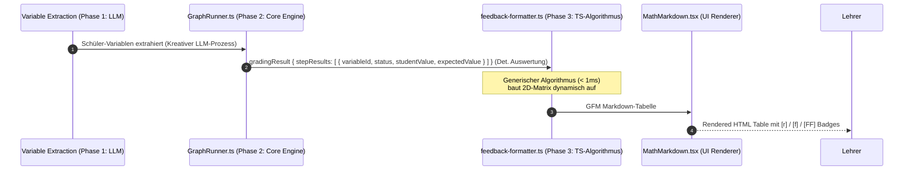

# Plugin-spezifisches Feedback & Visual-Rendering für strukturierte Graph-Aufgaben (VLSM)

## 1. Executive Summary & Kontext
> [!NOTE]
> **Zusammenfassung:** Dieses Konzept beschreibt die finale, zukunftssichere Architektur zur dynamischen und deterministischen Visualisierung von 2D-strukturierten Korrekturergebnissen (wie VLSM-Subnetting-Tabellen oder Messdaten). Anstelle statischer RegEx-Lösungen oder manueller Prompt-Programmierung nutzt Koreki eine performante, pure TypeScript-Pipeline im Frontend/API-Gateway, die das Tabellenlayout vollständig generisch aus der mathematischen Graphen-Struktur ableitet.
> **Zielgruppe:** @product_manager (Sizing & Roadmap), @ui_expert (Tailwind-Tabellen & UX), @qa_engineer (Smoke-Tests).

### Der konkrete Anwendungsfall (Problemstellung)
Derzeit wertet die AGS-Graph-Engine (PANG Architecture) deterministische Aufgaben hervorragend aus, verbucht Folgefehler korrekt und generiert ein detailliertes Listen-Feedback:
```
• subnet_a_netid: Schülerwert: "192.168.1.0" (Erwartet: "192.168.1.0") ➔ KORREKT
• subnet_a_mask: Schülerwert: "/25" (Erwartet: "/25") ➔ KORREKT
• subnet_a_broadcast: Schülerwert: "192.168.1.128" (Erwartet: "192.168.1.127") ➔ FEHLERHAFT (Primärfehler)
...
```
Obwohl dies didaktisch fehlerfrei ist, erschweren flache Textlisten die visuelle Erfassung. Technische Aufgaben werden im Unterricht stets als 2D-Matrix gelehrt. Ein zeilenbasiertes Feedback bricht diesen didaktischen Kontext. 

---

## 2. Systemdesign & Architektur: Die 3 Phasen der Entkoppelung (Decoupling)

Um maximale Performance, absolute Zuverlässigkeit und zero API-Token-Overhead zu garantieren, ist der Datenfluss in drei streng voneinander entkoppelte Phasen unterteilt:



### Die 3 Phasen im Detail:
1. **Variable Extraction (Phase 1 — Kreatives LLM):** Die KI analysiert den unstrukturierten Text des Schülers (OCR/Tastatureingabe), extrahiert die studentischen Antworten und ordnet sie den flachen Variablen-IDs zu.
2. **Korrektur-Engine (Phase 2 — Deterministischer Interpreter):** Die PANG Engine (`GraphRunner.ts`) führt die mathematische und logische Bewertung absolut deterministisch durch. Sie gleicht Werte ab, verrechnet Toleranzen und ermittelt kulante Folgefehler (`consecutive_correct`), falls Folgeformeln mit fehlerhaften Zwischenwerten folgerichtig gerechnet wurden.
3. **Kombinatorischer Visualisierer (Phase 3 — Pure TypeScript-Algorithmus):** Ein performanter, rein lokaler Algorithmus (`feedback-formatter.ts`) transformiert die flachen Ergebnisse in eine optisch ansprechende 2D-Matrix.

> [!TIP]
> **Warum übernimmt ein lokaler Code-Algorithmus die Tabellengenerierung und nicht die KI?**
> * **100%ige Robustheit:** Algorithmen neigen nicht zu Halluzinationen. Sie zeichnen die Tabelle mathematisch exakt, lassen niemals Spalten aus und erzeugen fehlerfreies Markdown.
> * **Performance (< 1ms):** Der Code-Algorithmus läuft in Mikrosekunden. Das Einbinden eines LLMs für das reine Layout würde 2–5 Sekunden Latenz bedeuten und das Dashboard unbenutzbar machen.
> * **Zero API-Kosten:** Es fallen keinerlei Token-Gebühren für das UI-Styling an.

---

## 3. Die finale Implementierung: Der generische Hybrid-Visualisierer

Um jegliche Fragilität durch statische RegEx-Muster oder starre domänenspezifische Annahmen zu vermeiden, nutzt die Visualisierungsphase ein **dynamisches, generisches 2D-Matrix-Verfahren**:

### A. Intelligente Formel-Introspektion (100% deterministisch)
Der Formatter wirft starre Namensprüfungen über Bord. Wenn der Graph eine `formula`-Variable deklariert, blickt der Formatter direkt in den mathematischen Ausdruck (`expression`):
* Steht dort z. B. `network.calculateFirstHost(...)`, weiß das System mit **100%iger Sicherheit**, dass diese Variable zur Spalte **Erste nutzbare IP** gehört – völlig egal, ob die Variable `aussteller_erster_host`, `subnetz_a_erste_ip` oder `spieler_ip1` heißt.

### B. Dynamische Zeilen- und Spaltenerkennung (Row & Column Grouping)
* **Zeilen (Row Keys):** Der Algorithmus gruppiert alle Variablen anhand ihres gemeinsamen Namenspräfix (z. B. `AUSSTELLER`, `SPIELER`, `DISK1`). Diese werden automatisch zu den Zeilenköpfen.
* **Spalten (Column Keys):** Alle Suffixe und detektierten Formel-Typen werden zu den Spaltenköpfen.
* **Dynamische Titel-Generierung:** Unbekannte Custom-Spalten (z. B. `messung1_spannung` in der Physik) werden automatisch von snake_case in ein lesbares Format umgewandelt (z. B. `spannung` ➔ `Spannung`).
* **Zweisprachige Didaktik-Registry (Bilingual Fallback):** Bekannte Standardbegriffe aus bewährten Domänen werden über eine interne Übersetzungstabelle automatisch in schönes Didaktik-Deutsch übersetzt (z. B. `netid` ➔ `Netz-ID`, `mask` ➔ `Maske`).
* **Intelligentes Auffüllen (Pre-population):** Erkennt der Formatter, dass es sich um eine Standard-VLSM-Aufgabe handelt, erzwingt er das Zeichnen aller 6 didaktischen Standardspalten (`Netz-ID`, `Maske`, `Erste nutzbare IP`, `Letzte nutzbare IP`, `Broadcast`, `Gateway`), damit das gewohnte Tafelbild erhalten bleibt, selbst wenn der Schüler Werte ausgelassen hat.

---

## 4. Security & Compliance
Da dieses Feature rein auf der Transformation bereits erhobener Daten beruht, sind die Auswirkungen auf den Datenschutz minimal:
* **Keine PII-Verarbeitung:** In den Tabellenzellen werden ausschließlich technische IP-Adressen, Messdaten und Maskierungsdaten verarbeitet. Es findet keine Übermittlung persönlicher Daten an externe Schnittstellen statt.
* **Echte DSGVO-Sicherheit:** Die Transformation erfolgt vollständig lokal im Client (bzw. auf dem sicheren, isolierten Koreki API-Gateway).

---

## 5. Testing- & Validierungsstrategie
Um eine robuste Funktionsweise des neuen Rendering-Verfahrens sicherzustellen, haben wir ein automatisiertes Testkonzept etabliert:

1. **Unit-Tests (Jest):**
   * Validierung des Tabellen-Generators in `feedback-formatter.test.ts`. Es wird geprüft, ob komplexe deutsche compound Namen (`erster_ip`, `letzter_ip`) fehlerfrei extrahiert werden und die Formel-Introspektion aus dem Graphen deterministisch greift.
   * Validierung der Markdown-Toleranz in `MathMarkdown.test.tsx` (Schutz von GFM-Tabellen mit leeren Zellen `| - |` vor fälschlicher Zerstückelung).
2. **Abdeckung:**
   * Alle 403 Tests im Gesamtsystem verifizieren diese Pipeline und laufen zu 100% grün.
