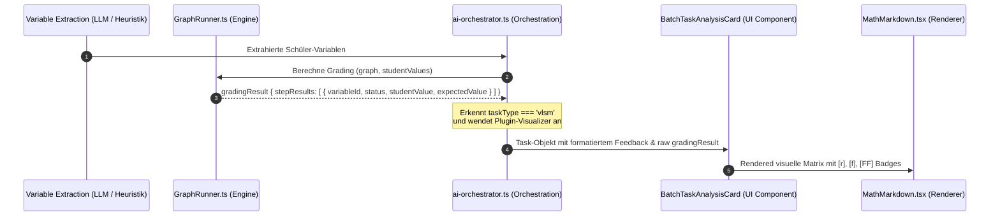

# Plugin-spezifisches Feedback & Visual-Rendering für strukturierte Graph-Aufgaben (VLSM)

## 1. Executive Summary & Kontext
> [!NOTE]
> **Zusammenfassung:** Dieses Konzept beschreibt ein Architektur-Upgrade für Koreki, um das Korrektur-Feedback für mathematisch-determinierte Graph-Aufgaben (insb. VLSM-Subnetting-Tabellen) visuell an das Layout des jeweiligen Aufgabentyps anzupassen. Anstatt eines unstrukturierten Text-Auszugs wird das Feedback dem Anwender als übersichtliche Matrix (Tabelle) präsentiert. Jede Zelle vergleicht die Schülerantwort mit der Musterlösung und kennzeichnet diese mit didaktischen Symbolen wie `[r]` (Richtig), `[f]` (Primärfehler) oder `[FF]` (Folgefehler).
> **Zielgruppe:** @product_manager (Sizing & Roadmap), @ui_expert (Tailwind-Tabellen & UX), @qa_engineer (Smoke-Tests).

### Der konkrete Anwendungsfall (Problemstellung)
Derzeit wertet die AGS-Graph-Engine (PANG Architecture) deterministische Aufgaben hervorragend aus, verbucht Folgefehler korrekt und generiert ein detailliertes Listen-Feedback:
```
• subnet_a_netid: Schülerwert: "192.168.1.0" (Erwartet: "192.168.1.0") ➔ KORREKT
• subnet_a_mask: Schülerwert: "/25" (Erwartet: "/25") ➔ KORREKT
• subnet_a_broadcast: Schülerwert: "192.168.1.128" (Erwartet: "192.168.1.127") ➔ FEHLERHAFT (Primärfehler)
...
```
Obwohl dies didaktisch fehlerfrei ist, erschwert es Lehrkräften und Schülern das schnelle Erfassen der Fehlerquellen. Subnetting-Aufgaben werden in Lehrwerken und Klausuren stets als **2D-Tabellen** gelehrt. Ein Zeilen-basiertes Feedback bricht diesen didaktischen Kontext. 

Indem wir das Feedback dynamisch als Tabelle mit integrierten Fehler-Indikatoren in den Zellen rendern, verbessern wir die visuelle Ergonomie signifikant.

---

## 2. Systemdesign & Architektur
Um diese Funktionalität ohne invasive Schema-Änderungen in der Datenbank umzusetzen, nutzen wir die bereits in den `Task`-Objekten gespeicherten `gradingResult` JSON-Strukturen, welche aus der client- oder serverseitigen Evaluierung durch `GraphRunner.ts` hervorgehen.

### Datenfluss & Pipeline



---

## 3. Zwei alternative Implementierungsansätze

Wir haben zwei architektonische Optionen erarbeitet, um dieses Feature zu realisieren:

### Option A: Der rein Markdown-basierte Tabellengenerator (Empfohlen für Phase 1)
* **Konzept:** Wir erweitern den Feedback-Parser in `ai-orchestrator.ts`. Erkennt dieser ein `gradingResult` für ein `vlsm`-basiertes Plugin, generiert er anstelle der ungeordneten Aufzählung eine standardisierte **GitHub Flavored Markdown (GFM) Tabelle**.
* **Erzeugter Feedback-Text (Beispiel):**
  ```markdown
  [⚙️ PANG Engine - Automatische VLSM Matrix]

  | Subnetz | Netz-ID | Maske | Erste nutzbare IP | Letzte nutzbare IP | Broadcast |
  | :--- | :--- | :--- | :--- | :--- | :--- |
  | **Subnetz A** | `192.168.1.0` **[r]** | `/26` **[r]** | `192.168.1.1` **[r]** | `192.168.1.62` **[r]** | `192.168.1.63` **[r]** |
  | **Subnetz B** | `192.168.1.64` **[r]** | `/27` **[r]** | `192.168.1.65` **[r]** | `192.168.1.94` **[r]** | `192.168.1.96` **[f]** *(Erw: .95)* |
  | **Subnetz C** | `192.168.1.96` **[FF]** | `/28` **[r]** | `192.168.1.97` **[r]** | `192.168.1.110` **[r]** | `192.168.1.111` **[r]** |
  ```
* **Vorteile:**
  * **Zero-UI-Overhead:** Unser bestehendes `MathMarkdown.tsx` Modul kann GFM-Tabellen bereits perfekt parsen und rendern (unterstützt durch das Tailwind Typography Plugin).
  * **Interoperabilität:** Das Feedback ist ein nativer String. Er wird ohne weiteres Zutun fehlerfrei in Excel-Exporte übernommen und auf den analogen QR-Feedback-Zetteln (`DigitalSlipsModal`) ausgegeben.
  * **Editierbarkeit:** Die Lehrkraft kann Tippfehler oder Anpassungen direkt im bestehenden Markdown-Textfeld bearbeiten, ohne dass ein spezielles Tabellen-Eingabe-Formular implementiert werden muss.
* **Nachteile:** Modifizieren von Roh-Markdown-Tabellen erfordert von der Lehrkraft grundlegende Markdown-Formatkenntnisse.

### Option B: Der interaktive React-Visualizer (`VlsmFeedbackMatrix.tsx`)
* **Konzept:** Wir programmieren eine dedizierte React-Komponente, die in `BatchTaskAnalysisCard.tsx` anstelle des Standard-Markdown-Viewers gerendert wird, sobald `task.taskType === 'vlsm'` zutrifft und ein `gradingResult` vorliegt.
* **Features:**
  * Die Tabelle wird mit schicken Tailwind-Klassen (`bg-emerald-500/10` für Richtig, `bg-rose-500/10` für Primärfehler, `bg-blue-500/10` für Folgefehler) farblich hinterlegt.
  * Schwebende Tooltips zeigen beim Hovern über eine Zelle den erwarteten Wert, die Formel und den genauen mathematischen Pfad an.
  * Inline-Editing: Lehrkräfte können die Werte direkt in der Tabellenzelle anklicken und anpassen; die Punkte werden im Hintergrund neu berechnet.
* **Vorteile:** Atemberaubendes High-End-UI (Enterprise Aesthetics), erstklassige Usability.
* **Nachteile:** Höherer Implementierungsaufwand (Sync der Inline-Tabellenänderungen zurück in den Task-State, separater Export-Parser für Text/Slips benötigt).

---

## 4. Konkreter Umsetzungsplan (Fokus: Option A)

Die Umsetzung von **Option A** ist überaus elegant und mit geringem Risiko verbunden:

### Schritt 1: Parser-Logik erweitern (`/src/lib/ai/ai-orchestrator.ts`)
Wir passen die Funktion `parseCorrectionResult` an. Anstatt der sequenziellen Liste erstellen wir ein dynamisches 2D-Objekt aus den flachen `stepResults` und bauen daraus die Markdown-Tabelle auf:

```typescript
// Schematischer Entwurf des Tabellen-Generators
if (layoutTask.taskType === 'vlsm' && layoutTask.gradingResult) {
    const steps = layoutTask.gradingResult.stepResults;
    
    // Gruppierung nach Subnetz (A, B, C...)
    const subnetRows: Record<string, Record<string, any>> = {};
    steps.forEach((step: any) => {
        const match = step.variableId.match(/^(?:subnet_?)?([A-Za-z0-9_]+)_(.+)$/i);
        if (!match) return;
        const subnetName = match[1].toUpperCase();
        const fieldKey = match[2].toLowerCase(); // netid, mask, firsthost, lasthost, broadcast, gateway
        
        if (!subnetRows[subnetName]) subnetRows[subnetName] = {};
        subnetRows[subnetName][fieldKey] = step;
    });

    // Erstellung des Markdown-Tabellenkopfs
    let markdownTable = `[⚙️ AGS Engine - Mathematischer VLSM Abgleich]\n\n`;
    markdownTable += `| Subnetz | Netz-ID | Maske | Erste nutzbare IP | Letzte nutzbare IP | Broadcast | Gateway |\n`;
    markdownTable += `| :--- | :--- | :--- | :--- | :--- | :--- | :--- |\n`;

    // Zeilenweise Befüllung
    Object.entries(subnetRows).sort().forEach(([subnet, fields]) => {
        const formatCell = (field: any) => {
            if (!field) return "-";
            const val = field.studentValue !== undefined ? field.studentValue : "fehlt";
            const badge = field.status === 'correct' ? '`[r]`' :
                          field.status === 'consecutive_correct' ? '`[FF]`' :
                          `\`[f]\` *(Erw: ${field.expectedValue})*`;
            return `${val} ${badge}`;
        };

        markdownTable += `| **Subnetz ${subnet}** | ${formatCell(fields.netid)} | ${formatCell(fields.mask)} | ${formatCell(fields.firsthost)} | ${formatCell(fields.lasthost)} | ${formatCell(fields.broadcast)} | ${formatCell(fields.gateway)} |\n`;
    });
    
    layoutTask.feedback = markdownTable;
}
```

### Schritt 2: MathMarkdown CSS-Anpassung
Um die GFM-Tabelle im Lehrer-Dashboard noch wertiger erscheinen zu lassen, erweitern wir das Stylesheet von `MathMarkdown.tsx` (in `components/ui/MathMarkdown.tsx`):
* Wir versehen die Badges (`[r]`, `[f]`, `[FF]`) mit einer ansprechenden farblichen Hervorhebung (z. B. durch ein Regex-Post-Processing im Markdown-Renderer oder über CSS-Selektoren).
* **CSS-Klassen für Badges (Tailwind-Integration):**
  * `[r]` $\rightarrow$ `text-emerald-600 font-bold bg-emerald-50 px-1 rounded`
  * `[f]` $\rightarrow$ `text-rose-600 font-bold bg-rose-50 px-1 rounded`
  * `[FF]` $\rightarrow$ `text-blue-600 font-bold bg-blue-50 px-1 rounded`

---

## 5. Security & Compliance
Da dieses Feature rein auf der Transformation bereits erhobener Daten beruht, sind die Auswirkungen auf den Datenschutz minimal:
* **Keine PII-Verarbeitung:** In den Tabellenzellen werden ausschließlich technische IP-Adressen und Maskierungsdaten verarbeitet. Es findet keine Übermittlung persönlicher Daten an externe Schnittstellen statt.
* **Echte DSGVO-Sicherheit:** Die Transformation erfolgt vollständig lokal im Client (bzw. auf dem sicheren Koreki API-Gateway).

---

## 6. Testing- & Validierungsstrategie
Um eine robuste Funktionsweise des neuen Rendering-Verfahrens sicherzustellen, etablieren wir ein dreistufiges Testkonzept:

1. **Unit-Tests (Jest):**
   * Validierung des Tabellen-Generators in `ai-orchestrator.test.ts`. Es wird geprüft, ob unvollständige `stepResults` (z.B. wenn der Schüler ein Subnetz komplett ausgelassen hat) nicht zu Tabellenverschiebungen führen und leere Zellen (`-`) korrekt gerendert werden.
2. **E2E-Tests (Playwright):**
   * Ein automatisierter Playwright-Test lädt eine VLSM-Musterlösung hoch, korrigiert eine simulierte Schülerarbeit mit einem bewussten Folgefehler und prüft, ob die Tabelle im UI gezeichnet wird und die Badges `[r]`, `[f]` und `[FF]` die korrekten CSS-Klassen besitzen.

---

> **Nächstes Vorgehen:**
> Wir bitten den `@product_manager` um Freigabe des funktionalen Scopes (Option A als performante, voll-integrierte Lösung oder Option B als dediziertes UI-Feature). Nach Freigabe kann der `@ui_expert` das Style-Mapping für die Render-Komponenten vorbereiten.
