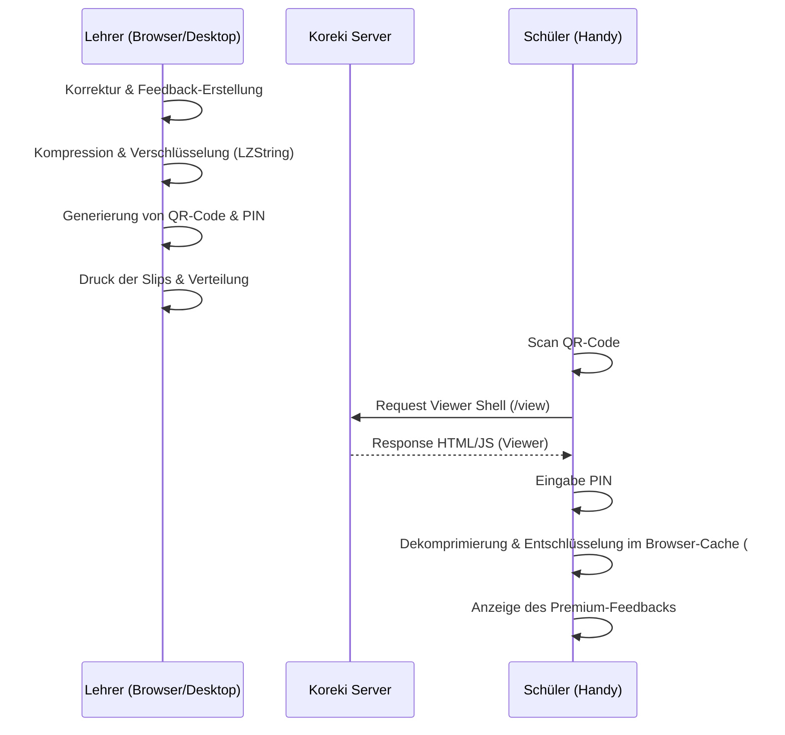

# Digital Feedback Slips

## 1. Executive Summary & Kontext
> [!NOTE]
> **Zusammenfassung:** Ermöglicht Lehrern die Verteilung von detailliertem Schülerfeedback über physische Rückgabe-Slips mit QR-Codes. Die Daten werden client-seitig verschlüsselt und niemals auf Koreki-Servern gespeichert.
> **Zielgruppe:** Lehrer (Nutzer), Administratoren, Datenschutzbeauftragte.

In vielen Schulen ist die Verteilung von digitalem Feedback aufgrund strenger Datenschutzauflagen (keine Cloud-Speicherung von Schülerdaten) schwierig. Die Digital Feedback Slips lösen dieses Problem durch eine „Offline-First“ Distribution, bei der das Feedback direkt im URL-Anker des QR-Codes transportiert wird.

---

## 2. Architektur & Systemdesign
> [!TIP]
> Die Lösung basiert auf dem **Zero-Knowledge-Prinzip**. Der Server liefert lediglich den statischen Viewer aus, sieht aber niemals den Inhalt des Feedbacks.

---

## 3. Implementierung & Nutzung
Das Feature ist nahtlos in den **BatchProcessor** integriert.

### Nutzung für Lehrer:
1. Nach Abschluss der Korrekturen in der **ExportToolbar** auf „Digitale Slips“ klicken.
2. Es öffnet sich ein Modal mit einer Druckansicht. Jeder Schüler erhält einen Streifen mit:
   * Name des Schülers
   * QR-Code
   * 4-stelliger PIN (stabil & sicher)
3. Die Slips ausdrucken, ausschneiden und an die physischen Arbeiten tackern.

### Nutzung für Schüler:
1. QR-Code scannen.
2. PIN vom Slip eingeben.
3. Detailliertes Feedback (Aufgaben-Punkte, Korrekturen, Folgefehler) einsehen.

---

## 4. Security & Compliance
> [!IMPORTANT]
> Dies ist das sicherste Distributions-Verfahren in Koreki, da es die DSGVO-Anforderungen durch technische Isolation (Privacy by Design) übererfüllt.

* **Datenverarbeitung:** Es werden **keine personenbezogenen Daten** (PII) auf Koreki-Servern gespeichert. Das Feedback existiert nur auf dem Gerät des Lehrers und temporär im Browser-RAM des Schülers.
* **Authentifizierung:** Ein 4-stelliger PIN schützt vor neugierigen Blicken (Sicherheitsfaktor „Wissen“).
* **Transport:** Die Datenübertragung zum Schüler erfolgt verschlüsselt (TLS) und die Daten selbst sind im URL-Hash verpackt, der niemals an den Webserver gesendet wird.

---

## 5. Testing & Referenzen
* **Unit-Tests:** `tests/unit/distribution.test.ts` (Encoding/Decoding Logic)
* **Integration-Tests:** `tests/integration/DigitalSlipsModal.test.tsx`
* **Technologien:** LZ-String (Kompression), qrcode.react (QR-Generierung), Lucide React (UI-Icons).
