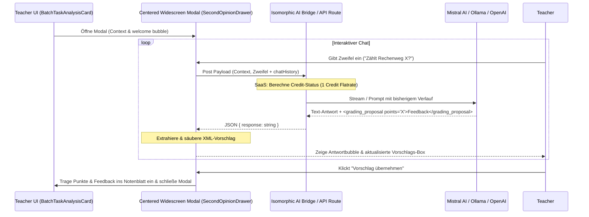

title: "KI-Zweitmeinung / Korrektur-Sparring"
description: "Ein interaktiver päd. Copilot (Korrektur-Sparring), der Lehrern hilft, unsichere Schülerantworten im Dialog zu klären und per Knopfdruck Punkte und Feedback anzupassen."
author: "@principal_architect & @ui_expert"
date: "2026-05-19"
last_updated: "2026-05-19"
version: "2.0.0"
status: "Approved"
domain: "technical"
security_classification: "Internal"
---

# KI-Zweitmeinung & Korrektur-Sparring

## 1. Executive Summary & Kontext
> [!NOTE]
> **Zusammenfassung:** Ermöglicht Lehrern, bei uneindeutigen Schülerantworten eine hochpräzise, päd. Zweitmeinung im Dialog einzuholen. Über ein zentriertes Glassmorphism-Panel wird der Copilot aktiviert und startet ein interaktives **Korrektur-Sparring**. Am Ende jeder Chat-Antwort liefert die KI einen präzisen Vorschlag zur Punktevergabe und zum Feedback via XML (`<grading_proposal>`), welcher per Klick direkt in das Notenblatt der Lehrkraft übernommen werden kann.
> **Zielgruppe:** Lehrer (als Vertrauensanker bei der Benotung), Product Owner (PM) zur Validierung des Nutzwerts.

Im Korrekturalltag stoßen Lehrer häufig auf "Grenzfälle" (z. B. ungenaue Formulierungen, semantische Grauzonen oder Teillösungen). Ein starrer Einmal-Check greift hier oft zu kurz. Das **Korrektur-Sparring** fungiert als digitaler Kollege auf Augenhöhe, mit dem sich Folgefehler, pädagogische Kulanz und fachliche Zweifelsfälle interaktiv ausdiskutieren lassen.

---

## 2. Architektur & Systemdesign
Der Zweitblick nutzt die isomorphe AI-Bridge (`src/lib/ai/`) und läuft vollkommen zustandslos und datenschutzkonform über temporären RAM-Zustand.



### Multi-Target Runtime Adaptations & Flatrate Billing
Um der hybriden Produktstruktur von Koreki gerecht zu werden, verhält sich das Feature je nach Laufzeitumgebung und Lizenzmodell unterschiedlich:

1. **SaaS-Version (Cloud, STANDARD-Modus):**
   * **Pfad:** UI ➔ Next.js API-Route (`/api/second-opinion`) ➔ Cloud-Database (Credit-Debit) ➔ AI-Bridge ➔ Globales LLM.
   * **1 Credit Flatrate:** Es wird exakt **1 Credit flat** für die gesamte Sparring-Sitzung berechnet. Die Buchung erfolgt ausschließlich bei der *allersten* Nachricht. Alle Folgefragen und Diskurs-Schritte innerhalb dieses Chats sind komplett kostenlos (**0 Credits**), um den explorativen Dialog nicht finanziell zu bestrafen.

2. **Desktop-Version (Tauri-Native App):**
   * **Pfad:** UI ➔ Client-side Isomorphic AI-Bridge (`src/lib/ai/`) ➔ Lokales LLM (z.B. Ollama) ➔ Lokaler RAM.
   * **Billing:** Kostenlos (**0 Credits**), da die Rechenleistung lokal erbracht wird.

3. **Community- / PURE-Version (SaaS mit eigenem Key):**
   * **Pfad:** UI ➔ Client-side AI-Bridge ➔ Direct Request an Drittanbieter-Endpunkt via lokal hinterlegtem API-Key.
   * **Billing:** Kostenlos (**0 Credits**), Abrechnung erfolgt direkt über den API-Vertrag des Nutzers beim jeweiligen Provider.

### Prompt-Schnittstelle & XML-Integration

#### 📨 API Request Payload Proposal (The Context Package)
Der Payload an das Backend enthält neben der aktuellen Frage auch die Historie:

```typescript
interface ChatMessage {
  role: 'user' | 'assistant';
  content: string;
}

interface SecondOpinionRequestPayload {
  taskName: string;            // Name der Aufgabe
  taskInstructions?: string;   // Die konkrete Aufgabenstellung/Frage
  sampleSolution?: string;     // Erwartete Antwort / Korrekturrichtlinien
  maxPoints: number;           // Maximal erreichbare Punktzahl
  studentText: string;         // Die rohe Schülerantwort
  currentPoints: number;       // Die bisher zugewiesenen Punkte
  currentFeedback: string;     // Das aktuelle, zur Diskussion stehende Feedback
  teacherDoubt?: string;       // Aktuelle Frage des Lehrers
  chatHistory?: ChatMessage[]; // Liste der bisherigen Chatnachrichten im Sparring
}
```

#### 📩 Live XML-Proposal-Injektion
Am Ende jeder Antwort generiert die reasoning-optimierte LLM-Engine das folgende XML-Tag:

```xml
<grading_proposal points="2.5">
[r] Der Rechenweg ist vollkommen korrekt. [f] Lediglich beim Vorzeichen ist ein kleiner Fehler unterlaufen.
</grading_proposal>
```

Die UI extrahiert diese Struktur über eine reguläre Expression robust aus der Antwort, blendet sie aus der sichtbaren Textbubble aus und befüllt damit die interaktive **Vorschlagsbox** auf der linken Seite des zentrierten Modals.

---

## 3. UI & UX (Koreki Enterprise Aesthetics)
Das Interface ist als zentriertes Widescreen-Modal gestaltet, das optisch perfekt auf den Anonymisierungs-Dialog abgestimmt ist.

* **Zentriertes Layout (`max-w-5xl h-[90vh]`):**
  * **Linke Spalte (Breite: ~40%):** Zeigt den kompakten Aufgabenkontext (Name, Schülerantwort-Auszug) sowie die **dynamische Vorschlags-Box**. Sobald die KI im Chat einen Vorschlag macht, erscheint hier die empfohlene Punktzahl nebst Feedback und dem prominenten, violetten Button **"Vorschlag übernehmen"**.
  * **Rechte Spalte (Breite: ~60%):** Der interaktive Chatverlauf. Die KI empfängt den Lehrer mit einer persönlichen, aufgabenbezogenen Begrüßung. Sprechblasen sind farblich und asymmetrisch gestaltet (Lehrer: Indigo, KI: Soft Glassmorphism).
  * **Unterseite Chat:** Eingabemaske mit Sende-Button (Sparkles/Send Icon). Ein dynamischer Disclaimer zeigt dem Lehrer transparent die Credit-Kosten an (z. B. *"Folgefrage kostenlos (0 Credits)"*).

---

## 4. Implementierungsstatus & Tests

### 🗓️ Phase 1: Schnittstellen & AI-Core (Completed)
* Die isomorphen Provider (`mistral-provider.ts`, `openai-provider.ts`, `ollama-logic.ts`) wurden refaktoriert, um rohe Textantworten (Markdown statt erzwungenem JSON) zurückzugeben.
* Der Prompt-Builder wurde in `prompt-builder.ts` zu einem kollegialen, dialogbasierten System-Prompt umgebaut.

### 🗓️ Phase 2: Billing & API Gate (Completed)
* Next.js API-Route `/api/second-opinion` prüft `chatHistory.length`. Ist sie `>= 2` (also eine Folgefrage), werden **0 Credits** abgebucht. Nur die erste Nachricht zieht **1 Credit** ab (SaaS).

### 🗓️ Phase 3: Widescreen UI & Animation (Completed)
* `SecondOpinionDrawer.tsx` wurde in ein zentriertes Widescreen-Modal umgewandelt. Das Design nutzt Backdrop-Blur, asymmetrische Chat-Sprechblasen und ein elegantes ChatGPT-artiges pulsierendes Punkte-Ladesymbol für Korekis Antwortphasen.

### 🗓️ Phase 4: Qualitätsprüfung & Stabilität (Completed)
* Die Typenprüfung `npx tsc --noEmit` schließt mit **Exit Code 0** ab.
* Alle 358 Unit- und Integrationstests laufen fehlerfrei durch (`npm test`).

---

## 5. Security & Compliance (DSGVO Hardened)
* **Volatile Memory:** Alle Diskursdaten und Chatverläufe existieren ausschließlich im flüchtigen React-State und werden weder im `localStorage` noch in der Datenbank zwischengespeichert.
* **Audit Logs:** Es werden nur anonyme Zähler-Events ohne jegliche Inhaltsdaten auf dem Server registriert.

---
*Status: IMPLEMENTED & VERIFIED (V2 - INTERACTIVE SPARRING CHAT)* 🏛️🎨✨
