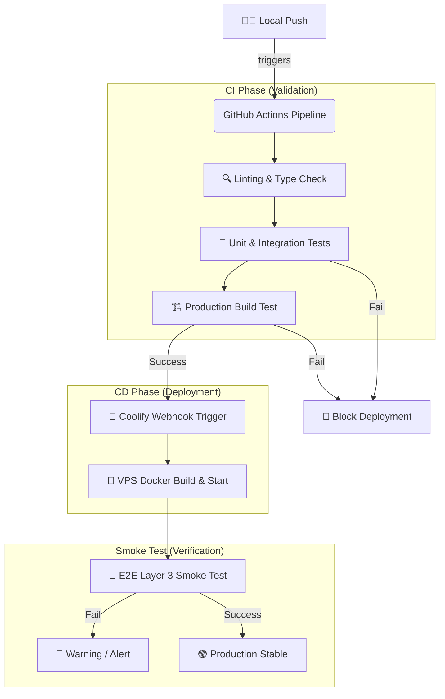

# 🚀 Koreki CI/CD Blueprint (Industrial Grade)

## 1. Executive Summary & Kontext

Dieses Dokument beschreibt die Architektur der kontinuierlichen Integration (CI) und Bereitstellung (CD) für die Koreki-Plattform. Ziel ist es, die 100%ige Stabilität der Produktionsumgebung durch automatisierte Qualitätsschranken zu garantieren.

## 🏗️ Pipeline-Architektur (Mermaid)

## 📋 Die 4 Phasen der Qualitätssicherung

### 1. Phase: Statische Analyse (Linting & Types)
*   **Werkzeuge**: `npm run lint`, `tsc --noEmit`
*   **Ziel**: Verhindert Syntaxfehler, nicht deklarierte Variablen und Typ-Inkompatibilitäten, bevor sie überhaupt gebaut werden.

### 2. Phase: Logik-Validierung (Unit & Integration)
*   **Werkzeuge**: `npm test` (Jest)
*   **Ziel**: Automatische Ausführung aller 260+ Tests in `tests/unit` und `tests/integration`. Diese Phase stellt sicher, dass Notenberechnungen, KI-Parsing und UI-Komponenten logisch einwandfrei bleiben.

### 3. Phase: Build-Verifizierung
*   **Werkzeug**: `npm run build`
*   **Ziel**: Bestätigt, dass keine Next.js spezifischen Fehler (z.B. falsche Routen, fehlende Server-Props) den produktiven Betrieb stören.

### 4. Phase: E2E Smoke Test (Layer 3)
*   **Werkzeug**: `npm run test:e2e` (Playwright)
*   **Ziel**: Wird **nach** dem Deployment ausgeführt. Verifiziert den „Golden Thread“ gegen die Live-URL. Dies ist die ultimative Bestätigung, dass die Seite für den Endkunden benutzbar ist.

## 🔐 Geheimnis-Management (GitHub Secrets)

Damit die Pipeline gegen die Produktion testen kann (Layer 3), müssen folgende Variablen sicher in den **GitHub Actions Secrets** hinterlegt werden:

| Secret Name | Zweck |
| :--- | :--- |
| `E2E_TEST_USER` | Der Test-Nutzer für den Login-Check. |
| `E2E_TEST_PASSWORD` | Das Passwort für den Test-Nutzer. |
| `MISTRAL_API_KEY` | Erforderlich für KI-Tests (falls Mocking deaktiviert). |
| `COOLIFY_WEBHOOK` | Die URL, die das eigentliche Deployment anstößt. |

## 🛡️ Schutzmechanismus: "Block on Failure"
In diesem Setup wird GitHub so konfiguriert, dass der **Webhook zu Coolify nur ausgelöst wird**, wenn alle CI-Phasen (1-3) mit einem grünen Exit-Code enden. Das verhindert, dass eine kaputte Version jemals die Nutzer erreicht.

---
*Status: Industrial Grade Concept Ready for Implementation*

---

## X. Security & Compliance (Mandatory for Industrial Grade)
> [!IMPORTANT]
> **Pillar 3 Compliance (CI/CD Security Guard):** Alle in unseren Workflows verwendeten GitHub Actions von Drittanbietern **müssen** zwingend über ihren vollständigen 40-Zeichen-Commit-SHA gepinnt werden, anstatt veränderliche Tags (wie `@v4` oder `@v0`) zu nutzen. Dies schützt unsere CI/CD-Pipeline vor Supply-Chain-Angriffen, falls ein Drittanbieter-Repository kompromittiert wird.

### 🛡️ Richtlinien für GitHub Actions Pinning:
1. **Verwendung von Commit-SHAs:** Jede externe Action muss über `@<commit-sha>` referenziert werden.
2. **Maintenance Comments:** Um die Lesbarkeit und automatische Paket-Updates (z. B. durch Dependabot) zu ermöglichen, muss direkt hinter dem Commit-SHA ein Kommentar mit dem originalen Versions-Tag stehen.
   * *Beispiel:* `uses: actions/checkout@11bd71901bbe5b1630ceea73d27597364c9af683 # v4.2.2`
3. **Automatische Updates:** Dependabot ist so konfiguriert, dass es Workflows liest, die Versionen in den Kommentaren erkennt und automatisierte Pull Requests mit den aktualisierten SHAs erstellt.

* **Datenverarbeitung:** In der Build-Phase der Pipelines werden Secrets ausschließlich über geschützte GitHub Repository Secrets injiziert und niemals im Code oder in Build-Logs im Klartext exponiert.
* **Authentifizierung/Autorisierung:** GitHub-Token in den Pipelines haben strikt lesenden Zugriff (`contents: read`), außer für Release-Workflows, die explizit Schreibrechte für Releases (`contents: write`) oder Pakete (`packages: write`) benötigen.
* **Audit-Logs:** Alle Workflow-Runs werden über GitHub Actions Audit Logs versioniert und archiviert, um Änderungen an Builds lückenlos nachzuvollziehen.

---

## Y. Testing & Referenzen
> [!WARNING]
> Verlinke hier zwingend auf zugehörige GitHub PRs, Tasks oder Architektur-Entscheidungen (ADR).

* **Verwandte Dokumente:** [release-process.md](file:///c:/Users/AndreasHeid/Documents/Antigravity/koreki/docs/operations/release-process.md), [security-pillars.md](file:///c:/Users/AndreasHeid/Documents/Antigravity/koreki/docs/technical/security-pillars.md)
* **Test-Coverage:** 100% Validierung der CI/CD Workflows vor jedem Push in `main`.
* **Externe Referenzen:** [GitHub Security Hardening Guide for Actions](https://docs.github.com/en/actions/security-guides/security-hardening-for-github-actions#using-third-party-actions)
