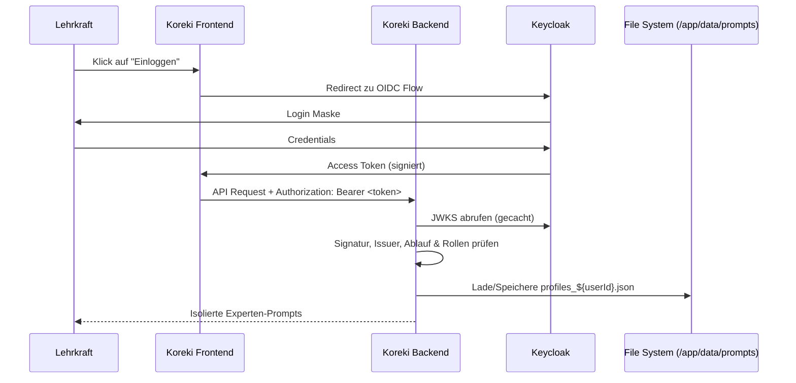

# Community Multi-User Setup (Keycloak & Docker)

## 1. Executive Summary & Kontext
> [!NOTE]
> **Zusammenfassung:** Dieses Dokument beschreibt das Setup der Koreki Community Edition in einer Multi-User Umgebung. Es nutzt Keycloak als Identitätsprovider und stellt eine strikte Daten-Isolation auf Dateisystem-Ebene sicher.
> **Zielgruppe:** DevOps, System-Administratoren, Entwickler.

Koreki Community Edition wurde primär als Single-User Desktop-App konzipiert. Dieses Setup ermöglicht den Betrieb als zentrale Instanz (z. B. für Schulen), in der mehrere Lehrkräfte ihre eigenen Experten-Profile verwalten können, ohne dass Datenlecks zwischen den Nutzern entstehen.

---

## 2. Architektur & Systemdesign
Die Authentifizierung erfolgt über den OIDC-Standard. Koreki fungiert als Client, während ein mitgelieferter Keycloak-Container die Nutzerbasis verwaltet.



---

## 3. Implementierung & Nutzung

### Docker-Compose Start
Nutze das spezialisierte Compose-File (`community-multi-full.yml`), das Keycloak, Nginx-Gateway und eine PostgreSQL-Datenbank (für Keycloak) automatisch mitstartet.

> [!WARNING]
> **Die APP_URL ist das Herzstück des Setups!** Sie muss exakt die IP oder Domain enthalten, über die die Nutzer später auf Koreki zugreifen (z.B. `http://192.168.250.12:8083` oder `https://koreki.schule.de`).
> Wenn du die `APP_URL` oder Einstellungen in der `.env` nachträglich änderst, **musst du zwingend das `--build` Flag anhängen**, damit das Frontend die neuen Variablen übernimmt!

```bash
# Startet Koreki, Keycloak, Nginx und DB (Immer mit --build beim ersten Mal oder nach Änderungen)
APP_URL="http://192.168.250.12:8083" docker compose -f docker-compose.community-multi-full.yml up -d --build
```

### Umgebungsvariablen (Koreki)
Folgende Variablen müssen in der `.env` oder im Compose-File gesetzt sein:
* `APP_URL`: Die finale Aufruf-URL inklusive http(s) und Port. (Muss in der `.env` stehen oder beim Befehl übergeben werden)
* `NEXT_PUBLIC_KOREKI_MODE=community`: Aktiviert lokale Isolation.
* `NEXT_PUBLIC_AUTH_TYPE=KEYCLOAK`: Aktiviert den OIDC/Keycloak-Pfad im Frontend.
* `NEXT_PUBLIC_OIDC_ISSUER`: URL deines Keycloak Realms (z.B. `${APP_URL}/auth/realms/koreki`). Gegen diesen Wert wird der `iss`-Claim jedes Tokens geprüft.
* `NEXT_PUBLIC_OIDC_CLIENT_ID` / `OIDC_CLIENT_ID`: ID des Clients in Keycloak (Standard: `koreki-app`).
* `OIDC_ISSUER_INTERNAL`: (Optional) Abweichender Pfad, über den der Server die Signaturschlüssel (JWKS) abruft — nötig, wenn die öffentliche URL aus dem Container heraus nicht auflösbar ist. Im mitgelieferten Stack: `http://gateway/auth/realms/koreki`.
* `MISTRAL_API_KEY`: (Optional) Zentraler API-Key für Mistral. 
* `MITTWALD_API_KEY`: (Optional) Zentraler API-Key für Qwen 3.6 / Mittwald.
* `NEXT_PUBLIC_HAS_GLOBAL_AI=true`: Signalisiert dem Frontend, dass globale Keys vorhanden sind (unterdrückt das Setup-Modal für Endnutzer).

### Keycloak Konfiguration
Im mitgelieferten Stack wird der Realm automatisch aus `keycloak/koreki-realm.json` importiert (eine Datei für alle Umgebungen). Bei einem **externen** Keycloak entsprechend anlegen:
1. **Realm:** `koreki`.
2. **Client:** OIDC-Client `koreki-app`.
   - **Access Type:** Public (SPA-Frontend mit PKCE `S256`).
   - **Valid Redirect URIs:** deine `APP_URL` + `/*`.
   - **Web Origins:** deine `APP_URL`.
3. **Roles:** Realm-Rollen `koreki-user` (Standard) und `koreki-admin` (Zugriff auf KI-Einstellungen).

> [!NOTE]
> Ein Custom-Protocol-Mapper für Rollen ist **nicht** erforderlich. Der Server liest Rollen aus `realm_access.roles`, das Keycloak über den Standard-Client-Scope `roles` immer mitliefert.

---

## 4. Security & Compliance (Industrial Grade)
> [!IMPORTANT]
> Die Identität stammt ausschließlich aus dem **signierten Access Token**. Der Server verifiziert bei jedem Request Signatur (via JWKS), Issuer, Client-Bindung und Ablauf, bevor `sub` und Rollen verwendet werden. Client-gelieferte Identitäts-Header sind keine Vertrauensquelle.

* **Datenverarbeitung:** Personenbezogene Daten der Schüler werden im RAM verarbeitet. Experten-Prompts werden verschlüsselt oder isoliert in `/app/data/prompts/profiles_${userId}.json` gespeichert.
* **Authentifizierung:** Erfolgt über Keycloak. Passwörter werden niemals in der Koreki-Datenbank gespeichert.
* **Audit-Logs:** Kritische Aktionen (Logins, Profil-Änderungen) werden über den `audit-service.ts` im Backend erfasst.

---

## 5. Testing & Referenzen
* **Verwandte Dokumente:** [Community Persistence Doku](../technical/community-edition-persistence.md)
* **Test-Coverage:** Der Keycloak-Login-Flow ist derzeit NICHT durch E2E-Tests abgedeckt. Das frühere `tests/e2e/auth.setup.ts` meldete sich gegen die Produktion an und wurde am 19.08.2026 entfernt; die lokale Test-Kette läuft ohne Login (`NEXT_PUBLIC_AUTH_TYPE=NONE`).

---
