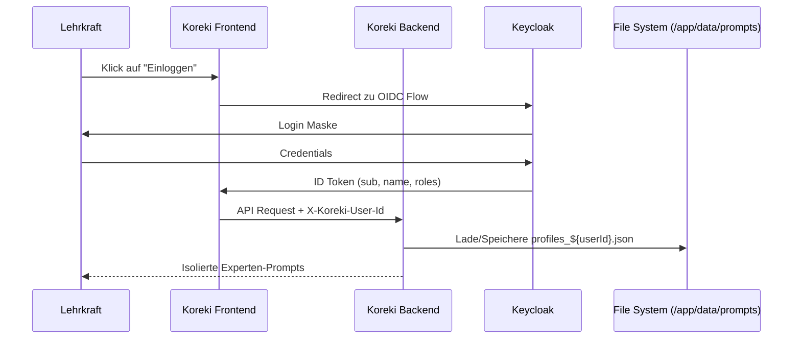

# Community Multi-User Setup (Keycloak & Docker)

## 1. Executive Summary & Kontext
> [!NOTE]
> **Zusammenfassung:** Dieses Dokument beschreibt das Setup der Koreki Community Edition in einer Multi-User Umgebung. Es nutzt Keycloak als Identitätsprovider und stellt eine strikte Daten-Isolation auf Dateisystem-Ebene sicher.
> **Zielgruppe:** DevOps, System-Administratoren, Entwickler.

Koreki Community Edition wurde primär als Single-User Desktop-App konzipiert. Dieses Setup ermöglicht den Betrieb als zentrale Instanz (z. B. für Schulen), in der mehrere Lehrkräfte ihre eigenen Experten-Profile verwalten können, ohne dass Datenlecks zwischen den Nutzern entstehen.

---

## 2. Architektur & Systemdesign
Die Authentifizierung erfolgt über den OIDC-Standard. Koreki fungiert als Client, während ein mitgelieferter Keycloak-Container die Nutzerbasis verwaltet.



---

## 3. Implementierung & Nutzung

### Docker-Compose Start
Nutze das spezialisierte Compose-File, das Keycloak und eine PostgreSQL-Datenbank (für Keycloak) automatisch mitstartet:

```powershell
# Startet Koreki, Keycloak und DB
$env:KOREKI_DOMAIN="localhost"; docker-compose -f docker-compose.community-multi.yml up -d --build
```

### Umgebungsvariablen (Koreki)
Folgende Variablen müssen in der `.env` oder im Compose-File gesetzt sein:
* `NEXT_PUBLIC_KOREKI_MODE=community`: Aktiviert lokale Isolation.
* `NEXT_PUBLIC_AUTH_TYPE=KEYCLOAK`: Aktiviert den OIDC/Keycloak-Pfad im Frontend.
* `KEYCLOAK_ISSUER`: URL deines Keycloak Realms (z.B. `http://localhost:8080/realms/koreki`).
* `KEYCLOAK_CLIENT_ID`: ID des Clients in Keycloak (Standard: `koreki-client`).
* `MISTRAL_API_KEY`: (Optional) Zentraler API-Key für Mistral. 
* `MITTWALD_API_KEY`: (Optional) Zentraler API-Key für Qwen 3.6 / Mittwald.
* `NEXT_PUBLIC_HAS_GLOBAL_AI=true`: Signalisiert dem Frontend, dass globale Keys vorhanden sind (unterdrückt das Setup-Modal für Endnutzer).

### Keycloak Konfiguration
1. **Realm:** Erstelle einen Realm namens `koreki`.
2. **Client:** Erstelle einen OIDC-Client `koreki-client`.
   - **Access Type:** Public (für SPA Frontend) oder Confidential (falls Backend-Sync gewünscht).
   - **Valid Redirect URIs:** `http://localhost:3000/*` (oder deine Domain).
   - **Web Origins:** `http://localhost:3000`.
3. **Roles:** (Optional) Erstelle die Rolle `koreki-admin` für erweiterten Zugriff auf KI-Einstellungen.

---

## 4. Security & Compliance (Industrial Grade)
> [!IMPORTANT]
> Die Isolation basiert auf dem `sub`-Claim (Subject) des OIDC-Tokens. Dieser wird im `apiClient` automatisch als `X-Koreki-User-Id` injiziert.

* **Datenverarbeitung:** Personenbezogene Daten der Schüler werden im RAM verarbeitet. Experten-Prompts werden verschlüsselt oder isoliert in `/app/data/prompts/profiles_${userId}.json` gespeichert.
* **Authentifizierung:** Erfolgt über Keycloak. Passwörter werden niemals in der Koreki-Datenbank gespeichert.
* **Audit-Logs:** Kritische Aktionen (Logins, Profil-Änderungen) werden über den `audit-service.ts` im Backend erfasst.

---

## 5. Testing & Referenzen
* **Verwandte Dokumente:** [Community Persistence Doku](../technical/community-edition-persistence.md)
* **Test-Coverage:** Playwright E2E Tests decken den Keycloak-Login-Flow ab (`tests/e2e/auth.setup.ts`).

---
