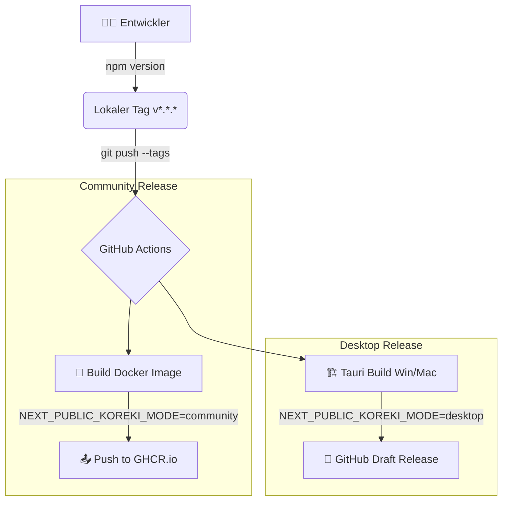

# 📦 Koreki Release-Prozess (Community & Desktop)

## 1. Executive Summary
Koreki wird in drei Editionen verteilt: SaaS (Continuous Deployment), Community (Docker) und Desktop (Native Binaries). Während SaaS automatisch über Coolify bereitgestellt wird, erfordern Community und Desktop eine explizite Versionierung über Git-Tags.

## 🏗️ Release-Workflow (GitHub Actions)



## 📋 Schritt-für-Schritt Anleitung

### 1. Versionierung vorbereiten
Bevor ein Release erstellt wird, müssen die Versionsnummern in den Konfigurationsdateien synchronisiert werden.

1.  **`package.json`**: Update des `"version"` Feldes.
2.  **`src-tauri/tauri.conf.json`**: Update des `"version"` Feldes (muss mit package.json übereinstimmen).

### 2. Git-Tag erstellen und pushen
Der Release-Prozess wird ausschließlich durch das Pushen eines Tags ausgelöst, der dem Muster `v*` (z.B. `v0.9.10`) entspricht. 

> [!IMPORTANT]
> **Windows/MSI Kompatibilität:** Tags und Versionsnummern in `package.json`/`tauri.conf.json` müssen **rein numerisch** sein (z.B. `0.9.10`). Buchstaben wie `-beta` führen zu Fehlern beim Erstellen der Windows-Installer (MSI).

```powershell
# Änderungen committen
git add .
git commit -m "chore: release v0.9.10"

# Tag erstellen
git tag v0.9.10

# Push an den Server (löst Actions aus)
git push origin main
git push origin v0.9.10
```


### 3. Community Edition aktualisieren (Lokal)
Um eine bestehende lokale Community-Instanz auf den neuesten Stand des Repositories zu bringen:

```powershell
git pull
docker compose -f docker-compose.community.yml up -d --build
```


## 🚀 Automatisierte Artefakte

### Community Edition (Docker)
Das Docker-Image wird automatisch gebaut und unter `ghcr.io/koreki-org/koreki` veröffentlicht. *   **Tags:** Es werden sowohl der spezifische Versionstag als auch der `latest`-Tag aktualisiert.
*   **Modus:** Das Image ist vorkonfiguriert für `NEXT_PUBLIC_KOREKI_MODE=community` und `NEXT_PUBLIC_SINGLE_USER_MODE=true`.

### Desktop App (Tauri)
GitHub Actions baut native Installer für Windows (`.msi`) und macOS (`.dmg` für Intel/Silicon).
*   **Ablage:** Die Dateien werden an einen neuen **Draft Release** auf GitHub angehängt.
*   **Aktion erforderlich:** Der Draft Release muss manuell im GitHub UI geprüft und auf "Published" gesetzt werden.

## 🔐 Security & Compliance
*   **Signierung:** Desktop-Releases sollten in Zukunft über einen Apple/Microsoft Developer Account signiert werden (aktuell unsignierte Installer für Beta).
*   **Abhängigkeiten:** Vor jedem Release wird automatisch ein `security-check` (npm audit) durchgeführt.

---
*Status: Industrial Grade Release Process Active*
