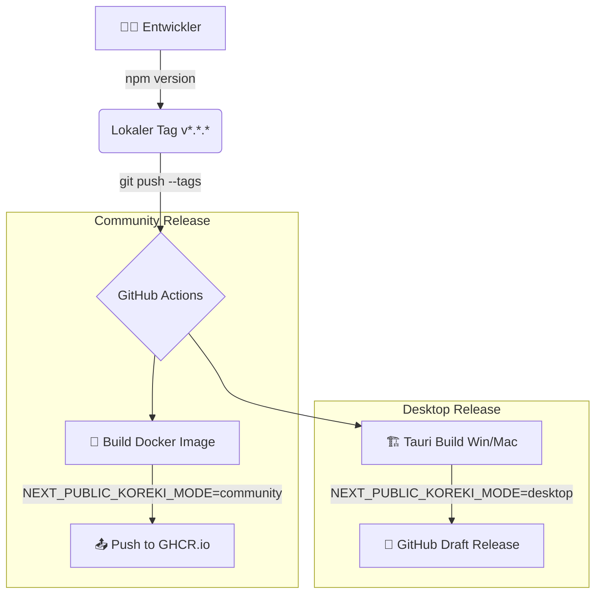

# 📦 Koreki Release-Prozess (Community & Desktop)

## 1. Executive Summary
Koreki wird in drei Editionen verteilt: SaaS (Continuous Deployment), Community (Docker) und Desktop (Native Binaries). Während SaaS automatisch über Coolify bereitgestellt wird, erfordern Community und Desktop eine explizite Versionierung über Git-Tags.

## 🏗️ Release-Workflow (GitHub Actions)


```mermaid
graph TD
    A[👨‍💻 Entwickler] -->|npm version| B(Lokaler Tag v*.*.*)
    B -->|git push --tags| C{GitHub Actions}
    
    subgraph "Community Release"
        C --> D[🐳 Build Docker Image]
        D -->|NEXT_PUBLIC_KOREKI_MODE=community| E[📤 Push to GHCR.io]
    end
    
    subgraph "Desktop Release"
        C --> F[🏗️ Tauri Build Win/Mac]
        F -->|NEXT_PUBLIC_KOREKI_MODE=desktop| G[🎁 GitHub Draft Release]
    end
```

## 📋 Schritt-für-Schritt Anleitung

### 1. Versionierung vorbereiten
Bevor ein Release erstellt wird, müssen die Versionsnummern in den Konfigurationsdateien synchronisiert werden.

1.  **`package.json`**: Update des `"version"` Feldes.
2.  **`src-tauri/tauri.conf.json`**: Update des `"version"` Feldes (muss mit package.json übereinstimmen).

### 2. Git-Tag erstellen und pushen
Der Release-Prozess wird ausschließlich durch das Pushen eines Tags ausgelöst, der dem Muster `v*` (z.B. `v0.9.10`) entspricht. 

> [!IMPORTANT]
> **Windows/MSI Kompatibilität:** Tags und Versionsnummern in `package.json`/`tauri.conf.json` müssen **rein numerisch** sein (z.B. `0.9.10`). Buchstaben wie `-beta` führen zu Fehlern beim Erstellen der Windows-Installer (MSI).

```powershell
# Änderungen committen
git add .
git commit -m "chore: release v0.9.10"

# Tag erstellen
git tag v0.9.10

# Push an den Server (löst Actions aus)
git push origin main
git push origin v0.9.10
```


### 3. Community Edition aktualisieren (Lokal)
Um eine bestehende lokale Community-Instanz auf den neuesten Stand des Repositories zu bringen:

```powershell
git pull
docker compose -f docker-compose.community.yml up -d --build
```


## 🚀 Automatisierte Artefakte

### Community Edition (Docker)
Das Docker-Image wird automatisch gebaut und unter `ghcr.io/koreki-org/koreki` veröffentlicht. *   **Tags:** Es werden sowohl der spezifische Versionstag als auch der `latest`-Tag aktualisiert.
*   **Modus:** Das Image ist vorkonfiguriert für `NEXT_PUBLIC_KOREKI_MODE=community` und `NEXT_PUBLIC_SINGLE_USER_MODE=true`.

### Desktop App (Tauri)
GitHub Actions baut native Installer für Windows (`.msi`) und macOS (`.dmg` für Intel/Silicon).
*   **Ablage:** Die Dateien werden an einen neuen **Draft Release** auf GitHub angehängt.
*   **Aktion erforderlich:** Der Draft Release muss manuell im GitHub UI geprüft und auf "Published" gesetzt werden.

### Selbst-Aktualisierung der Desktop-App (seit 10.11.2026)
Installierte Desktop-Apps fragen beim Start einmal `https://github.com/koreki-org/koreki/releases/latest/download/latest.json` ab. Gibt es eine neuere Version, erscheint rechts oben die Pille „Neue Version“; installiert wird nur auf Klick in den Einstellungen, weil der Neustart die geladenen Arbeiten löscht (Code: `src/lib/desktop-update.ts`).

*   **Freigabe = Veröffentlichen.** `releases/latest` kennt keine Entwürfe. Erst das Veröffentlichen des Draft Release verteilt die Version an alle Apps — vorher prüfen.
*   **Signatur:** Der Workflow baut mit `--config src-tauri/tauri.release.conf.json` die Update-Pakete (`.sig`) und `latest.json`. Dafür braucht er die Secrets `TAURI_SIGNING_PRIVATE_KEY` (Inhalt der Schlüsseldatei) und `TAURI_SIGNING_PRIVATE_KEY_PASSWORD` (leer, solange der Schlüssel kein Passwort hat). Der öffentliche Schlüssel steht in `src-tauri/tauri.conf.json` unter `plugins.updater.pubkey`.
*   **Schlüssel nie verlieren.** Ohne den privaten Schlüssel kann keine installierte App mehr aktualisiert werden; alle müssten von Hand neu installieren. Eine Sicherungskopie liegt außerhalb von Rechner und Repository (Passwort-Manager).
*   **Lokale Builds** (`npm run build:desktop`) erzeugen keine Update-Pakete und brauchen keinen Schlüssel.
*   **Linux:** Selbst-Aktualisierung nur für das AppImage, nicht für `.deb`/`.rpm`.
*   **Altbestand:** Versionen bis 0.9.98 haben keinen Updater und müssen einmal von Hand aktualisiert werden.

## 🛡️ Permanent Release-Audit Guardrails (Checkliste vor jedem Release)

Um ein unaufgeräumtes Repository zu vermeiden, wird für einzelne Releases **keine separate Audit-Datei** mehr erstellt. Stattdessen führt der **Principal Architect** vor jedem `git push --tags` diese standardisierte Checkliste durch und dokumentiert die Freigabe direkt in der **GitHub Pull Request Beschreibung** oder im **Release-Changelog**.

### 1. 🔐 Geheimnis- & Security-Check
- [ ] **Secret Search:** Keine produktiven API-Keys, SMTP-Passwörter, Stripe-Keys oder NextAuth-Secrets im aktuellen Code oder der Git-Historie.
- [ ] **Umgebungsvariablen:** Die Datei `.env` ist ignoriert. `.env.example` ist auf dem neuesten Stand für die neue Version und enthält ausschließlich sichere Dummy-Werte.
- [ ] **Vulnerability Audit:** Ein lokaler Lauf von `npm run security-check` verläuft fehlerfrei.

### 2. 🏗️ Technische Integrität
- [ ] **Versions-Synchronität:** Die Versionsnummer in `package.json` und `src-tauri/tauri.conf.json` ist absolut identisch.
- [ ] **Update-Pakete:** Der Draft Release enthält `latest.json` und zu jedem Installer eine `.sig`-Datei. Fehlen sie, findet keine installierte App die Version.
- [ ] **Tag-Format:** Die Versionsnummer ist rein numerisch (z.B. `0.9.57`). Suffixe wie `-beta` sind ausgeschlossen (Tauri-Windows-Kompatibilität).
- [ ] **Relative Pfade:** Alle Verlinkungen im `README.md` und der Hauptdokumentation zeigen auf existierende, korrekte Pfade im Repository.

### 3. ⚖️ Lizenz- & Markenkonformität
- [ ] **Dual-Licensing:** Das `README.md` verweist korrekt auf die freie pädagogische Nutzung (Polyform Non-Commercial) und den kommerziellen White-Label-Hostingkontakt für Dienstleister.
- [ ] **Mitwirkende (CLA):** Die `CONTRIBUTING.md` enthält den rechtlichen Rahmen für Beiträge.

---
*Status: Release Process Active*