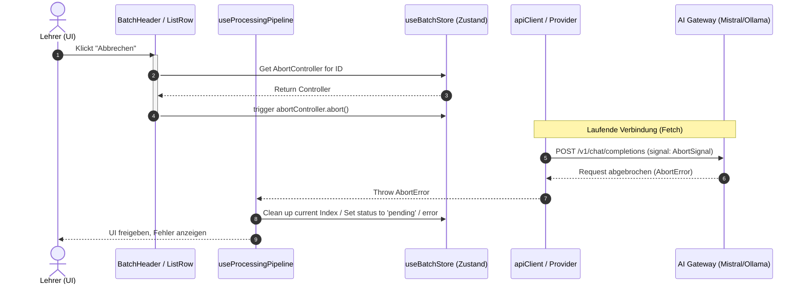

# RFC: Central AI Request Abort & Timeout Mechanism

## 1. Executive Summary & Kontext
> [!NOTE]
> **Zusammenfassung:** Dieses Dokument beschreibt die Einführung eines systemweiten Abbruch- und Timeout-Mechanismus für alle KI-API-Anfragen in Koreki. Durch den Einsatz von nativen `AbortController`-Instanzen und einer zentralen Zustand-Registry wird sichergestellt, dass hängende API-Aufrufe die Anwendung nicht blockieren, Ressourcen freigegeben und Credits vor unnötigem Verbrauch geschützt werden.
> **Zielgruppe:** Entwickler, UI-Designer, Backend-Systemarchitekten.

Es kommt vereinzelt vor, dass asynchrone KI-Anfragen (sei es durch Netzwerkabbrüche, Gateway-Timeouts der Provider oder extreme Überlastungen) ohne Rückmeldung "ins Leere laufen". Da die Benutzeroberfläche bei laufender Korrektur gesperrt ist (`loading: true`), führt dies zu einer Blockade der Anwendung ohne Fehlerrückmeldung. 

Dieses RFC stellt einen robusten Lösungsansatz vor, um KI-Anfragen in allen drei Hauptbereichen abbrechbar zu machen:
1. **Musterlösung hochladen** (Layout-Analyse)
2. **Schülerlösung korrigieren** (Einzel-Korrektur)
3. **Stapelverarbeitung** (Batch-Korrektur)

---

## 2. Architektur & Systemdesign (Zentrales State Management)
> [!TIP]
> Die Steuerung der Abbrüche muss zentral im globalen Zustand-Store (`useBatchStore`) erfolgen, um Race-Conditions im parallelisierten `promisePool` zu vermeiden.

### Ablaufdiagramm der Request-Registrierung und des Abbruchs



### Zustand-Erweiterung (`useBatchStore.ts`)
Wir erweitern den globalen `useBatchStore` um eine Registry für aktive AbortController, typisiert über `requestId` (z.B. ein Index, ein Dateiname oder die Konstante `'model-solution'`).

```typescript
interface BatchStateStore {
    // ... bestehende Zustände ...
    
    // Registry für aktive AbortController
    activeRequests: Record<string, AbortController>;
    registerRequest: (id: string, controller: AbortController) => void;
    abortRequest: (id: string) => void;
    abortAllRequests: () => void;
    clearRequest: (id: string) => void;
}
```

---

## 3. Implementierung & Integration in den drei Scopes

### A) Scope 1: Upload Musterlösung (`cleanAndExtractLayout`)
Beim Laden und Analysieren der Musterlösung kann die Extraktion bei extrem komplexen Dokumenten hängen.
* **Technischer Flow:** 
  1. Beim Aufruf von `cleanAndExtractLayout` wird ein `AbortController` mit der ID `'model-solution'` registriert.
  2. Im UI (Musterlösungs-Panel) wird neben dem Lade-Spinner ein Button **"Analyse abbrechen"** gerendert.
  3. Beim Klick wird `abortRequest('model-solution')` aufgerufen, wodurch der laufende Fetch abgebrochen und `isLoadingModel(false)` gesetzt wird.

### B) Scope 2: Schülerlösung (Import/Extraktion & Einzel-Korrektur)
Hier müssen wir zwei verschiedene Phasen betrachten:

1. **Phase 1: Der Upload-Prozess (Import & Typisierung)**
   * **Mechanismus:** Wenn Schülerlösungen hochgeladen werden, bestimmt der Lehrer im PDF-Typ-Modal (`PDFTypeModal`), ob es sich um Scans oder digital lesbare PDFs (Typed) handelt:
     * **Scanned PDFs:** Hier erfolgt das Rendering der Previews (`previewDataUrls`) rein lokal im Client (via `pdfjs-dist`). **Es findet zu diesem Zeitpunkt kein API-Aufruf statt.**
     * **Typed PDFs:** Hier triggert das System unmittelbar nach der Typisierung automatisch den `startExtraction`-Prozess. Dieser führt eine lokale Text-Extraktion durch und feuert sofort im Hintergrund pro Dokument einen `clean-and-map` KI-API-Request (`performAIRequest`), um den extrahierten Text strukturiert den Aufgaben zuzuweisen.
   * **Problem:** Läuft einer dieser automatischen `clean-and-map`-Requests direkt nach dem Upload ins Leere, friert die UI im Ladezustand (`isLoadingBatch: true`) ein, noch bevor der Lehrer überhaupt auf "Korrigieren" klicken kann.
   * **Lösung:** Registrierung eines `AbortControllers` für den automatischen Hintergrund-Mapping-Prozess des Imports (`extract-${idx}`). Ein Abbruch-Button im Upload-Ladespinner entriegelt die UI sofort.

2. **Phase 2: Die Einzel-Korrektur (`processSingleFile`)**
   * **Mechanismus:** Ein Lehrer korrigiert einen einzelnen Schüler neu (z.B. nach einem Fehler).
   * **Lösung:** Beim Aufruf von `processSingleFile(idx)` wird ein `AbortController` mit der ID `student-${idx}` registriert. In der Zeile `BatchFileListItem` wird während des Status `isProcessing === true` ein "Abbrechen"-Button angezeigt, der die spezifische API-Verbindung kappt und das Item sauber zurück in den Zustand `pending` versetzt.

### C) Scope 3: Stapelverarbeitung (Batch Processing)
Hier laufen mehrere Anfragen nacheinander oder parallel im `promisePool`.
* **Technischer Flow:**
  1. Jedes Item im Pool erhält eine dedizierte `requestId` (z.B. `student-${idx}`).
  2. Im `BatchHeader` wird während der Stapelverarbeitung der Button **"Stapel abbrechen"** (anstatt des blockierten "Korrigieren"-Buttons) gerendert.
  3. Klickt der User darauf, wird `abortAllRequests()` ausgeführt. Alle laufenden Fetches brechen sofort ab, der Promise-Pool stoppt die Verarbeitung der verbleibenden Elemente, und alle noch ausstehenden Dokumente verbleiben sauber im Zustand `pending`. Bereits korrigierte Dokumente behalten ihr Ergebnis (`done`).

---

## 4. Security, Client- & Provider-Hardening
> [!IMPORTANT]
> Keine Implementierung ohne Security- und Performance-Absicherung. Wir müssen sicherstellen, dass Abbrüche auf allen Abstraktionsebenen sauber greifen.

* **Client-seitige Timeouts:** standardmäßig definieren wir zusätzlich einen festen Client-Timeout (z.B. 60 Sekunden für Standard-Korrekturen, 120 Sekunden für Handschriften/Qwen-Medium-Kognition) über `AbortSignal.timeout(60000)`, um unendliches Hängen auf OS-Ebene von vornherein auszuschließen.
* **Isomorpher Support (Tauri Desktop & Web):**
  * **Web (STANDARD / PURE-Fetch):** Greift nativ über die Fetch-API und leitet das Signal bis zum API-Server durch.
  * **Desktop (Tauri Rust-Proxy):** Da Tauri-Invokes nicht direkt über standardmäßiges JS `AbortSignal` abgebrochen werden können, implementieren wir eine doppelte Verteidigung:
    1. Der Rust `reqwest` Client in `execute_ai_proxy_command` wird mit einem robusten globalen Read-Timeout ausgestattet:
       ```rust
       let client = reqwest::Client::builder()
           .timeout(std::time::Duration::from_secs(90))
           .danger_accept_invalid_certs(true)
           .build()?;
       ```
    2. Im TypeScript Layer wird der Tauri `invoke` Aufruf in ein `Promise.race` mit dem Abort-Signal gehüllt, sodass das UI sofort reagiert, selbst wenn der Rust-Hintergrund-Thread bis zum Timeout weiterläuft.
* **Credit-Sicherheit:** Da Credits erst *nach* erfolgreicher Pipeline-Ausführung abgezogen werden (siehe `useProcessingPipeline.ts` Zeile 333), entstehen dem Nutzer durch einen vorzeitigen Abbruch keinerlei Credit-Verluste.

---

## 5. Testing & Referenzen
* **Verwandte Dokumente:** [Batch-Processing Lifecycle & UI State Management](./batch-processing-lifecycle.md)
* **Test-Coverage:** Die Abbruch-Logik wird durch Unit-Tests auf Hook-Ebene (`tests/unit/useProcessingPipeline.test.ts`) sowie einen Playwright-Integrationstest abgedeckt, der einen API-Timeout provoziert und das visuelle Entsperren des UI validiert.

---
*Status: Proposed*