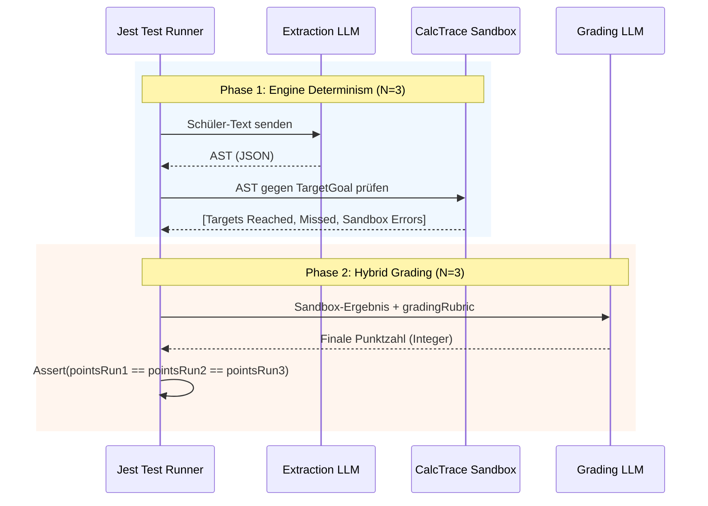

# AI Determinism Testing (Layer 2.5)

## 1. Executive Summary & Kontext
> [!NOTE]
> **Zusammenfassung:** Dieses Dokument beschreibt die Layer 2.5 E2E-Testarchitektur, mit der wir beweisen, dass die Koreki KI (Calc Engine + Hybrid Grading) bei gleicher Eingabe zu 100% deterministisch exakt dieselbe finale Punktzahl vergibt.
> **Zielgruppe:** KI-Entwickler, Prompt Engineers, QA

Durch den Einsatz von generativen LLMs besteht die Gefahr von inkonsistenten Bewertungen. Um das Vertrauen von Lehrern zu garantieren, muss die Pipeline für strukturierte Aufgaben (`calc-trace`) mathematisch beweisbar deterministisch sein.

---

## 2. Architektur & Systemdesign
Die Determinismus-Prüfung erfolgt in zwei Phasen, die den Produktions-Workflow exakt nachbilden.



---

## 3. Implementierung & Nutzung
Das Determinismus-Tool liegt als Jest-Testsuite unter `tests/integration/CalcDeterminism.test.ts`.

### Ausführung
Da diese Tests echte LLM-Aufrufe machen (und somit Token-Kosten verursachen), sind sie **nicht** an den regulären `npm test` oder Pre-Commit-Hook gebunden.

**Lokale Ausführung (Manuell):**
**Lokale Ausführung (Manuell):**
Voraussetzung: `.env.local` mit gültigem `MISTRAL_API_KEY`, `OPENAI_API_KEY` oder `MITTWALD_API_KEY`.
```bash
# Standard-Provider (meist Mistral)
npm run test:determinism

# Explizit Mistral (mit Temperature 0.0 + random_seed 42 Interceptor)
npm run test:determinism:mistral

# Explizit Qwen / OpenAI-Compatible (mit Temperature 0.3 + seed 42 Interceptor)
npm run test:determinism:qwen

# Lokales Ollama (mit Temperature 0.3 + seed 42 Interceptor in den Ollama-Options)
npm run test:determinism:ollama
```

### Hinzufügen neuer Testfälle
In der `CalcDeterminism.test.ts` können neue Fixtures in das `TEST_CASES` Array aufgenommen werden. 
Wichtig: Für Phase 2 muss die Eigenschaft `gradingRubric` (der textuelle Erwartungshorizont) im `target` Objekt definiert sein.

---

## 4. Security & Compliance
> [!IMPORTANT]
> **API Keys:** API Keys dürfen niemals in den Code committet werden. Für lokale Tests wird die `.env.local` genutzt. Falls das Tool später via GitHub Actions auf Pull Requests (PRs) ausgeführt wird, MÜSSEN die Keys zwingend als verschlüsselte GitHub Repository Secrets (z.B. `MISTRAL_API_KEY`) hinterlegt werden.

---

## 5. Testing & Referenzen
> [!WARNING]
> Änderungen an `src/lib/ai/prompt-builder.ts` oder den Core-Prompts erfordern einen zwingenden Re-Run dieses Tests, um Regressionen in der Punktevergabe auszuschließen.

* **Test-Skript:** `tests/integration/CalcDeterminism.test.ts`
* **Referenz-Skill:** `.claude/skills/industrial-testing/SKILL.md` (Sektion 8)

---

## 6. Architektonische Erkenntnisse: Die "Teilpunkte-Illusion"
> [!CAUTION]
> **PANG-Engine wird zwingend erforderlich:** Extensive E2E-Tests (Layer 2.5) haben im Juli 2026 bewiesen, dass LLMs (wie Mistral Large) bei unstrukturierten Teilpunkten **nicht** zu 100% deterministisch arbeiten – selbst bei erzwungener `Temperature = 0.0` und statischem `random_seed`.

### 6.1 Die Qwen-Anomalie
Um die Mistral-Ausfälle zu verifizieren, wurde in der Test-Suite ein dynamischer Provider-Umschalter integriert (`test:determinism:qwen`).
* **Ergebnis:** Das Qwen-Modell hat (über eine dedizierte OpenAI-kompatible Schnittstelle) mit `Temperature 0.3` und `seed 42` **alle** Determinismus-Tests zu 100% fehlerfrei bestanden.
* **Fazit:** Der Determinismus von Teilpunkten hängt aktuell von internen Server-Architekturen (MoE vs Dense) und geheimen Hardware-Rundungen der Provider ab. Ein Enterprise-System darf juristische Sicherheit nicht von Provider-Lotterien abhängig machen, weshalb harte Teilpunkte zukünftig rein durch die PANG-Sandbox berechnet werden müssen.

### 6.2 Die native Unit-Awareness (CalcTrace V8)
Um die restliche Fluktuation bei Skalenwechseln (z.B. Wh vs. kWh, oder A vs. mA) und Währungsrechnungen vollständig zu eliminieren, wurde in CalcTrace V8 eine native physikalische und monetäre Sandbox etabliert:
1. **Phase 1 (LLM):** Das LLM agiert als reiner Beobachter. Es kopiert die Formeln des Schülers inklusive ihrer literalen Einheiten (z. B. `4 kΩ * 1.846 mA` oder `0.1916 kWh * 0.30 €/kWh`) direkt in das `formula`-Feld. Sollte das LLM mal keine Einheiten extrahieren können, dient das Feld `formulaUnit` als robuster Fallback für die Skalierung.
2. **Sandbox (Code):** Die Sandbox registriert custom Währungen (wie `EUR`/`€`, `USD`/`$`, `CHF`) direkt in `math.js`. Sie normalisiert Formeln (z.B. `Ω` -> `ohm`) und wertet diese nativ als physikalische Größen aus. Bei der Context Propagation verbleiben Ergebnisse als reine Zahlen (`context[step.id] = step.result`), um studentische Umrechnungs-Abkürzungen (wie `0.8 * 1000 = 800 mm`) fehlerfrei zu stützen.
* **Ergebnis:** Dies eliminiert jegliche mathematische Transformations-Verantwortung des LLMs, beendet prompt-basiertes Oszillieren bei Präfixwechseln und liefert ein absolut stabiles, deterministisches Grading.

---

## 7. Zielgrößen-Isolation bei strukturierten `_formel`-Kriterien (Juli 2026)

> [!NOTE]
> **Zusammenfassung:** Im strukturierten Kriterien-Pfad (`criteria`-Array, siehe `src/lib/ai/prompt-builder.ts`) wurde ein Kontaminations-Bug gefunden: Ein Rechenfehler bei EINER Zielgröße einer Multi-Zielgrößen-Aufgabe (z. B. `I` in einer Reihenschaltungsaufgabe mit Rges/I/U1/U2) führte dazu, dass schwächere LLMs die `_formel`-Punkte auch bei fehlerfreien, unabhängigen Zielgrößen (z. B. `Rges`) fälschlich aberkannt haben.

### 7.1 Root Cause
Der `criteriaBlock`-Generator (`prompt-builder.ts`, Zeile ~170ff.) übergibt der Grading-LLM für `_formel`-Kriterien nur einen Hinweis zur Notations-Kulanz (Variablennamen, fehlende linke Seite), aber **keine explizite Aussage zur Unabhängigkeit der Zielgrößen voneinander**. Dadurch generalisieren manche Modelle einen lokal gemeldeten Rechenfehler fälschlich auf die gesamte Aufgabe ("Kreuz-Kriterien-Kontamination").

**Laufzeit (gemessen 03.09.2026).** Gegen ein lokales `qwen3.6:35b` braucht Phase 2 (Hybrid-Bewertung) rund **sieben Minuten je Iteration**. Bei `ITERATIONS = 5` reisst der Lauf damit das in der Datei gesetzte Jest-Limit von 20 Minuten (`jest.setTimeout(1200000)`) — das ist ein Laufzeit-Abbruch, kein Bewertungsfehler. Wer den Test lokal vollstaendig fahren will, braucht ein hoeheres Limit oder weniger Iterationen. Phase 1 (reine Sandbox-Auswertung) laeuft in gut zwei Minuten durch.

Zusätzlich hatte der Layer-2.5-Determinismus-Test (`tests/integration/CalcDeterminism.test.ts`) `settings.activeSkillIds` initial nie gesetzt, obwohl die App für MINT-Aufgaben standardmäßig Folgefehler-Fairness-Skills aktiviert (`ModelSolutionCard.tsx:257/301`). Ein frisches SaaS-Konto hat laut `prisma/schema.prisma` (`activeSkillIds Json @default("[]")`) ebenfalls initial keine Skills aktiv, bis der Nutzer aktiv ein Profil in den Settings speichert.

### 7.2 Angewendeter Fix
1. **Testfidelity:** `activeSkillIds` im Test ergänzt (mirrort den App-Default), damit der Test reale Nutzungsbedingungen abbildet.
2. **Prompt-Klarstellung:** Im `criteriaBlock`-Intro (einmalig pro Aufgabe, nicht pro Kriterium wiederholt) wurde ergänzt: *"WICHTIG - Zielgrößen-Isolation: Bewerte jedes Kriterium AUSSCHLIESSLICH anhand der ihm zugeordneten Zielgröße. Ein Rechen-, Werte- oder Ergebnisfehler bei EINER Zielgröße darf die Bewertung der Kriterien ANDERER Zielgrößen derselben Aufgabe unter keinen Umständen beeinflussen."*

### 7.3 Modell-Vergleich nach dem Fix (lokal via Ollama, identischer Testfall, 5 Iterationen, Temp 0.3 / Seed 42)

| Modell | Ergebnis je Iteration | Verhalten |
|---|---|---|
| Qwen3.6:35b | 11, 11, 11, 11, 11 | ✅ deterministisch und korrekt |
| Mistral-Small3.2:24B | 7, 7, 7, 7, 7 | ✅ deterministisch, aber weiterhin falsch — ignoriert die Klarstellung vollständig |
| Gemma4:12b | 11, 7, 7, 7, 7 | ❌ weiterhin nicht-deterministisch |

Phase 1 (CalcTrace-Extraktion + Sandbox-Auswertung) blieb bei **allen drei Modellen** über sämtliche Iterationen zu 100% deterministisch — die Instabilität beschränkt sich ausschließlich auf die LLM-Bewertung der `_formel`-Kriterien in Phase 2.

### 7.4 Fehlgeschlagener Versuch: explizite Pro-Kriterium-Fakten (Regression bei Qwen)
> [!CAUTION]
> **Lehre:** Ein zusätzlicher, pro `_formel`-Kriterium wiederholter "Zusatz-Fakt" (z. B. *"Diese Zielgröße hat laut Sandbox KEINEN Rechenfehler — Fehler bei ANDEREN Zielgrößen sind irrelevant"*) wurde testweise ergänzt, um die Isolation noch expliziter zu machen. Ergebnis: **Qwen3.6:35b fiel dadurch von 11/12 auf einen neuen, stabilen Fehlzustand von 8/12** — der bis dahin perfekte Provider wurde durch die "Verbesserung" beschädigt. Die Änderung wurde sofort zurückgerollt; Qwen war danach nachweislich wieder bei 11/12.
>
> **Erklärung:** Das wiederholte Erwähnen "es gibt hier irgendwo einen Fehler, aber ignoriere ihn" macht den Fehler im Prompt salienter, statt ihn unsichtbar zu machen (Analogie: "Denk nicht an einen rosa Elefanten"). Zusätzlich wurde beim fehlerhaften Zielwert selbst (`I`) fälschlich suggeriert, der Fehler beträfe auch die Formel — obwohl nur das Ergebnis falsch war. Das bestätigt die im vorherigen Abschnitt zitierte "Anchoring"-Literatur: mehr explizite Fehler-Erwähnungen sind nicht automatisch besser.
>
> **Konsequenz für zukünftige Prompt-Änderungen an diesem Pfad:** Jede weitere Änderung muss zwingend gegen Qwen als Regressionstest laufen, nicht nur gegen die schwächeren Modelle — sonst wird ein Modell repariert und ein anderes, vorher einwandfreies, kaputt gemacht.

### 7.5 Erweiterter Modell-Sweep (gleicher Testfall, Ollama, 40GB-VRAM-Host)
Zusätzlich zu den drei Modellen aus 7.3 wurden zwei weitere Größenklassen getestet, um zu prüfen, ob die Instabilität eine reine Kapazitätsfrage ist:

| Modell | Parameter | Ergebnis je Iteration | Verhalten |
|---|---|---|---|
| Qwen3.6:35b | 36B (MoE) | 11, 11, 11, 11, 11 | ✅ deterministisch und korrekt |
| **Gemma4:31b** | 31B | **11, 11, 11, 11, 11** | ✅ **deterministisch und korrekt** |
| Mistral-Small3.2 | 24B | 7, 7, 7, 7, 7 | deterministisch, aber falsch |
| Gemma4:12b | 12B | 7, 11, 11, 7, 11 | nicht-deterministisch |
| **Llama3.1** | 8B | **0, 0, 0, 0, 0** | deterministisch, aber vollständiger Kollaps (leere Kriterien-Bewertung, `pointsObtained` fällt auf 0 zurück) |

**Wichtige Differenzierung:** Bei der **Gemma-Familie** ist die Instabilität nachweislich eine **Kapazitätsfrage** — Gemma4:31b (mehr als doppelte Parameterzahl von Gemma4:12b) löst die Aufgabe tadellos. Bei **Mistral-Small** ist es das **nicht**: Die explizite Isolations-Anweisung aus 7.2 zeigte dort exakt null Wirkung (Abschnitt 7.3), was eher für einen systematischen, modellfamilien-spezifischen Bias spricht als für eine reine Größenfrage — ein größeres Cloud-Mistral-Modell würde also nicht zwangsläufig das gleiche Verhalten zeigen wie Gemma4:31b. Bei 8B-Modellen (Llama3.1) bricht die Fähigkeit, das strukturierte 12-Kriterien-Format überhaupt korrekt zu bedienen, komplett zusammen — das ist kein Grading-Genauigkeitsproblem mehr, sondern ein Format-Kollaps.

**Nebenbefund zu Abschnitt 6.1:** Qwen3.6:35b — in allen Tests durchgehend das zuverlässigste Modell — ist laut Ollama-Metadaten selbst als `qwen35moe` (Mixture-of-Experts) getaggt, nicht Dense. Das relativiert die frühere Vermutung aus 6.1, MoE-Architektur sei grundsätzlich mit schlechterer Determinismus-Eigenschaft verbunden — zumindest für die hier getestete Art von Instruction-Following/Isolations-Aufgabe war das MoE-Modell das stabilste im gesamten Vergleich.

### 7.6 Nebenbefund: Governance
Die `criteriaBlock`/`statusText`-Strings liegen aktuell hartkodiert in `prompt-builder.ts` statt als `.md`-Content in `src/prompts/` (Abweichung von der Content-in-Library-Konvention). Grund: Der Text wird pro Kriterium dynamisch aus Sandbox-Daten (Schritt-IDs, Punktzahlen, Status) zusammengesetzt — eine Schleife mit Fallunterscheidungen, die das bestehende einfache `{{PLATZHALTER}}`-Templating nicht abbilden kann. Eine Auslagerung der reinen Formulierungen (nicht der Auswahllogik) in eine Content-Datei ist als spätere, rein strukturelle Aufräumaufgabe vorgemerkt — unabhängig vom hier beschriebenen Fix.

### 7.7 Bekannte Einschränkung (bewusst akzeptiert, Stand Juli 2026)
> [!IMPORTANT]
> Die Zielgrößen-Isolation für `_formel`-Kriterien im strukturierten Kriterien-Pfad ist derzeit **nicht bei allen Modellen verlässlich**, selbst mit expliziter Anweisung. Zuverlässig getestet: Qwen3.6:35b (36B, MoE) und Gemma4:31b — beide 100% deterministisch und korrekt. Nicht zuverlässig: Mistral-Small3.2 (24B, konstant falsch trotz expliziter Anweisung — vermutlich systematischer Bias, keine Kapazitätsfrage), Gemma4:12b (instabil, aber vermutlich durch mehr Kapazität lösbar), Llama3.1:8b (kompletter Format-Kollaps).
>
> **Bewusste Entscheidung:** Für den Moment wird kein weiterer Prompt- oder Sandbox-Aufwand betrieben (keine deterministische Isolations-Metadaten-Injektion, kein AST-Formel-Vergleich, kein separater Micro-Call pro Zielgröße). Diese Einschränkung wird als bekanntes Risiko für Community-Edition-Nutzer mit schwächeren/kleineren lokalen Modellen dokumentiert und bei Bedarf erneut aufgegriffen, falls reale Nutzer betroffen sind. Mögliche zukünftige Ansätze (nicht umgesetzt, siehe auch 7.4-Lehre — jede Änderung braucht einen Qwen-Regressionstest): physische Trennung der `_formel`-Bewertung in einen eigenen, isolierten Micro-Call pro Zielgröße (einzige Option mit echter Garantie statt Wahrscheinlichkeitsverbesserung laut externer Zweitmeinung), Checklisten-Format analog zum Legacy-Pfad (`math-engine/hybrid-instruction.md`), oder JSON-Reasoning-Feld pro Kriterium statt gemeinsamem Freitext.

