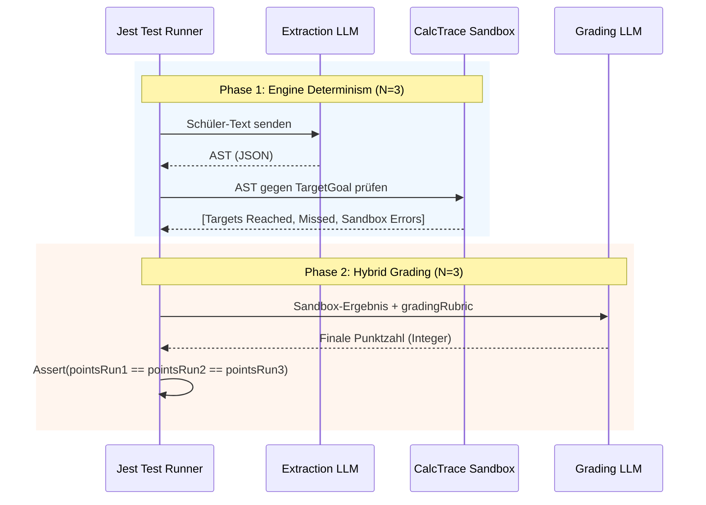

# AI Determinism Testing (Layer 2.5)

## 1. Executive Summary & Kontext
> [!NOTE]
> **Zusammenfassung:** Dieses Dokument beschreibt die Layer 2.5 E2E-Testarchitektur, mit der wir beweisen, dass die Koreki KI (Calc Engine + Hybrid Grading) bei gleicher Eingabe zu 100% deterministisch exakt dieselbe finale Punktzahl vergibt.
> **Zielgruppe:** KI-Entwickler, Prompt Engineers, QA

Durch den Einsatz von generativen LLMs besteht die Gefahr von inkonsistenten Bewertungen. Um das Vertrauen von Lehrern zu garantieren, muss die Pipeline für strukturierte Aufgaben (`calc-trace`) mathematisch beweisbar deterministisch sein.

---

## 2. Architektur & Systemdesign
Die Determinismus-Prüfung erfolgt in zwei Phasen, die den Produktions-Workflow exakt nachbilden.



---

## 3. Implementierung & Nutzung
Das Determinismus-Tool liegt als Jest-Testsuite unter `tests/integration/CalcDeterminism.test.ts`.

### Ausführung
Da diese Tests echte LLM-Aufrufe machen (und somit Token-Kosten verursachen), sind sie **nicht** an den regulären `npm test` oder Pre-Commit-Hook gebunden.

**Lokale Ausführung (Manuell):**
**Lokale Ausführung (Manuell):**
Voraussetzung: `.env.local` mit gültigem `MISTRAL_API_KEY`, `OPENAI_API_KEY` oder `MITTWALD_API_KEY`.
```bash
# Standard-Provider (meist Mistral)
npm run test:determinism

# Explizit Mistral (mit Temperature 0.0 + random_seed 42 Interceptor)
npm run test:determinism:mistral

# Explizit Qwen / OpenAI-Compatible (mit Temperature 0.3 + seed 42 Interceptor)
npm run test:determinism:qwen

# Lokales Ollama (mit Temperature 0.3 + seed 42 Interceptor in den Ollama-Options)
npm run test:determinism:ollama
```

### Hinzufügen neuer Testfälle
In der `CalcDeterminism.test.ts` können neue Fixtures in das `TEST_CASES` Array aufgenommen werden. 
Wichtig: Für Phase 2 muss die Eigenschaft `gradingRubric` (der textuelle Erwartungshorizont) im `target` Objekt definiert sein.

---

## 4. Security & Compliance
> [!IMPORTANT]
> **API Keys:** API Keys dürfen niemals in den Code committet werden. Für lokale Tests wird die `.env.local` genutzt. Falls das Tool später via GitHub Actions auf Pull Requests (PRs) ausgeführt wird, MÜSSEN die Keys zwingend als verschlüsselte GitHub Repository Secrets (z.B. `MISTRAL_API_KEY`) hinterlegt werden.

---

## 5. Testing & Referenzen
> [!WARNING]
> Änderungen an `src/lib/ai/prompt-builder.ts` oder den Core-Prompts erfordern einen zwingenden Re-Run dieses Tests, um Regressionen in der Punktevergabe auszuschließen.

* **Test-Skript:** `tests/integration/CalcDeterminism.test.ts`
* **Referenz-Skill:** `.agents/skills/industrial_testing/SKILL.md` (Sektion 8)

---

## 6. Architektonische Erkenntnisse: Die "Teilpunkte-Illusion"
> [!CAUTION]
> **PANG-Engine wird zwingend erforderlich:** Extensive E2E-Tests (Layer 2.5) haben im Juli 2026 bewiesen, dass LLMs (wie Mistral Large) bei unstrukturierten Teilpunkten **nicht** zu 100% deterministisch arbeiten – selbst bei erzwungener `Temperature = 0.0` und statischem `random_seed`.

### 6.1 Die Qwen-Anomalie
Um die Mistral-Ausfälle zu verifizieren, wurde in der Test-Suite ein dynamischer Provider-Umschalter integriert (`test:determinism:qwen`).
* **Ergebnis:** Das Qwen-Modell hat (über eine dedizierte OpenAI-kompatible Schnittstelle) mit `Temperature 0.3` und `seed 42` **alle** Determinismus-Tests zu 100% fehlerfrei bestanden.
* **Fazit:** Der Determinismus von Teilpunkten hängt aktuell von internen Server-Architekturen (MoE vs Dense) und geheimen Hardware-Rundungen der Provider ab. Ein Enterprise-System darf juristische Sicherheit nicht von Provider-Lotterien abhängig machen, weshalb harte Teilpunkte zukünftig rein durch die PANG-Sandbox berechnet werden müssen.
