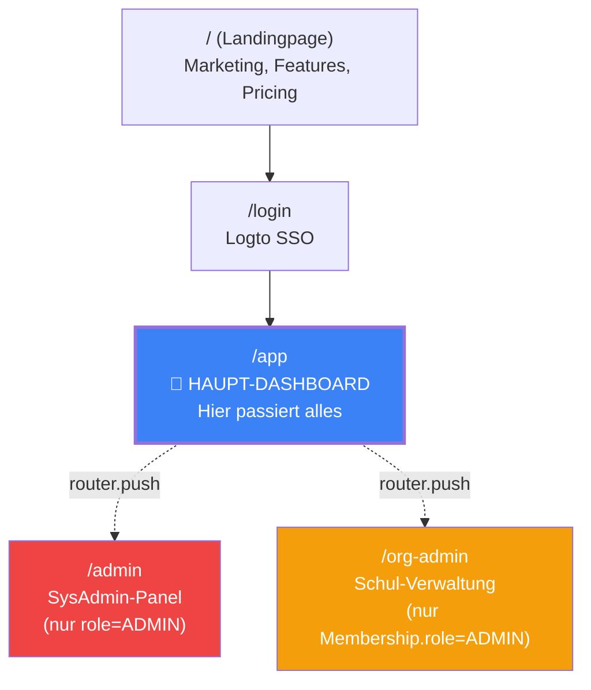
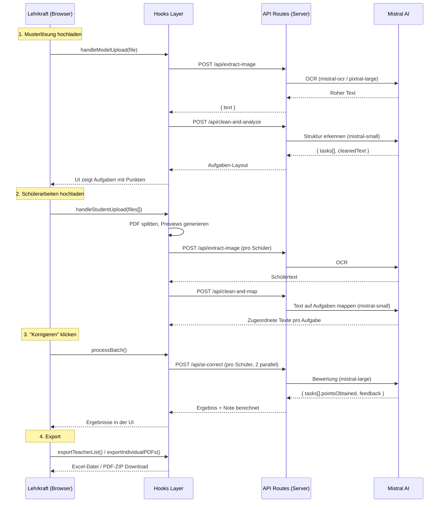
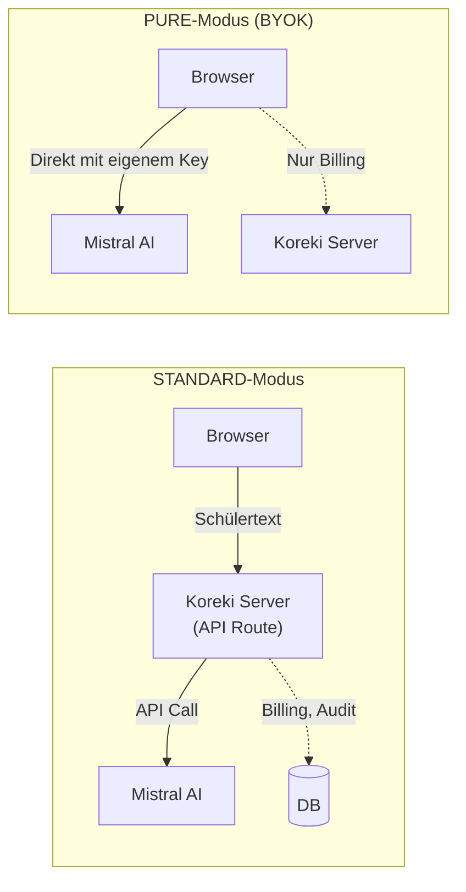

# Software-Onboarding: Koreki verstehen & loslegen

## 1. Executive Summary & Kontext

> [!NOTE]
> **Zusammenfassung:** Koreki ist eine Web-App, mit der Lehrkräfte Schülerarbeiten per KI korrigieren und bewerten lassen. Dieses Dokument erklärt die Software aus der Perspektive eines neuen Entwicklers: Was macht sie, wie ist sie aufgebaut, und wo finde ich was?
> **Zielgruppe:** Neue Entwickler, die schnell produktiv werden müssen.

### Was macht Koreki? — In 60 Sekunden

Stell dir vor, ein Lehrer hat 30 handgeschriebene Klausuren auf dem Schreibtisch. Statt jede einzeln zu lesen und zu bewerten, macht er Folgendes:

1. **Er tippt/lädt seine Musterlösung hoch** → Koreki analysiert sie automatisch und erkennt die Aufgabenstruktur (Aufgabe 1, 2, 3 mit jeweiligen Punkten)
2. **Er scannt die Schülerarbeiten als PDF** → Koreki erkennt den Text per OCR, bereinigt ihn und ordnet ihn den Aufgaben zu
3. **Ein Klick auf „Korrigieren"** → Die KI bewertet jede Schülerantwort gegen die Musterlösung, vergibt Punkte und schreibt individuelles Feedback
4. **Export** → Der Lehrer bekommt eine Excel-Tabelle mit allen Noten + individuelle PDF-Feedbackbögen für jeden Schüler

**Das ist der Golden Thread** — der zentrale Pfad der App. Wenn du das verstehst, verstehst du Koreki.

---

## 2. Architektur & Systemdesign

### 2.1 Lokal starten

```bash
# 1. Repo klonen & Deps installieren
npm install

# 2. Environment einrichten
cp .env.example .env.local
# → Dann die Werte ausfüllen (siehe unten)

# 3. DB migrieren & starten
npx prisma@6 migrate deploy
npm run dev
# → http://localhost:3000
```

**Benötigte Env-Variablen:**

| Variable | Woher? | Wofür? |
|---|---|---|
| `MISTRAL_API_KEY` | [console.mistral.ai](https://console.mistral.ai) | KI (OCR + Korrektur) |
| `DATABASE_URL` | Lokales PostgreSQL | Nutzer, Credits, Compliance |
| `LOGTO_ENDPOINT`, `LOGTO_APP_ID`, `LOGTO_APP_SECRET` | Logto-Instance | Authentifizierung |
| `LOGTO_COOKIE_SECRET` | Selbst generieren (32+ Zeichen) | Session-Verschlüsselung |
| `NEXT_PUBLIC_BASE_URL` | `http://localhost:3000` | Redirect-URLs |

### 2.2 Die Screens — Was sieht der Nutzer?



**Die wichtigen Seiten:**

| Route | Datei | Was passiert dort |
|---|---|---|
| `/app` | `pages/app.tsx` | **Das Herzstück.** Upload, OCR, Korrektur, Export — alles auf einer Seite |
| `/admin` | `pages/admin.tsx` | SysAdmin verwaltet Nutzer, Credits, Workspaces, Kosten, Audit-Logs |
| `/org-admin` | `pages/org-admin.tsx` | Schulverwalter sehen ihre Mitglieder, Invite-Code, Credits |
| `/` | `pages/index.tsx` | Landingpage (Marketing-Layout) |
| `/pricing` | `pages/pricing.tsx` | Credit-Pakete, Stripe-Checkout |

> [!TIP]
> **90% der Feature-Arbeit passiert in und um `/app`.** Das ist die Seite, die du als erstes verstehen musst.

### 2.3 Der Golden Thread — Schritt für Schritt im Code

So sieht der Korrektur-Pfad technisch aus:



**Die Schlüssel-Dateien dafür:**

| Schritt | Datei | Was tut sie |
|---|---|---|
| **Einstiegspunkt** | `pages/app.tsx` | Thin Controller — verbindet Hooks mit UI-Komponenten |
| **Datei-Verarbeitung** | `hooks/useFileProcessor.ts` | Fassade: delegiert an Sub-Hooks |
| **→ Upload & Extraktion** | `hooks/file-processor/useBatchActions.ts` | Dateien annehmen, Batch aufbauen |
| **→ OCR + Cleaning + Korrektur** | `hooks/file-processor/useProcessingPipeline.ts` | Die eigentliche Pipeline-Logik |
| **KI-Routing** | `lib/ai/ai-orchestrator.ts` | Entscheidet: PURE (direkt) vs. STANDARD (Server) |
| **Prompt-Bau** | `lib/ai/prompt-builder.ts` | Baut die System-Prompts zusammen |
| **Prompts (Markdown)** | `src/prompts/*.md` | Die tatsächlichen Anweisungen an die KI |
| **Server: OCR** | `pages/api/extract-image.ts` | Vision-API aufrufen, Billing |
| **Server: Cleaning** | `pages/api/clean-and-analyze.ts` | Musterlösung → Aufgaben-Struktur |
| **Server: Mapping** | `pages/api/clean-and-map.ts` | Schülertext → Aufgaben zuordnen |
| **Server: Korrektur** | `pages/api/ai-correct.ts` | Pädagogische Bewertung |
| **Export** | `lib/excel.ts`, `lib/pdf.ts` | Excel/PDF-Generierung (alles client-side) |

### 2.4 Welches KI-Modell für welche Aufgabe?

Aus `src/lib/ai/constants.ts`:

| Konstante | Modell | Aufgabe | Warum dieses? |
|---|---|---|---|
| `MISTRAL_OCR_MODEL` | `mistral-ocr-latest` | Text aus Scans extrahieren | Spezialisierte OCR-Engine |
| `MISTRAL_UTILS_MODEL` | `mistral-small-latest` | Layout-Analyse (Digital) | Effizient für strukturierte Digital-Texte |
| `MISTRAL_CORE_MODEL` | `mistral-large-latest` | Analyse (Scan) & Korrektur | Maximale Präzision für unstrukturierte Inhalte |

> **Merke:** Digitale Vorverarbeitung nutzt das **schnelle** Modell (`small`). Komplexe Analysen von Scans und die finale pädagogische Korrektur nutzen das **große** Modell (`large`).

### 2.5 Die zentrale Datenstruktur: `BatchFile`

Alles dreht sich um diesen Typ (aus `src/types/index.ts`):

```typescript
interface BatchFile {
    name: string;              // "Schüler #1"
    originalName?: string;     // "Moritz Beispielfeld"
    status: 'pending' | 'processing' | 'done' | 'error';
    
    // Input
    files?: File[];            // Originale Upload-Dateien
    fileText?: string;         // Extrahierter/bereinigter Text
    tasks?: Task[];            // Text aufgeteilt nach Aufgaben
    documentType?: 'typed' | 'scanned';
    
    // OCR
    ocrDone?: boolean;
    previewDataUrls?: string[];  // Vorschau-Bilder
    pageCount?: number;
    pageRange?: [number, number]; // Bei gesplitteten PDFs
    
    // Privacy
    isRedacted?: boolean;
    redactedDataUrls?: string[]; // Anonymisierte Bilder für Cloud-OCR
    
    // Output
    result: Analysis | null;   // KI-Bewertung (Punkte, Feedback)
    grade?: string;            // Berechnete Note ("2,3")
    error: string | null;
    
    // UI
    selected?: boolean;        // Für Batch-Auswahl
    estimatedCredits?: number;
}
```

Ein `BatchFile` durchläuft den Lifecycle: `pending` → (OCR) → (Cleaning) → `processing` (Korrektur) → `done`.

### 2.6 State-Management: Wo lebt was?

```
┌─────────────────────────────────────────────────────────────┐
│  BROWSER (Zustand Stores — In-Memory, vergänglich)          │
├─────────────────────────────────────────────────────────────┤
│  useBatchStore    → batchFiles[], processingIndex           │
│  useDashboardStore → modelSolution, tasksLayout, pureApiKey │
│                                                             │
│  ⚠️ F5/Refresh = alles weg! Das ist Absicht (DSGVO).       │
│  Schülerdaten dürfen NIE persistiert werden.                │
└─────────────────────────────────────────────────────────────┘

┌─────────────────────────────────────────────────────────────┐
│  TanStack Query Cache (Browser, temporär)                   │
├─────────────────────────────────────────────────────────────┤
│  ['user']    → User-Objekt inkl. Credits, Rolle, Workspace  │
│  ['aiStatus'] → Budget-Status (Cost-Brake aktiv?)           │
└─────────────────────────────────────────────────────────────┘

┌─────────────────────────────────────────────────────────────┐
│  PostgreSQL (Server, persistent)                            │
├─────────────────────────────────────────────────────────────┤
│  User, Workspace, Membership → Accounts & Orgas             │
│  PromptProfile → Individualisierte Korrektur-Prompts        │
│  SystemSettings (Singleton) → Budgets, globaler Prompt       │
│  PrivacyLog → Audit Trail (90 Tage Retention)               │
│  ProcessedStripeSession → Idempotente Zahlungen              │
└─────────────────────────────────────────────────────────────┘
```

> [!CAUTION]
> **Die wichtigste Regel:** Schülertexte, Uploads, Bilder — alles was schülerbezogen ist — existiert **nur** im Browser-RAM (Zustand). Niemals `localStorage`, niemals Datenbank. F5 drücken = Daten weg. Das ist kein Bug, das ist DSGVO by design.

---

## 3. Implementierung & Nutzung

### 3.1 Code-Architektur: Wer macht was?

```
pages/app.tsx          ← "Thin Controller" — verbindet alles
    │
    ├── hooks/useAuth.ts              ← Login-Status, User-Daten (TanStack Query)
    ├── hooks/useDashboardOrchestrator.ts  ← Modale, Compliance-Gating, Zustand-Store
    ├── hooks/useFileProcessor.ts     ← Fassade für die gesamte Dateiverarbeitung
    │   ├── useBatchState.ts          ← Zustand Store (batchFiles)
    │   ├── useBatchActions.ts        ← Upload, Import, Relink
    │   └── useProcessingPipeline.ts  ← OCR, Cleaning, Korrektur
    ├── hooks/usePromptGovernance.ts  ← Prompt-Profile laden
    └── hooks/useDashboardActions.ts  ← Settings speichern, Mode wählen
```

**Die goldene Regel: „Logic in Lib, State in Hook"**

| Schicht | Aufgabe | Beispiel |
|---|---|---|
| `components/` | **Rendern.** Nur JSX, max 150 LOC. Keine Business-Logik. | `BatchProcessor.tsx` zeigt die Batch-Liste |
| `hooks/` | **Orchestrieren.** State verwalten, APIs aufrufen, Lifecycle steuern. | `useProcessingPipeline` ruft die KI-APIs auf |
| `lib/` | **Berechnen.** Pure Functions, isoliert testbar, kein React. | `calculateGrade(85)` → `"1,8"` |
| `pages/api/` | **Server-Logik.** Auth prüfen, KI-API aufrufen, Billing buchen. | `ai-correct.ts` validiert, ruft Mistral, bucht Credits |

### 3.2 Betriebsmodi: Wie kommt die KI zum Schülertext?

Koreki hat zwei Betriebsmodi — das ist zentral für das Verständnis:



| Modus | Datenfluss | API-Key | Wer sieht die Schülerdaten? |
|---|---|---|---|
| **STANDARD** | Browser → Koreki Server → Mistral | Vom Server | Koreki-Server + Mistral |
| **PURE (BYOK)** | Browser → Mistral direkt | Eigener Key des Lehrers | Nur Mistral (der Server sieht nichts) |

Der Modus wird in `ai-orchestrator.ts` → `performAIRequest()` geroutet.

### 3.3 API-Sicherheit: Der `withSecurity()` Wrapper

**Jede** API-Route ist durch einen einzigen Wrapper geschützt (`src/lib/security.ts`):

```typescript
// So sieht jede API-Route aus:
export default withSecurity(async (req, res) => {
    // Hier ist der User bereits authentifiziert
    // Rate-Limit ist geprüft
    // Fairness-Check (Textlänge) ist bestanden
    const { claims } = req.user;
    // ... Business-Logik
}, { requireAdmin: 'SYS' }); // Optional: Admin-Berechtigung
```

**Was passiert im Wrapper (in dieser Reihenfolge):**

1. **Auth-Check** → Ist der User eingeloggt? (Logto)
2. **Fairness-Check** → Ist der Text ≤ 10.000 Zeichen/Seite?
3. **Rate-Limit** → Zu viele Anfragen? (429)
4. **RBAC** → Falls `requireAdmin`: DB-Lookup ob User/Membership die nötige Rolle hat

### 3.4 Das Rollen-System

```
SysAdmin (User.role = "ADMIN")
    └── Sieht /admin, kann alles global verwalten

OrgAdmin (Membership.role = "ADMIN" in einem bestimmten Workspace)
    └── Sieht /org-admin, kann NUR die eigene Organisation verwalten

Member (Membership.role = "MEMBER")
    └── Sieht /app, nutzt die App normal
```

Wichtig: Die Rolle wird **immer** gegen die Datenbank geprüft (`prisma.user.findUnique` / `prisma.membership.findUnique`), nie nur gegen den Logto-Token.

### 3.5 Compliance-Gating: Modaler Triage-Flow

Beim Laden von `/app` prüft der `useDashboardOrchestrator` automatisch:

```
User lädt /app
    ↓
Mode = UNSET? → Zeige OnboardingModal (STANDARD/PURE/TRIAL wählen)
    ↓
AVV nicht akzeptiert? → Zeige AVVUploadModal (Datenschutz-Vereinbarung)
    ↓
Mode = PURE & kein Key? → Zeige PureKeyModal (API-Key eingeben)
    ↓
✅ Alles ok → Dashboard nutzbar
```

### 3.6 Die Ordnerstruktur — Referenz

```
src/
├── components/
│   ├── ui/            # Basis-Primitives (Button, Card, Badge, Tabs, Input...)
│   │                    → PFLICHT: Immer diese nutzen, nie raw HTML
│   ├── batch/         # Alles rund um die Batch-Korrektur-Ansicht
│   ├── dashboard/     # Dashboard-Modals (gebündelt in DashboardModals.tsx)
│   ├── admin/         # SysAdmin: UserTable, WorkspaceManager, CostOverview
│   ├── org/           # OrgAdmin: OrgStats, OrgMemberTable, OrgModals
│   ├── marketing/     # Landingpage-Sektionen
│   ├── layout/        # Header, Footer, Navigation
│   ├── upload/        # Upload-Bereich
│   └── *.tsx          # Top-Level Modals (Credits, Help, Redaction, Split...)
│
├── hooks/
│   ├── store/         # Zustand Stores (useBatchStore, useDashboardStore)
│   ├── file-processor/ # Die KI-Pipeline (Extraction, OCR, Korrektur)
│   └── use*.ts        # Domain-Hooks (Auth, Admin, Billing, Prompts...)
│
├── lib/               # Pure Business Logic — KEIN React hier
│   ├── ai/            # KI-Orchestrierung (constants, orchestrator, prompts)
│   ├── security.ts    # withSecurity() Wrapper
│   ├── billing.ts     # Credit-Verwaltung, Cost-Brake
│   ├── logic.ts       # Noten-Berechnung, Diff, Batch-Reindexing
│   ├── excel.ts       # Excel-Export (SheetJS)
│   ├── pdf.ts         # PDF-Export (jsPDF)
│   ├── logger.ts      # PII-bereinigte Konsole
│   └── audit-service.ts  # Security-Events loggen
│
├── layouts/           # Seiten-Shells
│   ├── AppLayout.tsx       # Für die App (minimalistisch)
│   ├── AdminLayout.tsx     # Für Admin-Panels
│   └── MarketingLayout.tsx # Für öffentliche Seiten (Premium Look)
│
├── prompts/           # LLM-Anweisungen als Markdown
│   ├── vision.md           # OCR-Extraktion
│   ├── clean-and-analyze.md # Musterlösung → Aufgaben-Struktur
│   ├── clean-and-map.md     # Schülertext → Aufgaben mappen
│   └── correction.md        # Pädagogische Bewertung
│
├── pages/api/         # Server-Side Endpoints
│   ├── extract-image.ts    # OCR
│   ├── clean-and-*.ts      # Cleaning Pipeline
│   ├── ai-correct.ts       # KI-Korrektur
│   ├── user.ts             # User-Context laden
│   ├── admin/              # SysAdmin APIs
│   ├── org-admin/           # OrgAdmin APIs
│   ├── billing/            # Credit-Management
│   ├── stripe/             # Payment Webhooks
│   └── privacy/            # DSGVO Compliance
│
├── styles/globals.css  # Design Tokens, Animationen
└── types/index.ts      # Zentrale TypeScript Types
```

---

## 4. Security & Compliance

> [!IMPORTANT]
> Koreki verarbeitet Schülerdaten (PII). Drei Regeln, die du nie brechen darfst:

### Die drei absoluten Regeln

| # | Regel | Warum |
|---|---|---|
| 1 | **Schülerdaten nie persistieren** | DSGVO. Nur Zustand-RAM. Nie localStorage, nie DB. |
| 2 | **Jede API-Route durch `withSecurity()`** | Auth, Rate-Limit, Fairness, RBAC — alles in einem Wrapper |
| 3 | **Jede DB-Query mit `workspaceId` filtern** | Mandantentrennung. Keine globalen Abfragen auf Geschäftsdaten |

### Die 8 Sicherheitssäulen (Kurzreferenz)

| # | Säule | Wo im Code |
|---|---|---|
| 1 | Rate Limiting | `lib/rate-limit.ts` → In-Memory Limiter |
| 2 | Audit Logging | `lib/audit-service.ts` → `PrivacyLog` Tabelle |
| 3 | CI/CD Guard | `npm run security-check` |
| 4 | Log Sanitization | `lib/logger.ts` → PII maskiert |
| 5 | Resource Fairness | `security.ts` → 10k Zeichen/Seite Cap |
| 6 | Data Retention | `instrumentation.ts` → 90-Tage Auto-Cleanup |
| 7 | Cost Brake | `SystemSettings` → Budget-Limits |
| 8 | DB-RBAC | `security.ts` → DB ist Source-of-Truth |

---

## 5. Testing & Referenzen

### Tests laufen lassen

```bash
npm test                # Unit + Integration (Jest)
npm run test:e2e        # E2E User Journeys (Playwright)
npm run security-check  # Security Audit (obligatorisch vor Release)
```

| Layer | Was wird getestet | Ordner | Befehl (SaaS / Desktop) |
|---|---|---|---|
| **L1 (Unit)** | Pure Functions aus `lib/` | `tests/unit/` | `npm test` / `cross-env KOREKI_TEST_PLATFORM=desktop npm test` |
| **L2 (Integration)** | API-Routen, Service-Interaktionen | `tests/integration/` | `npm test` / `cross-env KOREKI_TEST_PLATFORM=desktop npm test` |
| **L3 (E2E)** | Komplette User Journeys | `tests/e2e/` | `npm run test:e2e` |

### Coding-Regeln Cheatsheet

| Thema | Regel |
|---|---|
| **UI-Elemente** | Nur aus `@/components/ui/` — nie raw `<button>`, `<input>` |
| **Farben** | HSL-Variablen: `bg-primary`, `text-muted-foreground` — nie `bg-blue-500` |
| **Fonts** | `font-outfit` (Branding), `font-inter` (Text) |
| **Komponenten-Größe** | Max 150 Zeilen. Darüber = Refactor-Pflicht |
| **Modals** | Via React Portals an `document.body` — nie inline in Pages |
| **Navigation** | Immer `router.push()` — nie `window.location.href` (zerstört Zustand-State) |
| **Z-Index** | 0 (Hintergrund) → 10 (Content) → 20 (Navigation) → 9999 (Modals) |

### Weiterführende Dokumente

| Dokument | Thema |
|---|---|
| [architecture.md](./architecture.md) | Detaillierte technische Architektur |
| [auth-system.md](./auth-system.md) | Logto-Integration & Sessions |
| [billing.md](./billing.md) | Credit-System & Stripe |
| [correction-workflow.md](./correction-workflow.md) | Korrektur-Pipeline im Detail |
| [privacy-data-flow.md](./privacy-data-flow.md) | DSGVO-Datenflussanalyse |
| [tenancy.md](./tenancy.md) | Multi-Tenancy & RBAC |

### Dein erster Tag: 5 Schritte

1. **App lokal starten** und den Demo-Modus testen (Button im Header)
2. **`app.tsx`** lesen — es ist nur ein Thin Controller, der Hooks zusammensteckt
3. **`useProcessingPipeline.ts`** lesen — hier passiert die eigentliche Arbeit
4. **Einen Prompt ändern** in `src/prompts/correction.md` und sehen, wie es die Bewertung verändert
5. **`npm test`** laufen lassen und schauen, was alles abgedeckt ist
