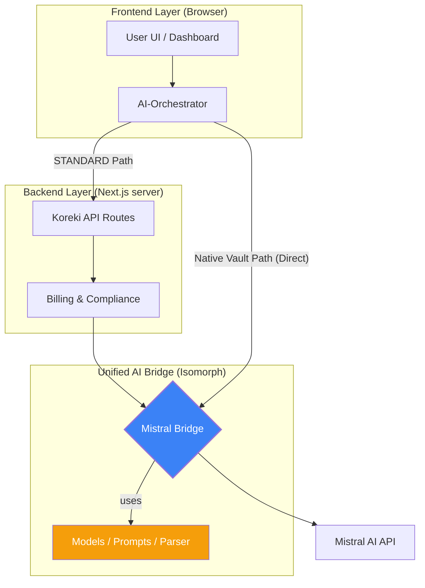

# Koreki - Architecture Document

## 1. Executive Summary & Kontext

> [!NOTE]
> Dieses Dokument definiert die Kernkomponenten und den Datenfluss von Koreki. Die Architektur ist auf Skalierbarkeit, Datenschutz (**Native OS Vault Integration**) und pädagogische Präzision optimiert.

## 2. Component Layout & Directory Structure

```text
koreki/
├── pages/
│   ├── _app.tsx              # Global Next.js App wrapper (CSS imports)
│   ├── app.tsx               # Main Application Entrance (Dashboard)
│   ├── login.tsx             # Authentication Page (Simple Password UI)
│   └── api/                  # Next.js Backend Endpoints
│       ├── ai-correct.ts     # Core LLM request for grading tasks (Uses Bridge)
│       ├── clean-and-analyze.ts # LLM request to extract the task layout (Uses Bridge)
│       ├── clean-and-map.ts  # LLM request to clean noise and map students (Uses Bridge)
│       ├── extract-image.ts  # OCR integration for scanned documents (Uses Bridge)
│       ├── login.ts          # Auth endpoint
│       └── workspaces/       # Organization and Tenancy management
├── components/               # React UI Components
│   ├── BatchProcessor.tsx    # Core UI for managing student list
│   └── ...
├── hooks/                    # Custom React Hooks
│   ├── useFileProcessor.ts   # Core logic for orchestration
│   └── useKorekiSync.ts      # .koreki Session logic
├── lib/                      # Core Business Logic & Utilities
│   ├── ai/                   # AI Orchestration (Isomorphic Core)
│   │   ├── mistral-provider.ts # Unified AI Bridge (Cloud)
│   │   ├── ollama-logic.ts     # Ollama Native Bridge (Desktop/Bypass)
│   │   ├── ai-orchestrator.ts  # Logic Facade (Orchestrator Between Providers)
│   │   └── ocr-orchestrator.ts # OCR/Vision Orchestration
│   ├── grading/              # Deterministic Assessment Engines
│   │   ├── CalcTrace.ts      # CalcTrace Engine (Calculation Chains)
│   │   ├── GraphRunner.ts    # PANG Engine (Grading Graphs)
│   │   └── ...
│   ├── ai-logic.ts           # Legacy Orchestration Facade (Backward Compatibility)
│   ├── billing/              # Billing & Credits logic
│   └── logic.ts              # Mathematical models
├── prisma/
│   └── schema.prisma         # Database schema
└── docs/
    ├── strategy/         # Roadmap, Product Status
    ├── technical/        # Architecture (this document)
    └── compliance/       # GDPR / AVV
```

---

## 3. Data Flow & Core Processes

### A. Initialization & Setup
1. **Model Solution**: The user provides a **Musterlösung**.
2. **Task Extraction**: The frontend calls `/api/clean-and-analyze`. The **Mistral Bridge** is used to extract a strict JSON layout of tasks.

### B. Batch Processing & OCR
Der Batch-Workflow wird durch die **Mistral Bridge** zentralisiert, um absolute Logik-Identität zwischen den Modi zu gewährleisten:



1. **Intelligent Extraction**: Scanned documents are sent to the **Bridge** (via Backend or Direct). Digital PDFs use word-boundary reconstruction to ensure semantic integrity.
2. **AI Text Cleaning/Mapping**: Die Bridge säubert den Text und mappt die Aufgaben über eine zentrale `internalProcessMapping` Logik. Im Desktop-Modus wird hierbei bevorzugt **Ollama** via Tauri-Invoke genutzt (siehe [Ollama Integration](./ollama-integration-hardening.md)).
3. **AI Correction**: Der finale Korrektur-Call nutzt die Bridge mit `mistral-large` (SaaS) oder spezialisierten lokalen Modellen (**Gemma 31B**, **Mistral Small 3.2**). Ein struktureller Fehler triggert automatisch den "Confidence Brake" (Status: Review erforderlich).

### 3.2 Dual-Engine Assessment (PANG vs. CalcTrace) 📐⚙️
Um eine präzise mathematisch-technische Bewertung mit didaktischer Folgefehler-Kompensation zu garantieren, verfügt Koreki über zwei spezialisierte Bewertungs-Engines:
*   **PANG Engine (Graph-basiert):** Wird für komplexe, netzwerkartige oder abhängige Tabellenstrukturen (wie VLSM-Subnetting oder RAID-Kapazitäten) eingesetzt. Sie baut einen topologisch sortierten gerichteten Graphen (`GradingGraph`) auf und nutzt `expr-eval` zur Formelauflösung.
*   **CalcTrace Engine (Rechenketten-basiert):** Wird für lineare Formeln in MINT-Fächern (wie Elektrotechnik, Physik) verwendet. Sie evaluiert eine flache Kette von Berechnungsschritten (`CalcTrace`) sequenziell und nutzt eine sandboxed mathjs-AST-Prüfung (`validateAST`) zum Schutz vor Prompt-Injection in generierten Formeln.

Beide Engines propagieren Fehler mithilfe eines Dual-Context-Modells (Musterlösung vs. Schüler-Kontext), um folgerichtige Folgeschritte mit vollen Kulanzpunkten zu bewerten.

### 3.3 Hybrid AI Orchestration (V16) ⚛️🛡️

Um maximale Flexibilität bei gleichzeitiger Sicherheit zu gewährleisten, nutzt der `AI-Orchestrator` ein hybrides Routing-Modell:

*   **Mistral (Standard Mode):** In der Community-Edition und im SaaS-Betrieb werden Mistral-Anfragen standardmäßig über das Backend (`/api/ai-correct` etc.) geproxied. Dies ermöglicht die zentrale Injektion des `MISTRAL_API_KEY` via Environment-Variablen auf dem Server, ohne dass Nutzer eigene Keys hinterlegen müssen.
*   **Desktop & Localhost Inferenz (Native Vault):** Lokale Inferenz-Anbieter wie Ollama sowie direkte API-Anbindungen (Mistral/OpenAI) im Desktop-Modus nutzen die **OS-native Tresor-Verschlüsselung**. API-Keys werden hardwarenah (Windows Safe Store / Secret Service) gespeichert, statt im flüchtigen Browser-RAM. Anfragen fließen direkt vom Client zum Provider (Zero-Transit PII).

---

## 4. AI Engine & Prompt Orchestration (V12) ⚛️
Die Koreki AI Engine nutzt ein hierarchisches **Specialized Prompt Routing**, um maximale Präzision bei minimalem Regressions-Risiko zu gewährleisten:

* **Base Layer (`src/prompts/*.md`):** Standard-Instruktionen, optimiert für Mistral Small und SaaS-Workflows.
* **Specialized Layer (`src/prompts/specialized/<family>/*.md`):** Modell-spezifische Overrides. Aktuell aktiv für:
    * **Gemma 4 (4B & 31B):** Zur Härtung der JSON-Integrität und Identifier-Mapping.
    * **Mistral Small 3.2:** Fokus auf subtile OCR-Fehlererkennung (`(?)` Marker).
* **Dynamic Resolver:** Ein zentraler Dispatcher in `prompt-builder.ts` entscheidet zur Laufzeit basierend auf dem gewählten Modell, welches Template geladen wird.

---

## 5. Desktop Integration (Tauri) 💻

> [!IMPORTANT]
> **Unified AI Bridge (Isomorphic Core)**: Um die Parität zwischen **PURE** und **STANDARD** zu gewährleisten, nutzt Koreki eine einzige Bridge (`mistral-provider.ts`). Diese garantiert, dass Modelle, Prompts und Parser identisch sind, unabhängig davon, ob sie im Browser oder auf dem Server ausgeführt werden.

> [!TIP]
> **KI-First & Strict Integrity**: Korrekturen und Mapping setzen auf "Instruction Hardening" in den Prompts. Der Orchestrator validiert strikt (`===`) und meldet Fehler transparent, statt ungenaue Ergebnisse stillschweigend zu akzeptieren.

### 4.3 Local Inference Resilience (Desktop only) 🛡️
Um maximale Datenhoheit zu gewährleisten, bietet Koreki eine gehärtete Integration für lokale LLMs (Ollama):
*   **CORS Bypass:** Native Rust-Proxying zur Umgehung von Browser-Restriktionen.
*   **Stream Stability:** Industrieller Byte-Buffer in Rust zur Abwicklung fragmentierter KI-Streams.
*   **Zero-Trust Connectivity:** Automatische URL-Normalisierung und Modell-Name-Trimming zur Vermeidung von Verbindungsfehlern (Trailing-Slash & Whitespace Sanitization).
*   **Context Window Pillar:** Industrieller Standard von **8192 Token** (`num_ctx`) zur Vermeidung von Truncation bei Vision-Modellen und großen Dokumenten.
*   **Hybrid Model Support:** Optimierte Pfade für High-Performance (Mistral Small) und Standard (Gemma 4B).
*   **Industrial Compact Standard (V14):** Globale Entfernung des redundanten `cleanedText` Feldes zur Latenz-Optimierung.
*   **Strict Task Verification:** Die Pipeline erzwingt nun eine valide Aufgabenstruktur; bei Fehlern wird ein expliziter Error geworfen, anstatt stillschweigend auf Roh-Text zurückzufallen.

---

## 6. Security & Privacy
- **Client-Side Chunking**: For large documents (100MB+), Koreki renders pages individually as image chunks. This prevents server memory exhaustion and ensures the `50MB` API limit is never hit during normal operation.
- **Privacy Logs**: Every acknowledgement is logged for compliance.

---
## 7. Deployment Tiers (Infrastructure Matrix) 🏮🛡️🏛️

Koreki operiert in drei klar definierten Deployment-Szenarien, um unterschiedliche Anforderungen an Datenschutz, Skalierbarkeit und Infrastruktur zu erfüllen:

| Feature | **Single Workplace (Lokal)** | **Schule (On-Prem)** | **SaaS (Full Cloud)** |
| :--- | :--- | :--- | :--- |
| **Datenbank** | **Keine** (Dateisystem / JSON) | **Keine** (Dateisystem / JSON) | **PostgreSQL** |
| **Auth** | **Mock/Local Auth** (Auto-Login) | **Mock/Local Auth** (Auto-Login) | **Logto** (Managed + M2M Sync) |
| **Email / SMTP** | **Keiner** | **SendGrid / SMTP** | **SendGrid (Managed)** |
| **Billing** | **Cut** (Flat-Modus) | **Cut** (Lizenz-Modus) | **Stripe** (SaaS) |
| **LLM Interface** | **Native Vault** (Secured Keys) / Ollama | **Standard (Proxy)** / Ollama | Mistral Managed |

> [!IMPORTANT]
> **SSoT (Single Source of Truth):** Diese Matrix ist die maßgebliche Referenz für alle technischen Implementierungen und Strategie-Entscheidungen. Abweichungen in anderen Dokumenten sind als Fehler zu betrachten.

## 8. Koreki Modularity Standard (Industrial Grade)

### A. Isomorphic AI Hub
Alle KI-Interaktionen MÜSSEN über die `MistralBridge` laufen. Direkte `fetch` Aufrufe an Mistral außerhalb der Bridge sind untersagt, um die Modell-Synchronität zu erhalten.

### C. Pipeline Unification
Sämtliche Mapping-Operationen (Digital & Scan) MÜSSEN den zentralen `internalProcessMapping` Pfad nutzen. Logik-Drift in den Verarbeitungsstufen ist strikt zu vermeiden.
*Status: Approved (V15)*