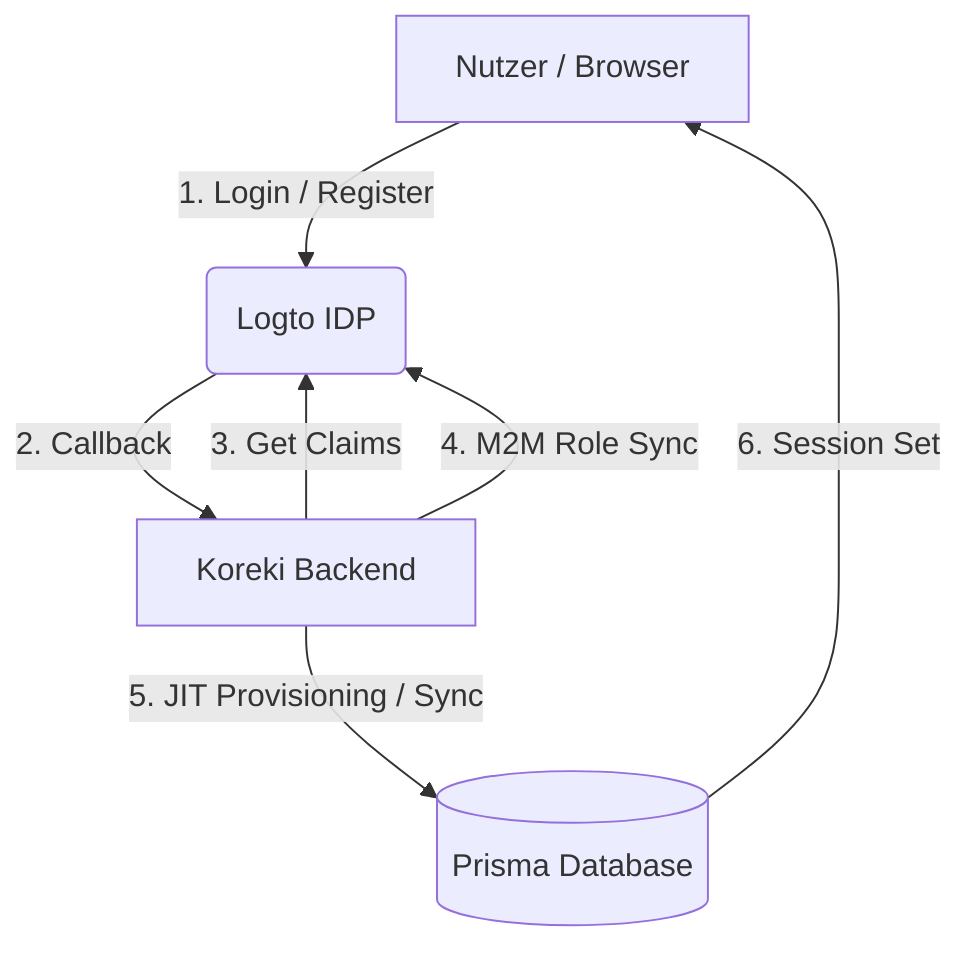
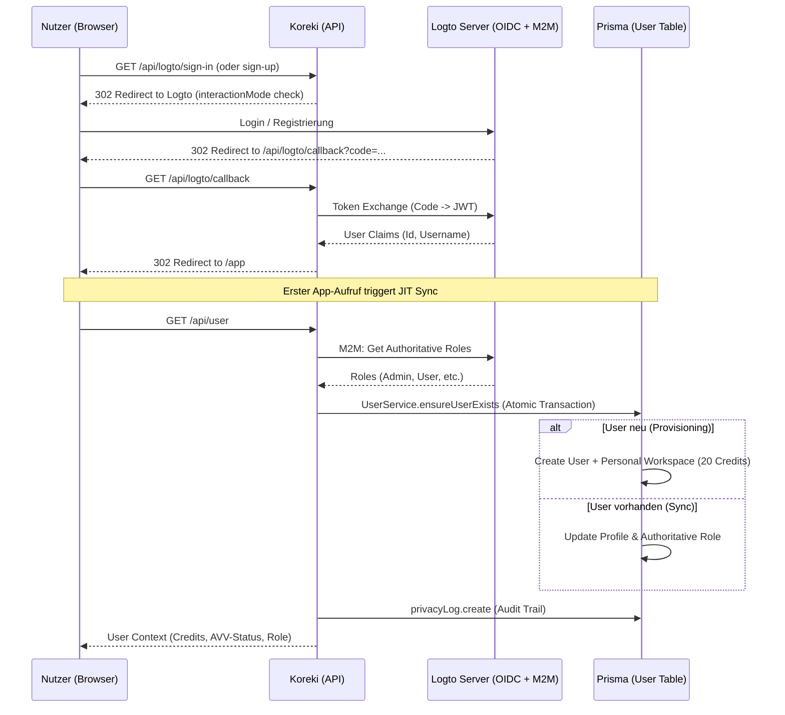

# Authentifizierung & Benutzerverwaltung (Auth System)

Koreki nutzt ein hybrides Authentifizierungsmodell, das je nach Deployment-Szenario zwischen **Logto (Cloud/SaaS)** und **Keycloak/Generic OIDC (Community Edition)** unterscheidet. Die Integration stellt sicher, dass Nutzer-Identitäten konsistent verwaltet werden, während die Systemarchitektur (DB vs. No-DB) flexibel bleibt.

---

## 1. Executive Summary & Kontext

Koreki nutzt **Logto** als zentralen Identity Provider (IDP). Die Integration erfolgt über das `@logto/next` SDK in Next.js und stellt eine nahtlose Verbindung zwischen der externen Authentifizierung und der internen Benutzerdatenbank (Prisma) her.

---

## 1. High-Level Architektur

Koreki verfolgt einen **Auto-Provisioning-Ansatz (JIT)**. Das bedeutet, dass Nutzerkonten in der lokalen Datenbank automatisch erstellt werden, sobald sich ein Nutzer erfolgreich über Logto anmeldet.



---

## 2. Der Login-Flow (OIDC)

Der Authentifizierungsprozess wird über eine dynamische Route abgewickelt, die alle Logto-Aktionen (SignIn, SignOut, Callback) zentralisiert.

### Sequenzdiagramm



---

## 3. User-Synchronisierung & Provisioning

Koreki implementiert ein **Industrial Just-In-Time (JIT) Provisioning**. Der Nutzer existiert in der lokalen Datenbank erst, wenn er sich das erste Mal erfolgreich authentifiziert hat.

### Features:
- **Atomic Provisioning**: Die Erstellung des Nutzers, des persönlichen Workspaces und der Owner-Membership erfolgt in einer **Prisma-Transaktion**. Ein automatischer Catch-Block fängt Race-Conditions (P2002) ab, falls ein Nutzer mehrere Tabs gleichzeitig öffnet.
- **Personal Workspace & Start-Credits**: Jeder neue Nutzer erhält automatisch einen persönlichen Workspace mit **20 Start-Credits**.
- **Authoritative M2M Profile & Role Sync**: Da OIDC-Claims (Session-Daten) unvollständig oder veraltet sein können, nutzt Koreki die **Logto Management API (M2M)** als sekundäre, autoritative Quelle. Wenn Profil-Informationen (z.B. E-Mail/Name) in den Claims fehlen, werden diese direkt vom Logto-Server abgefragt und in der lokalen DB "geheilt". Dies stellt sicher, dass Rollenänderungen und Profil-Updates sofort wirksam werden.
- **Ghost-User Prevention**: Beim Aufruf von `/api/user` wird zusätzlich geprüft, ob der Nutzer im Logto-System noch existiert. Falls ein Admin einen Nutzer in Logto löscht, wird dessen Zugriff in Koreki blockiert, selbst wenn das Session-Cookie noch gültig ist.

---

## 4. Sicherheitsmechanismen (Pillar 8 Architecture)

### Unified Security Wrapper (`withSecurity`)
Alle API-Endpunkte sind mit dem zentralen Sicherheits-Wrapper geschützt. Dieser übernimmt konsequent:
1. **Authentifizierung**: Context-Check via Logto User Context.
2. **Rate-Limiting**: Schutz vor DoS (Traefik-IP-kompatibel via `req.ip`).
3. **Pillar 8 RBAC**: DB-authoritative Rollenprüfung (Source of Truth nach M2M-Sync).
4. **Char-Limits**: Durchsetzung der Prompt-Grenzwerte (10k/Seite).
5. **Audit Trail**: Jeder erfolgreiche Login wird als `SECURITY_EVENT: LOGIN_SUCCESS` im `PrivacyLog` mit IP-Adresse und Zeitstempel protokolliert.

```typescript
export default withSecurity(async (req, res) => {
    const { isAuthenticated, claims } = req.user;
    // Granulare Logik...
}, { requireAdmin: 'ORG' }); // Optionale Rollen-Sperre
```

### Force-HTTPS & Proxy Integrity
Hinter dem Traefik-Proxy wird das SDK durch die `baseUrl` zur Nutzung von HTTPS gezwungen. Die IP-Erkennung berücksichtigt die `x-forwarded-for` Listen.

---

## 5. Desktop Security (Native Vault)

In der Desktop-Umgebung (Tauri) speichert Koreki sensible Zugangsdaten (wie API-Keys für Mistral oder OpenAI) **niemals** im `localStorage` oder in den `Cookies` des Browsers. Stattdessen wird die native Verschlüsselung des jeweiligen Betriebssystems angesprochen (Industrial Grade Security).

### OS-Level Vault Integration (`keyring-rs` v2)
Die Desktop-App nutzt das Crate `keyring` (Version 2.3.3, da Version 3 standardmäßig nur nicht-persistente Session-Keys anlegt), um Schlüssel dauerhaft und hardwarenah gesichert zu speichern:
- **Windows:** Speicherung im `Windows Credential Manager` (unter "Generische Anmeldeinformationen" als `koreki-app:koreki-mistral-key`). Wird als `CRED_PERSIST_LOCAL_MACHINE` hinterlegt.
- **Linux (Ubuntu):** Speicherung über die `secret-service` D-Bus API (z.B. GNOME Keyring oder KWallet). Der Tresor wird durch das Login-Passwort des Benutzers ver- und entschlüsselt.
- **macOS:** Speicherung im nativen `Keychain` (Apple Keychain Services).

**Vorteil:** Die Schlüssel sind gegen Diebstahl aus dem Dateisystem oder Auslesen der lokalen Anwendungsdaten geschützt. Eine Extraktion ist nur mit administrativen Rechten oder dem OS-Passwort des Benutzers möglich.

---

## 6. Technische Referenz

| Komponente | Dateipfad | Aufgabe |
| :--- | :--- | :--- |
| **Konfiguration** | `src/lib/logto.ts` | Definition von Endpoint, App-ID und Scopes. |
| **M2M Logik** | `src/lib/logto-mgmt.ts` | Authoritative Abfrage von Profilen und Rollen. |
| **Auth-Handler** | `src/pages/api/logto/[action].ts` | Einstiegspunkt (sign-in, sign-up, sign-out, callback, forgot-password). |
| **Email-Dienst** | **SMTP-Relay** (aktuell Brevo) | Versendet die Einmalcodes fuer Registrierung und Passwort-Reset. Konfiguriert im Logto-Connector, nicht im Code. |
| **User Service** | `src/lib/services/user-service.ts` | JIT Provisioning, Atomare Transaktionen, Sync-Logik. |
| **Sync-Endpoint** | `src/pages/api/user.ts` | Orchestriert Sync, Context-Rückgabe und Audit Logging. |
| **User-Management** | `src/pages/api/admin/users.ts` | Admin-Interface zur Verwaltung der lokalen User-Daten. |

---

## 7. Password Recovery & Email Integration (SMTP) 📧🛡️

Seit V0.9.15 verfügt Koreki über eine integrierte Passwort-Wiederherstellung. 

### Architektur des Password-Resets:
1.  **Hosted Flow**: Der "Passwort vergessen"-Link leitet den Nutzer an Logto weiter (`interactionMode: 'forgot_password'`).
2.  **Mailing-Infrastruktur**: Koreki versendet ueber einen generischen **SMTP-Relay** (aktuell **Brevo**, EU-gehostet). Die Domain `koreki.org` ist dort per DKIM authentifiziert; SPF und DMARC liegen bei Ionos (Pillar 10 Hardening). Der Relay ist bewusst austauschbar (Architectural Vision §5): ein Wechsel ist Konfiguration in der Logto-Konsole und in den `SMTP_*`-Variablen, kein Code.
3.  **Hybrid-Identität**: Nutzer können sich wahlweise via **Username** oder **Email** anmelden. Passwörter können jedoch nur wiederhergestellt werden, wenn der Account mit einer verifizierten E-Mail verknüpft ist.
4.  **OTP-Verifizierung**: Statt unsicherer Links setzt Koreki auf 6-stellige **One-Time-Passwords (OTP)**, die direkt in der Logto-Maske eingegeben werden.

### Konfiguration (SaaS/On-Prem):
*   Der Mail-Versand wird über den Logto-Connector konfiguriert. 
*   Absenderadresse: `no-reply@koreki.org` (Industrial Standard).

> [!WARNING]
> **Bekannte Ausfallursache:** Laeuft das Kontingent des Relays ab, meldet Logto
> `Error occurred in connector` mit der Fehlerantwort des Anbieters. Registrierung und
> Passwort-Reset stehen dann still, waehrend die Anmeldung mit Passwort weiterlaeuft —
> der Ausfall ist deshalb leicht zu uebersehen. Am 25.08.2026 war das der Fall
> (`Maximum credits exceeded`, abgelaufener SendGrid-Trial).

---

## 8. Community Gatekeeper (Keycloak & Generic OIDC) 🛡️🗝️

Für die **Community Edition** (Self-Hosted) unterstützt Koreki eine alternative Authentifizierung via Keycloak oder andere OIDC-kompatible Provider.

### Architektur-Merkmale:
- **Stateless Gatekeeper**: Im Gegensatz zum SaaS-Modus benötigt die Community Edition für die Authentifizierung **keine serverseitige Datenbank**. Die Sitzung verwaltet `oidc-client-ts` im Browser.
- **Server-seitige Token-Verifikation**: Jeder API-Request führt ein signiertes Access Token als `Authorization: Bearer` mit. Das Backend prüft Signatur (gegen den JWKS-Endpunkt des Realms), Issuer, Client-Bindung und Ablauf, bevor `sub` und Rollen verwendet werden (`src/lib/auth-keycloak-server.ts`). Da kein DB-Abgleich möglich ist, ist das verifizierte Token die alleinige Source of Truth — siehe Tier-Ausnahme zu Säule 8 im `security-standards` Skill.
- **Keine Identitäts-Spiegelung**: Nutzer-ID und Rollen werden **nicht** im `localStorage` gespiegelt und nicht als Header übertragen. Client-gelieferte Identitätsangaben sind keine Vertrauensquelle.
- **Auto-Persistenz**: Experten-Prompts werden im Community-Modus automatisch auf dem Server-Dateisystem gespeichert, verknüpft mit der Keycloak-ID (siehe [Community Persistence](./community-edition-persistence.md)).
- **Settings Governance (Zahnrad-Schutz)**: In Multi-User-Umgebungen (z. B. Schulen) ist der Zugriff auf Systemeinstellungen (KI-Provider, API-Keys) rollenbasiert geschützt. Nur Nutzer mit der Admin-Rolle können das Einstellungs-Zahnrad und das Initial-Setup-Modal sehen.

### Konfiguration & Rollen:
Über die Umgebungsvariable `NEXT_PUBLIC_AUTH_TYPE=KEYCLOAK` wird der Logto-Pfad deaktiviert und die OIDC-Schleuse aktiviert.

- **Admin-Rolle**: Die Realm-Rolle `koreki-admin` wird serverseitig auf die interne Rolle `ADMIN` abgebildet, `koreki-user` auf `USER`. Rollen ohne Koreki-Entsprechung (z. B. `offline_access`) werden verworfen.
- **Flexibilität**: Über `NEXT_PUBLIC_ADMIN_ROLE_NAME` kann ein **zusätzlicher** Rollenname akzeptiert werden, falls das Schulnetz (LDAP/AD) bereits eine eigene Admin-Rolle führt. `koreki-admin` bleibt immer gültig.
- **Token-Mapping**: Ein Custom-Protocol-Mapper ist **nicht** erforderlich. Rollen werden aus `realm_access.roles` gelesen, das Keycloak über den Standard-Client-Scope `roles` immer mitliefert. Ein flaches `roles`-Array wird zusätzlich akzeptiert, damit bestehende Realms mit Mapper unverändert weiterlaufen.
- **Rollenänderungen**: Wirken erst mit dem nächsten Access Token. Ohne Server-State gibt es keine sofortige Token-Rücknahme — kurze Token-Lifetime im Realm konfigurieren.

---

---

> [!TIP]
> Um einem Nutzer Admin-Rechte zu geben, muss dieser in der **Logto Console** (nicht in der Koreki-DB) der Rolle "Admin" zugewiesen werden. Die Synchronisation erfolgt beim nächsten Seitenaufruf automatisch.
