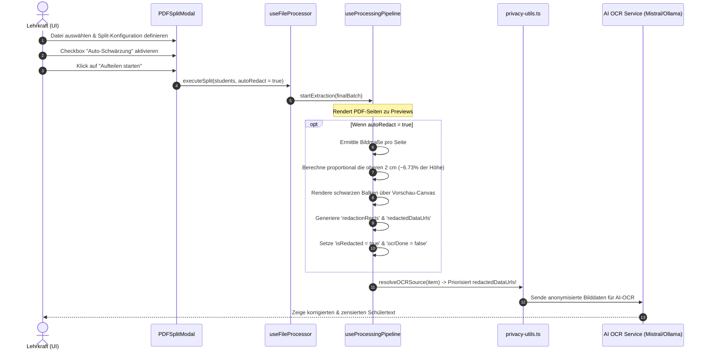

# Architektur-Konzept: Automatische Schwärzung im PDF-Aufteilungs-Prozess

> [!WARNING]
> **Abgelöst am 2026-08-03.** Die hier beschriebene Funktion ist aus dem Produkt entfernt worden; dieses Dokument bleibt ausschließlich als Entscheidungsprotokoll bestehen. Der beschriebene Code (`autoRedactTop2cm`, die Checkbox im `PDFSplitModal`, der Auto-Pfad in `useProcessingPipeline`) existiert nicht mehr.
>
> **Warum:** Die Option hing ausschließlich am Split-Dialog. Wer seine Schülerarbeiten bereits vereinzelt hochlädt — Einzel-PDFs, Bilddateien, Moodle-Export — durchlief diesen Dialog nie und bekam die Anonymisierungs-Hilfe damit gar nicht zu sehen. Hinzu kam, dass die Schwärzung eine geratene Zone traf (obere 2 cm) statt der Stelle, an der der Name auf dem konkreten Formular tatsächlich steht.
>
> **Nachfolger:** Die Schwärzung sitzt vollständig im Schwärzungs-Modal (`RedactionModal`), das aus jeder Scan-Zeile der Stapelverarbeitung erreichbar ist — unabhängig vom Upload-Pfad. Die Lehrkraft zieht die Balken dort, wo die Daten wirklich stehen, und überträgt sie per Haken auf jede Seite aller Scans des Stapels (`useRedactionBroadcast`). Balken tragen eine Herkunft (`scope: shared | local`), sodass gemeinsame und individuelle Schwärzungen in einem Durchgang nebeneinander bestehen. Koordinaten werden relativ zur Seitengröße gespeichert, damit dieselbe Schwärzung über unterschiedliche Auflösungen und Dokumente hinweg deckungsgleich sitzt.

## 1. Executive Summary & Kontext
> [!NOTE]
> **Zusammenfassung:** Dieses Dokument beschreibt die Erweiterung des "Aufteilen"-Modals um eine optionale Funktion zur automatischen Schwärzung der oberen 2 cm aller geteilten Scans. Dies eliminiert Namen und andere personenbezogene Daten (PII) vollautomatisch direkt nach dem Splitting.
> **Zielgruppe:** @product_manager, @ui_expert, @database_expert und @security_officer.

Dieser Vorschlag optimiert den Workflow für Lehrkräfte signifikant. Bisher mussten eingescannte Klausurenstapel getrennt und anschließend jede Schülerklausur einzeln im manuellen Schwärzungs-Modal anonymisiert werden. Die automatische Schwärzung ermöglicht es, während des Splitvorgangs mit einer einzigen Checkbox ("Obere 2 cm auf allen Seiten automatisch schwärzen") die Anonymisierung für den gesamten Stapel zu initiieren.

---

## 2. Architektur & Systemdesign

Die technische Umsetzung fügt sich nahtlos in das bestehende Client-seitige Anonymisierungs- und OCR-Framework von Koreki ein. Es sind keine serverseitigen Änderungen erforderlich.



### Proportionale Skalierung (2 cm Logik)
Da PDF-Scans in unterschiedlichen Auflösungen (DPI) und Skalierungen vorliegen können, wird die 2 cm Zensur proportional berechnet. Bei einem standardmäßigen A4-Blatt (29.7 cm Höhe im Hochformat) entsprechen 2 cm genau:
$$\frac{2}{29.7} \approx 6.73\% \text{ der Gesamthöhe}$$

Dies garantiert, dass die Zensur unabhängig von der Auflösung des Scans (z.B. 150 DPI, 300 DPI) oder der Render-Skalierung stets exakt die oberen 2 cm abdeckt.

---

## 3. Implementierung & Nutzung

### Schwierigkeitsgrad: 2 / 10 (Extrem Einfach)
Die Implementierung erfordert **keine neuen Abhängigkeiten** und **keine Änderungen am Datenbankschema oder den API-Routen**. Sie fügt sich perfekt in die Client-seitige Architektur ein.

### 3.1 UI-Erweiterung (in PDFSplitModal.tsx)
Es wird eine State-Variable `autoRedact` und ein Toggle-Switch/Checkbox im Split-Modal hinzugefügt:

```tsx
const [autoRedact, setAutoRedact] = useState(false);
```

Design-Integration im modern-minimalistischen HSL-Design-System von Koreki (Slate/Indigo):
```tsx
<label className="flex items-center gap-3 p-3 bg-slate-50 hover:bg-slate-100/80 rounded-xl border border-slate-200 cursor-pointer transition-all">
    <input
        type="checkbox"
        checked={autoRedact}
        onChange={(e) => setAutoRedact(e.target.checked)}
        className="w-4 h-4 rounded text-primary focus:ring-primary/20 border-slate-300"
    />
    <div className="flex flex-col">
        <span className="text-sm font-bold text-slate-800">Automatische Schwärzung</span>
        <span className="text-xs text-slate-500 font-medium leading-relaxed">
            Schwärzt die oberen 2 cm (Name etc.) auf allen Seiten automatisch.
        </span>
    </div>
</label>
```

### 3.2 Pipeline-Integration (in useProcessingPipeline.ts)
In `startExtraction` wird die automatische Schwärzung vor der OCR getriggert, wenn `autoRedactTop2cm` aktiv ist:

```typescript
let redactedDataUrls = items[i].redactedDataUrls;
let redactionRects = items[i].redactionRects;
let isRedacted = items[i].isRedacted;

if (items[i].autoRedactTop2cm && previewDataUrls && previewDataUrls.length > 0 && !items[i].isRedacted) {
    try {
        const rects: Record<number, { x: number, y: number, w: number, h: number }[]> = {};
        const redactedUrls: string[] = [];
        
        for (let pageIdx = 0; pageIdx < previewDataUrls.length; pageIdx++) {
            const url = previewDataUrls[pageIdx];
            const img = new Image();
            await new Promise((resolve, reject) => {
                img.onload = resolve;
                img.onerror = reject;
                img.src = url;
            });
            
            const h = Math.round(img.height * 0.0673); // 2 cm proportional bei A4
            const rect = { x: 0, y: 0, w: img.width, h };
            rects[pageIdx] = [rect];
            
            const canvas = document.createElement('canvas');
            canvas.width = img.width;
            canvas.height = img.height;
            const ctx = canvas.getContext('2d');
            if (ctx) {
                ctx.drawImage(img, 0, 0);
                ctx.fillStyle = '#0f172a'; // Slate-900 / Black-out
                ctx.fillRect(0, 0, img.width, h);
                redactedUrls.push(canvas.toDataURL('image/jpeg', 0.9));
            } else {
                redactedUrls.push(url);
            }
        }
        
        redactionRects = rects;
        redactedDataUrls = redactedUrls;
        isRedacted = true;
    } catch (err) {
        console.error("Failed auto-redaction during extraction", err);
    }
}
```

---

## 4. Security & Compliance (Mandatory)
> [!IMPORTANT]
> **Maximale DSGVO-Konformität:** Da die automatische Schwärzung vollständig im **Browser der Lehrkraft (Client-side)** stattfindet, verlassen Klarnamen von Schülern niemals den lokalen Rechner. Der AI-OCR-Service erhält ausschließlich die bereits mit schwarzen Balken überlagerten Bilder (`redactedDataUrls`), die von `resolveOCRSource` geliefert werden.

* **Datenverarbeitung:** Das System schützt sensible PII (Personally Identifiable Information) wie Schülernamen vollautomatisch.
* **Audit-Sicherheit:** Die generierten Zensur-Rechtecke werden im lokalen `redactionRects` State gespeichert. Dadurch sind sie für die Lehrkraft im manuellen Zensur-Modal voll sichtbar, anpassbar und löschbar.
* **Zero-Server-Footprint:** Keine Überlastung unseres backends, da die Bildmanipulation via HTML5-Canvas dezentral läuft.

---

## 5. Testing & Referenzen

* **E2E Smoke Tests:** Playwright-Tests in `tests/e2e/redaction.spec.ts` können die automatische Schwärzung validieren, indem sie den Splitting-Vorgang mit aktivierter Checkbox simulieren und prüfen, ob `isRedacted: true` gesetzt wurde.
* **Unit-Tests:** Jest-Tests für `generateSplitBatchItems` stellen sicher, dass die Flag `autoRedactTop2cm` korrekt übergeben und indiziert wird.
