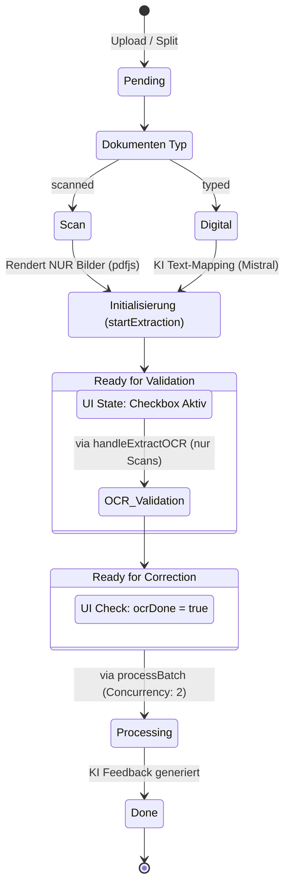

# Batch-Processing Lifecycle & UI State Management

## 1. Executive Summary & Kontext
> [!NOTE]
> **Zusammenfassung:** Dieses Dokument beschreibt die State-Architektur der Koreki Stapelverarbeitung, einschließlich der performanten Extraktionsvorbereitung für Scans und dem korrekten UI-Feedback während parallelisierter Hintergrundprozesse.
> **Zielgruppe:** Entwickler, UI-Designer, Backend-Systemarchitekten.

Die Stapelverarbeitung in Koreki stellt hohe Anforderungen an asynchrones UI-State-Management und Ressourcen-Schonung. Kürzlich implementierte "Industrial Grade"-Verbesserungen garantieren deterministisches Variablen-Verhalten beim Aufteilen von Dokumenten und vermeiden unkontrolliertes Aufrufen teurer LLM-Pipelines (`Mistral`) im falschen Kontext.

---

## 2. Architektur & Systemdesign (Status-Lebenszyklus)
> [!TIP]
> Die Unterscheidung zwischen `item.tasks` (OCR Ergebnis) und `item.result.tasks` (Korrektur-Ergebnis) ist essenziell für die korrekte Datenbindung im Frontend.

Das UI der Stapelverarbeitung nutzt eine reaktive Queueing-Systematik, kontrolliert über die Konstanten `status`, `ocrDone`, und den globalen `loading`-State.



---

## 3. Implementierung & kritische Logik-Flüsse

### A) Mistral-Bypass für Scans bei Initialisierung (`useProcessingPipeline.ts`)
Die Funktion `startExtraction` bereitet neue Dokumente (Upload oder durch Dokumenten-Schere geteilt) für die Liste vor. 
**Regel:** Wenn `documentType === 'scanned'`, darf niemals `runExtractionStrategy` (Mistral OCR) aufgerufen werden. Die Extraktion der Bilddaten (`previewDataUrls`) erfolgt aus Leistungs- und Kostengründen ausschließlich lokal über `extractTextFromFile`.

### B) Deterministische Datenreinigung beim Splitten (`logic.ts`)
Wenn ein bereits bearbeitetes Dokument mit der Schere aufgeteilt wird, nutzt `generateSplitBatchItems` den Spread-Operator (`...originalFile`). Hierbei **müssen** historische Zustände aktiv geerbt und gelöscht werden:
```typescript
        const item = {
            ...originalFile,
            status: 'pending',
            result: null,     // KI Feedback löschen
            fileText: undefined, // Alten Text löschen, um Neu-Extraktion zu erzwingen
            tasks: undefined,    // Alte Strukturierte Tasks löschen
            grade: undefined,
            ocrDone: false,
            // ...
        };
```

### C) Routing manueller Änderungen (`useBatchActions.ts`)
Die Methode `onUpdateText` empfängt Änderungen aus Formularfeldern sowohl VOR der Korrektur (OCR Verifizierung) als auch NACH der Korrektur (Review Point Change). 
- Ist `status === 'pending'`, so werden die Änderungen in `item.tasks` (Rohstruktur) gespeichert.
- Ist `status === 'done'`, so werden Änderungen in `item.result.tasks` (Bewertungsstruktur) gespeichert.

### D) Visuelles Queue-Feedback im UI (`BatchFileListItem.tsx`)
Während die globale Variable `loading === true` ist:
- Das aktiv bearbeitete Item (`isProcessing === true`) zeigt einen blauen Spinner (`text-primary`).
- Items, die auf **Bilderkennung** warten (`!ocrDone`), zeigen einen gedimmten Wartespinner.
- Items, die "ready" sind (`ocrDone: true` oder `documentType: typed`), behalten ihr Checkbox-Symbol (im Status `disabled={loading}`), um als "Bereit für den nächsten Schritt" wahrgenommen zu werden, ohne Interaktionen während des Lade-Locks zuzulassen.

---

## 4. Security & Compliance (Mandatory for Industrial Grade)
> [!IMPORTANT]
> Der bewusste Verzicht auf LLM-Aufrufe (`Mistral`) im Split-Prozess erhöht die Datensicherheit immens. Dies verhindert, dass im `PURE Mode` unautorisierte und unsichtbare Requests an lokale/externe Provider via `startExtraction` gefeuert werden.

* **Datenverarbeitung:** Das Schneiden und Rendering für Previews von Schülertexten (`extractTextFromFile`) geschieht im Client Memory (`pdfjs-dist`). Es findet keine vorzeitige Schatten-Verarbeitung via API Cloud statt.

---

## 5. Testing & Referenzen
> [!WARNING]
> Fehler im `status` oder beim Vererben von `fileText` lösen schwer debbuggbare Endlosschleifen oder duplizierten Text in der KI-Bewertung aus. Darf nur in Kombination mit UI-State geprüft werden.

* **Verwandte Dokumente:** [Korrektur-Workflow](./correction-workflow.md)
* **Test-Coverage:** Splitter UI Logic und Batch State Transitions sind Teil der Layer 3 Smoke-Tests.
