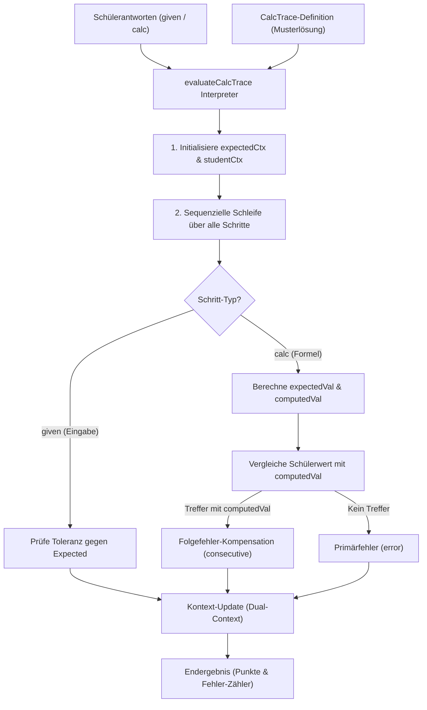

# CalcTrace Engine & Calculation Chain Architecture

## 1. Executive Summary & Kontext
> [!NOTE]
> **Zusammenfassung:** Die CalcTrace Engine ist ein zustandsfreier, leichtgewichtiger Formelketten-Interpreter zur mathematisch-physikalischen Bewertung von Schülerantworten mit automatisierter Folgefehler-Kompensation (Consecutive Error Compensation). Sie dient als performante, lineare Alternative zur graph-basierten PANG Engine.
> **Zielgruppe:** Core-Entwickler, QA-Ingenieure und Product Manager.

In MINT- und Technik-Fächern hängen Berechnungen oft sequenziell voneinander ab. Macht ein Schüler einen Fehler im ersten Schritt (z. B. Leistung $P$ falsch abgelesen), werden nachfolgende Ergebnisse (z. B. Energie $W = P \times t$) mathematisch falsch sein, obwohl die Rechenweise korrekt war. Die CalcTrace Engine löst dies, indem sie Fehler isoliert und Folgefehler vollständig kompensiert (didaktische Kulanz).

---

## 2. Architektur & Systemdesign

Die Auswertung basiert auf einer geordneten Liste von Schritten (`CalcStep`), die nacheinander evaluiert werden.



### 2.1 Dual-Context Propagation
Um Folgefehler zu erkennen, pflegt die Engine zur Laufzeit zwei getrennte Variablen-Kontexte:
1. **Expected Context (`expectedCtx`):** Enthält die mathematisch perfekten Werte aus der Musterlösung.
2. **Student Context (`studentCtx`):** Enthält die vom Schüler tatsächlich eingegebenen (oder computed) Werte.

Bei der Evaluierung eines Formelschritts (`type: 'calc'`) berechnet die Engine:
*   `expectedVal`: Formelauswertung unter Verwendung von `expectedCtx`.
*   `computedVal`: Formelauswertung unter Verwendung von `studentCtx` (Einsatz der fehlerhaften Vorläufer-Werte des Schülers).

Stimmt die Schülerantwort innerhalb der Toleranz mit `computedVal` überein, aber weicht sie von `expectedVal` ab, wird die Antwort als **folgerichtig** (`consecutive`) gewertet und erhält die volle Punktzahl.

### 2.2 Formel-Sandboxing & AST-Validierung (Security & Compliance)
Um Arbitrary Code Execution und Prompt-Injection durch manipulierte, KI-generierte Formeln im Browser und auf dem Server auszuschließen, nutzt CalcTrace eine gehärtete `mathjs`-Instanz.

Jede Formel durchläuft vor der Auswertung eine strenge AST-Traversierung (`validateAST`).
*   **Erlaubte Node-Typen:** Nur absolute mathematische Repräsentationen (`SymbolNode`, `ConstantNode`, `OperatorNode`, `ParenthesisNode`, `FunctionNode`) sind gestattet.
*   **Funktions-Whitelist:** Nur eine explizite Whitelist mathematischer und trigonometrischer Standardfunktionen ist zugelassen (`sin`, `cos`, `tan`, `asin`, `acos`, `atan`, `atan2`, `sinh`, `cosh`, `tanh`, `log`, `log10`, `ln`, `exp`, `sqrt`, `cbrt`, `abs`, `sign`, `round`, `floor`, `ceil`, `min`, `max`, `pow`, `sum`). Zugriffe auf `eval`, `import` oder andere invasive Funktionen werden sofort blockiert.

---

## 3. Implementierung & Nutzung

### 3.1 Datenstrukturen & Interfaces

Das JSON-Schema einer Rechenkette ist flach und intuitiv aufgebaut:

```typescript
export interface CalcStep {
  id: string;          // Eindeutige Variablen-ID (z. B. 'leistung_p')
  label: string;       // Benennung für UI/Feedback (z. B. 'Leistung P')
  type: 'given' | 'calc'; // 'given' = Startwert/Eingabe, 'calc' = Berechnet
  value: number;       // Wert laut Musterlösung
  formula?: string;    // Berechnungsformel (nur bei 'calc', z. B. 'U * I')
  tolerance?: number;  // Relative Toleranz (z. B. 0.01 für 1%)
  unit?: string;       // Physikalische Einheit (z. B. 'W')
  points?: number;     // Erreichbare Teilpunkte (Default: 1)
}
```

### 3.2 Beispiel-Evaluierung

```typescript
import { evaluateCalcTrace } from '@/lib/grading/CalcTrace';

const trace = {
  taskId: "task-leistung",
  steps: [
    { id: 'U', label: 'Spannung U', type: 'given', value: 230, unit: 'V' },
    { id: 'I', label: 'Stromstärke I', type: 'given', value: 10, unit: 'A' },
    { id: 'P', label: 'Leistung P', type: 'calc', formula: 'U * I', value: 2300, unit: 'W' }
  ]
};

// Schüler rechnet: U = 230 V, I = 9 A (Fehler!), berechnet P = 2070 W (Folgefehler-Korrekt!)
const studentAnswers = {
  U: 230,
  I: 9,
  P: 2070
};

const result = evaluateCalcTrace(trace, studentAnswers);
// result.results[1].status = 'error' (Stromstärke I ist falsch)
// result.results[2].status = 'consecutive' (Leistung P ist folgerichtig berechnet!)
```

---

## 4. Security & Compliance
*   **Datenminimierung:** Es werden ausschließlich physikalische/mathematische Kennwerte und Zwischenschritte verarbeitet. Es findet keine Übertragung oder Speicherung personenbezogener Schülerdaten statt (GDPR/DSGVO-konform).
*   **Ausführungssicherheit:** Durch die mathjs-AST-Validierung läuft die mathematische Evaluierung in einer hermetisch abgeriegelten Sandbox.

---

## 5. Testing & Referenzen
*   **Unit-Tests:** Die gesamte logische Integrität und Fehlerkompensation ist in [CalcTrace.test.ts](file:///c:/Users/AndreasHeid/Documents/Antigravity/koreki/tests/unit/lib/CalcTrace.test.ts) abgesichert.
*   **Verwandte Dokumente:** [PANG-Engine Dokumentation](./pang-engine.md), [Architekturübersicht](./architecture.md).
