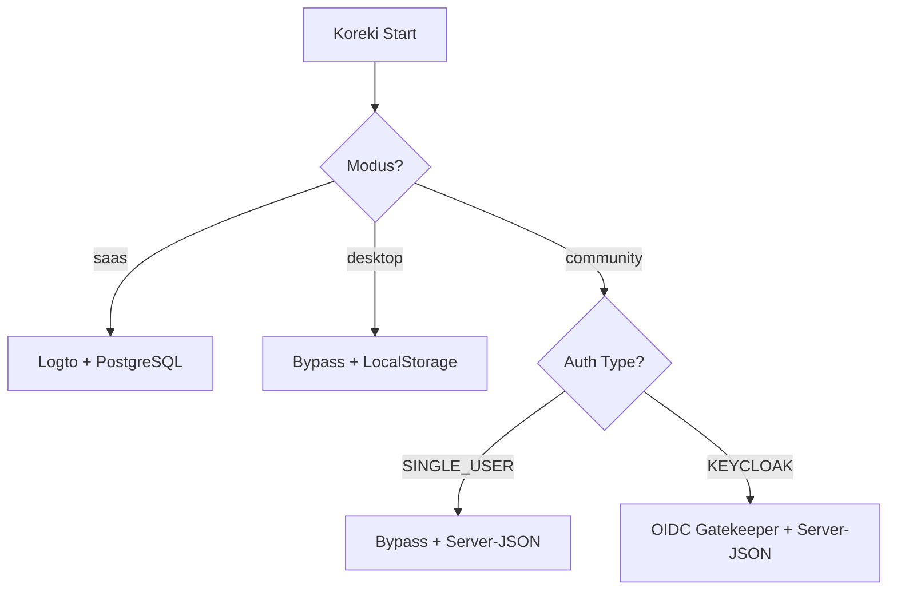

# Community Edition: Keycloak Auth & Filesystem Persistence

## 1. Executive Summary & Kontext
> [!NOTE]
> **Zusammenfassung:** Dieses System ermöglicht eine sichere, mehrbenutzerfähige Authentifizierung via Keycloak (OIDC) und eine dauerhafte Speicherung von Experten-Prompts auf dem Server-Dateisystem, ohne dass eine klassische Datenbank (PostgreSQL) installiert werden muss.
> **Zielgruppe:** Administratoren der Schulinfrastruktur und Entwickler.

In der Community Edition soll Koreki als zentraler Server in Schulen laufen. Um individuelle Lehrer-Accounts und Schutz vor Datenverlust (beim Löschen des Browserverlaufs) zu gewährleisten, wurde eine hybride Persistenz-Schicht implementiert.

---

## 2. Architektur & Systemdesign

### Strategie-Muster (Strategy Pattern)
Koreki entscheidet beim Start über die Umgebungsvariablen, welcher Authentifizierungs- und Speicherweg genutzt wird:



### Warum kein SQLite? (Verworfene Alternativen)

Die naheliegende Frage bei einer datenbankfreien Edition ist SQLite — eine eingebettete Datenbank ohne Serverprozess. Sie wurde bewusst verworfen:

| Alternative | Warum verworfen |
| :--- | :--- |
| **SQLite via Prisma** | Beseitigt nur den Datenbank**server**, nicht die **Migrationen** — und die sind der eigentliche Schmerzpunkt im Schulbetrieb. Jede Schema-Änderung bräuchte weiterhin `prisma migrate deploy` bei jedem Update, inklusive der Frage, was passiert, wenn eine Migration auf einer Instanz scheitert, an die niemand herankommt. Dazu ein zweiter Prisma-Provider mit abweichendem Schema (Enums als Strings, siehe [Disconnected Mode](./disconnected-mode.md)) und ein nativer Treiber im Container-Image. |
| **PostgreSQL im Community-Stack** | Widerspricht dem Zero-Ops-Ziel. Dass Keycloak intern eines mitbringt, ändert nichts — an dieses Postgres fasst kein Schuladministrator je an, es ist Teil des Keycloak-Containers. |
| **Browser-`localStorage`** | Datenverlust beim Löschen des Browserverlaufs, keine Nutzung über mehrere Geräte, kein Mehrbenutzerbetrieb. Genau der Zustand, den diese Architektur ablöst. |

> [!IMPORTANT]
> **Der Preis dieser Entscheidung:** JSON-Dateien bieten von sich aus keine Transaktionen, keine Atomarität und kein Locking — also genau die Haltbarkeitsgarantien, die eine Datenbank mitgebracht hätte. Diese müssen deshalb im Code abgebildet werden; sie sind in `json-vault.ts` gekapselt (siehe unten). Wer an den `Local*Services` arbeitet, muss diese Helfer verwenden und darf nicht direkt auf `fs` zugreifen.

**Weitere Konsequenzen, die bewusst getragen werden:**
* Jede Änderung schreibt die gesamte Datei neu — unkritisch bei Profilgrößen im Kilobyte-Bereich, aber keine Grundlage für wachsende Datenmengen.
* Keine Abfragemöglichkeit: Filtern und Sortieren passiert im Speicher.
* Der Migrationspfad nach PostgreSQL ist möglich, aber **ungebaut**. Erschwerend: Der Dateiname ist ein Einweg-Hash der OIDC-Sub, ein Import bräuchte die Keycloak-Nutzerliste zur Rückzuordnung.

### Haltbarkeitsgarantien (`json-vault.ts`)

Was eine Datenbank kostenlos mitgebracht hätte, leistet ein gemeinsames Hilfsmodul:

1. **Atomares Schreiben:** Geschrieben wird vollständig in eine Temp-Datei, danach umbenannt. Es existiert immer entweder der alte oder der neue Stand — nie ein abgeschnittener. Scheitert das Umbenennen (unter Windows etwa durch einen Virenscanner), greift nach drei Versuchen ein direkter Schreibvorgang als Rückfallebene.
2. **Quarantäne statt stiller Zerstörung:** Eine unlesbare Datei wandert nach `<datei>.corrupt-<zeitstempel>` und bleibt wiederherstellbar. Zuvor wurde in diesem Fall mit einem leeren Datensatz weitergearbeitet, den der nächste Speichervorgang dauerhaft festschrieb. Lässt sich eine beschädigte Datei nicht sichern, bricht der Schreibvorgang ab — ein sichtbarer Fehler ist besser als stiller Datenverlust.
3. **Serialisierung gleichzeitiger Schreibvorgänge:** Lesen, Zusammenführen und Schreiben laufen pro Datei in einem kritischen Abschnitt. Ohne das gewinnt bei zwei fast gleichzeitigen Speichervorgängen auf `global_ai_settings.json` der letzte vollständig.

### Dateisystem-Persistenz (The Vault)
Anstatt den flüchtigen `localStorage` des Browsers zu nutzen, speichert die Community Edition kritische Daten als isolierte JSON-Dateien in einem dedizierten "Vault":

1. **User-Granulare Daten (Prompts):** Der `LocalProfileService` speichert diese als isolierte JSON-Dateien:
   * **Pfad**: `/data/prompts/profiles_[SHA256_HASH_OF_USER_ID].json`
   * **Isolierung**: Die Dateinamen basieren auf dem SHA-256 Hash der OIDC-Sub (UserID). Dies verhindert Path-Traversal-Angriffe und garantiert strikte Datentrennung zwischen Lehrern.

2. **Globale AI-Einstellungen (Routing & Provider):** Der `GlobalSettingsService` speichert systemweite Parameter (wie Ollama-URL, Ollama-Modell oder Standard-Provider):
   * **Pfad**: `/data/prompts/global_ai_settings.json`
   * **Vollständiger Sync**: Sämtliche Admin-Änderungen in allen Setup-Dialogen (`SettingsModal`, `AiSetupModal`, `AiParamsModal`) speichern atomar das vollständige Routing-Setup (Provider, URLs, Modell-Tags, Thinking-Flags) via `/api/admin/global-ai-settings`.
   * **` .env` Fallback**: Existiert noch keine `global_ai_settings.json` (z. B. nach einer frischen Installation, bevor ein Admin im UI speichert), liest der Service automatisch Umgebungsvariablen (`DEFAULT_AI_PROVIDER`, `OLLAMA_BASE_URL`, `OLLAMA_MODEL`, `OPENAI_API_BASE`, `OPENAI_API_MODEL`) aus der `.env` als initialen Standard aus.
   * **Hydration**: Bei jedem Login werden diese Vorgaben über `/api/user` ans Frontend gesendet und überschreiben etwaige lokale "Relikte" im Browser (`localStorage`), sodass der Admin bzw. die Server-Konfiguration immer das letzte Wort hat.

---

## 3. Implementierung & Nutzung

### Konfiguration (`.env`)
Um den Keycloak-Gatekeeper und Standard-KI-Provider zu konfigurieren:
```bash
NEXT_PUBLIC_KOREKI_MODE=community
NEXT_PUBLIC_SINGLE_USER_MODE=false
NEXT_PUBLIC_AUTH_TYPE=KEYCLOAK

NEXT_PUBLIC_OIDC_ISSUER="https://keycloak.schule.de/realms/schule"
NEXT_PUBLIC_OIDC_CLIENT_ID="koreki-app"

# Optional: Custom Admin-Rolle für den Zahnrad-Schutz
NEXT_PUBLIC_ADMIN_ROLE_NAME="koreki-admin"

# Globaler KI-Standard (falls noch keine global_ai_settings.json angelegt wurde)
DEFAULT_AI_PROVIDER=ollama
OLLAMA_BASE_URL="http://127.0.0.1:11434"
OLLAMA_MODEL="qwen3.6:35b"
```

### API-Routing
- **Experten-Prompts:** Die API `/api/user/prompt-profiles` erkennt den Community-Modus und leitet Anfragen an den `LocalProfileService` weiter.
- **Globale Einstellungen:** Der Endpunkt `/api/admin/global-ai-settings` nimmt Konfigurationen für die `global_ai_settings.json` entgegen. Er verlangt strikt Admin-Rechte: die Rolle `ADMIN` muss in den **verifizierten** Token-Claims enthalten sein (`claims.roles`), abgeleitet aus der Keycloak-Realm-Rolle `koreki-admin`. Das Einstellungs-Zahnrad im Frontend ist für normale Lehrkräfte zusätzlich unsichtbar — die serverseitige Prüfung ist davon unabhängig und allein maßgeblich.

---

## 4. Security & Compliance (Mandatory)
> [!IMPORTANT]
> **Datenverarbeitung:** Neben den pädagogischen Anweisungen (Prompts) der Lehrkräfte speichert der Vault auch **Erfahrungsschätze** (`grading_memories_*.json`). Diese enthalten in `cases[].studentText` Schülerantworten — vor dem Speichern per KI stilistisch abstrahiert und ohne Klarnamen (siehe [Grading Memory](./grading-memory.md)), aber inhaltlich aus Schülerarbeiten abgeleitet. Sie sind damit schützenswert und der Grund, warum Mandantentrennung und Zugriffskontrolle in diesem Tier keine Formalität sind.

* **Authentifizierung:** Erfolgt über Keycloak. Koreki speichert keine Passwörter.
* **Autorisierung:** Jeder API-Zugriff erfordert ein serverseitig verifiziertes Keycloak-Token (Signatur via JWKS, Issuer, Client-Bindung, Ablauf — siehe [Auth System](./auth-system.md)). Die Datei-ID wird ausschließlich aus dem `sub`-Claim dieses Tokens abgeleitet, niemals aus Angaben des Clients.
* **Path-Traversal-Schutz (Defense-in-Depth):** Der `LocalProfileService` verarbeitet niemals direkte Nutzereingaben als Pfadsegmente (dank des SHA-256 Hashes). Als zusätzliche Rückfallebene löst der Service alle Pfade absolut auf (`path.resolve`) und stellt über eine `startsWith`-Validierung sicher, dass kein Dateizugriff außerhalb des designierten Stammverzeichnisses stattfinden kann. Bei Unstimmigkeiten wird der Request mit einem Sicherheitsalarm blockiert.
* **SaaS Isolation:** Der Keycloak-Code ist durch einen **Hard Domain Lock** auf `koreki.org` blockiert. Es besteht kein Risiko für den SaaS-Login.

---

## 5. Testing & Referenzen
* **Unit-Tests:** `LocalProfileService.test.ts` (Verifizierung der Datei-Isolierung).
* **Verwandte Dokumente:** 
  * [Auth System](./auth-system.md)
  * [Desktop vs SaaS](./deployment-tiers-comparison.md)
