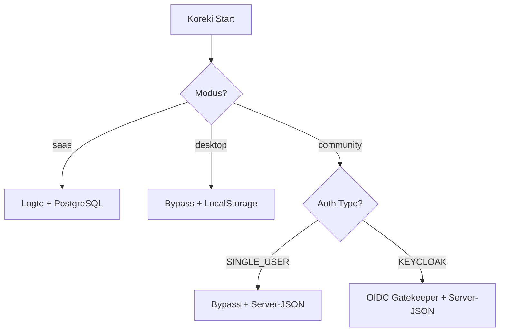

# Community Edition: Keycloak Auth & Filesystem Persistence

## 1. Executive Summary & Kontext
> [!NOTE]
> **Zusammenfassung:** Dieses System ermöglicht eine sichere, mehrbenutzerfähige Authentifizierung via Keycloak (OIDC) und eine dauerhafte Speicherung von Experten-Prompts auf dem Server-Dateisystem, ohne dass eine klassische Datenbank (PostgreSQL) installiert werden muss.
> **Zielgruppe:** Administratoren der Schulinfrastruktur und Entwickler.

In der Community Edition soll Koreki als zentraler Server in Schulen laufen. Um individuelle Lehrer-Accounts und Schutz vor Datenverlust (beim Löschen des Browserverlaufs) zu gewährleisten, wurde eine hybride Persistenz-Schicht implementiert.

---

## 2. Architektur & Systemdesign

### Strategie-Muster (Strategy Pattern)
Koreki entscheidet beim Start über die Umgebungsvariablen, welcher Authentifizierungs- und Speicherweg genutzt wird:



### Dateisystem-Persistenz (The Vault)
Anstatt den flüchtigen `localStorage` des Browsers zu nutzen, speichert die Community Edition kritische Daten als isolierte JSON-Dateien in einem dedizierten "Vault":

1. **User-Granulare Daten (Prompts):** Der `LocalProfileService` speichert diese als isolierte JSON-Dateien:
   * **Pfad**: `/data/prompts/profiles_[SHA256_HASH_OF_USER_ID].json`
   * **Isolierung**: Die Dateinamen basieren auf dem SHA-256 Hash der OIDC-Sub (UserID). Dies verhindert Path-Traversal-Angriffe und garantiert strikte Datentrennung zwischen Lehrern.

2. **Globale AI-Einstellungen (Routing & Provider):** Der `GlobalSettingsService` speichert systemweite Parameter (wie Ollama-URL, Ollama-Modell oder Standard-Provider):
   * **Pfad**: `/data/prompts/global_ai_settings.json`
   * **Vollständiger Sync**: Sämtliche Admin-Änderungen in allen Setup-Dialogen (`SettingsModal`, `AiSetupModal`, `AiParamsModal`) speichern atomar das vollständige Routing-Setup (Provider, URLs, Modell-Tags, Thinking-Flags) via `/api/admin/global-ai-settings`.
   * **` .env` Fallback**: Existiert noch keine `global_ai_settings.json` (z. B. nach einer frischen Installation, bevor ein Admin im UI speichert), liest der Service automatisch Umgebungsvariablen (`DEFAULT_AI_PROVIDER`, `OLLAMA_BASE_URL`, `OLLAMA_MODEL`, `OPENAI_API_BASE`, `OPENAI_API_MODEL`) aus der `.env` als initialen Standard aus.
   * **Hydration**: Bei jedem Login werden diese Vorgaben über `/api/user` ans Frontend gesendet und überschreiben etwaige lokale "Relikte" im Browser (`localStorage`), sodass der Admin bzw. die Server-Konfiguration immer das letzte Wort hat.

---

## 3. Implementierung & Nutzung

### Konfiguration (`.env`)
Um den Keycloak-Gatekeeper und Standard-KI-Provider zu konfigurieren:
```bash
NEXT_PUBLIC_KOREKI_MODE=community
NEXT_PUBLIC_SINGLE_USER_MODE=false
NEXT_PUBLIC_AUTH_TYPE=KEYCLOAK

NEXT_PUBLIC_OIDC_ISSUER="https://keycloak.schule.de/realms/schule"
NEXT_PUBLIC_OIDC_CLIENT_ID="koreki-app"

# Optional: Custom Admin-Rolle für den Zahnrad-Schutz
NEXT_PUBLIC_ADMIN_ROLE_NAME="koreki-admin"

# Globaler KI-Standard (falls noch keine global_ai_settings.json angelegt wurde)
DEFAULT_AI_PROVIDER=ollama
OLLAMA_BASE_URL="http://127.0.0.1:11434"
OLLAMA_MODEL="qwen3.6:35b"
```

### API-Routing
- **Experten-Prompts:** Die API `/api/user/prompt-profiles` erkennt den Community-Modus und leitet Anfragen an den `LocalProfileService` weiter.
- **Globale Einstellungen:** Der Endpunkt `/api/admin/global-ai-settings` nimmt Konfigurationen für die `global_ai_settings.json` entgegen. Er verlangt strikt Admin-Rechte (`claims.role === 'ADMIN'` oder `AuthType === NONE`). Das Einstellungs-Zahnrad im Frontend ist für normale Lehrer im Keycloak-Modus vollständig unsichtbar.

---

## 4. Security & Compliance (Mandatory)
> [!IMPORTANT]
> **Datenverarbeitung:** Es werden keine personenbezogenen Daten (PII) der Schüler auf dem Server gespeichert. Lediglich die pädagogischen Anweisungen (Prompts) der Lehrer werden nutzerbezogen abgelegt.

* **Authentifizierung:** Erfolgt über Keycloak. Koreki speichert keine Passwörter.
* **Autorisierung:** Ein Zugriff auf Prompts ist nur mit einem gültigen Keycloak-Token möglich, das zur jeweiligen Datei-ID passt.
* **Path-Traversal-Schutz (Defense-in-Depth):** Der `LocalProfileService` verarbeitet niemals direkte Nutzereingaben als Pfadsegmente (dank des SHA-256 Hashes). Als zusätzliche Rückfallebene löst der Service alle Pfade absolut auf (`path.resolve`) und stellt über eine `startsWith`-Validierung sicher, dass kein Dateizugriff außerhalb des designierten Stammverzeichnisses stattfinden kann. Bei Unstimmigkeiten wird der Request mit einem Sicherheitsalarm blockiert.
* **SaaS Isolation:** Der Keycloak-Code ist durch einen **Hard Domain Lock** auf `koreki.org` blockiert. Es besteht kein Risiko für den SaaS-Login.

---

## 5. Testing & Referenzen
* **Unit-Tests:** `LocalProfileService.test.ts` (Verifizierung der Datei-Isolierung).
* **Verwandte Dokumente:** 
  * [Auth System](./auth-system.md)
  * [Desktop vs SaaS](./deployment-tiers-comparison.md)
