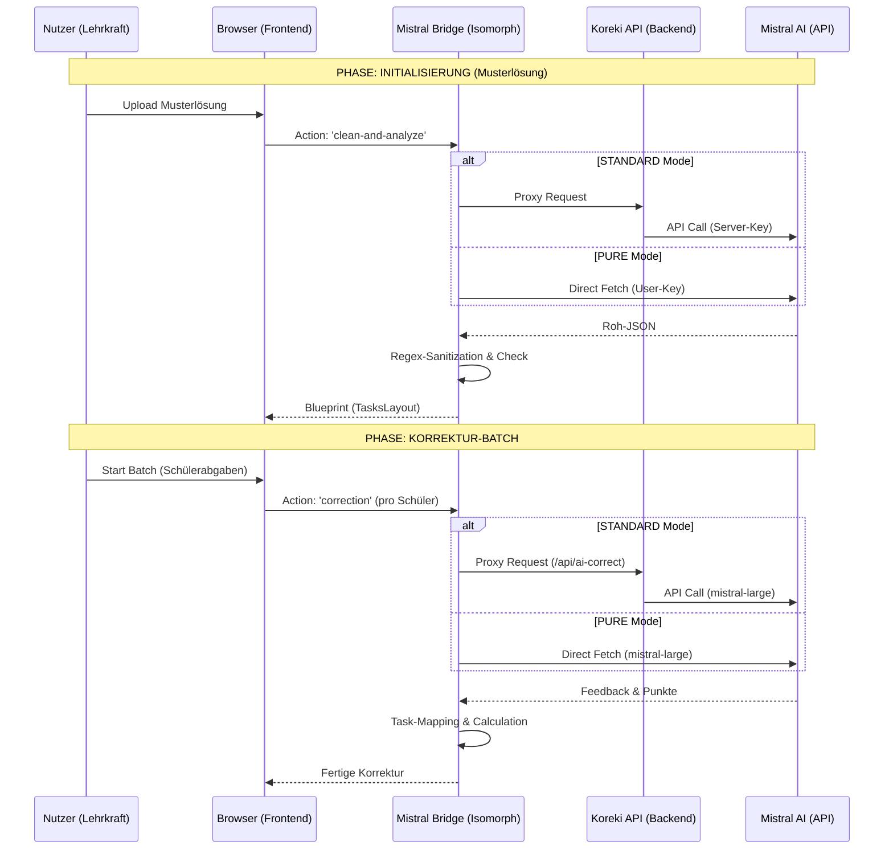

# Korrektur-Workflow (Technical Lifecycle)

## 1. Executive Summary & Kontext

Diese Dokumentation beschreibt den präzisen technischen Ablauf einer Korrektur in Koreki. Das System folgt einer **Blueprint-First Architektur**, bei der die Musterlösung die strukturelle Basis für alle folgenden Analysen bildet.

**Update (Unified AI Bridge):** Alle KI-Anfragen werden nun über eine isomorphe Bridge (`mistral-provider.ts`) geschleust, um absolute Identität der Logik zwischen **STANDARD** und **PURE** Modus zu garantieren.

---

## 2. Übersicht des Gesamtprozesses

Der Workflow nutzt die **Mistral Bridge** als zentralen Hub für Prompts, Modell-Tiers und JSON-Parsing.



---

## 3. Die Unified AI Bridge (Isomorphic Core)

Die `MistralBridge` (`src/lib/ai/mistral-provider.ts`) ist das Herzstück der aktuellen Architektur. Sie garantiert:

1.  **Modell-Konsistenz**:
    -   **`mistral-large-latest`**: Standard für pädagogische Korrekturen und die Analyse von komplexen Scans (maximale Präzision).
    -   **`mistral-small-latest`**: Optimiert für `clean-and-analyze` bei **digitalen PDFs** (maximale Effizienz).
    -   **`mistral-ocr-latest`**: Spezialisiert für `ocr` (Hochpräzise Handschrifterkennung).

2.  **Robuste Validierung**: Jede Antwort durchläuft eine Regex-Sicherung, die Markdown-Fences (` ```json `) entfernt, bevor `JSON.parse` ausgeführt wird.

3.  **Architektonische Rationale (SOLID Principles)**:
    Koreki verzichtet bewusst auf einen "Vision-Monolithen". Der Workflow folgt dem **Single Responsibility Principle (SRP)**:
    - **Isolation**: Texterkennung, Layout-Analyse und pädagogische Bewertung sind getrennte Verantwortlichkeiten.
    - **Präzision**: Ein Modell, das nur transkribiert ("Robotic Writing Head"), liefert eine höhere Verbatim-Treue als ein Modell, das gleichzeitig interpretieren muss.
    - **Wartbarkeit (ISP)**: Änderungen an der Analyse-Logik (z.B. Token-Upgrade auf 4000) können vorgenommen werden, ohne die Korrektur-Logik zu gefährden.

---

## 4. Large Payload Handling (Performance & Stability)

Koreki ist für Dokumentenstapel bis **100MB+** ausgelegt, ohne den Server zu fluten.

### A) Client-Side Page Chunking
Große PDFs werden nicht als Ganzes übertragen. Die `extraction-logic.ts` nutzt `pdf.js` im Browser, um jede Seite einzeln zu rendern.
- Jede Seite wird als separater, kleiner Bild-Chunk (ca. 2-5MB) an die Bridge gesendet.
- **Vorteil**: Die Server-seitige Limitierung von `50MB` (Nginx/API) wird im Normalbetrieb nie erreicht, da die Last pro Seite und nicht pro Gesamtdokument skaliert.

### B) Sequential Processing & Resilience Layer
Um 429-Fehler (Rate Limits) bei der Mistral API (insb. im Free/Basic Tier) zu vermeiden, nutzt Koreki eine zwei-stufige Guardrail-Architektur:
1.  **Drosselung auf 1 (Sequentiell)**: Jede Seite/Anfrage wird erst vollständig abgeschlossen, bevor die nächste gestartet wird. Dies vermeidet parallele RPC-Kollisionen.
2.  **Retry-Backoff-Strategie**: In der `fetchWithRetry`-Utility sind **3 Retries** mit exponentiellem Backoff implementiert. Bei einem 429-Fehler wartet das System automatisch länger, bevor ein neuer Versuch gestartet wird.
- **Skalierbarkeit**: Im **Business Tier** von Mistral kann die Concurrency in den Konfigurationsdateien (`ocr-orchestrator.ts`, `extraction-logic.ts`) wieder auf **2-5** erhöht werden.

---

## 5. Besonderheit im PURE-Modus (Zero-Data-Footprint)

Im **PURE-Modus** (Eigener API-Key) erreicht das System das höchste Datenschutzniveau:
- **Keine Inhaltsdaten auf dem Koreki-Server**: Weder Musterlösungen noch Schülertexte berühren die Koreki-API.
- **Direktverbindung**: Die `MistralBridge` kommuniziert direkt mit `api.mistral.ai`.
- **Minimaler Billing-Ping**: Der Koreki-Server erhält lediglich einen anonymisierten Ping (`/api/billing/pure-deduct`) mit der Anzahl der verarbeiteten Seiten zur Credit-Abrechnung.

---

## 6. Zusammenfassung der Modell-Zuweisung

| Phase | Ziel | Modell (Unified Tier) | Begründung |
| :--- | :--- | :--- | :--- |
| **OCR** | Text aus Scans lesen | `mistral-ocr-latest` | Handschrift-Spezialist |
| **Analyse (Digital)** | Layout aus PDF-Text | `mistral-small-latest` | Effizienz bei digitalem Text |
| **Analyse (Scan)** | Layout aus Transkript | `mistral-large-latest` | Präzision für unstrukturierte Scans |
| **Korrektur** | Pädagogische Bewertung | `mistral-large-latest` | Maximale pädagogische Tiefe |

---
*Status: INDUSTRIAL STABLE (UNIFIED BRIDGE ARCHITECTURE)* 🏛️🛡️🚀

> [!IMPORTANT]
> ARCHITECT-NOTE: Jegliche Erweiterung der Prompt-Logik MUSS in der `MistralBridge` erfolgen, um die Synchronität zwischen PURE und STANDARD zu wahren. Die `fetchWithRetry`-Logik ist das zentrale Sicherheitsnetz gegen API-Instabilitäten.
