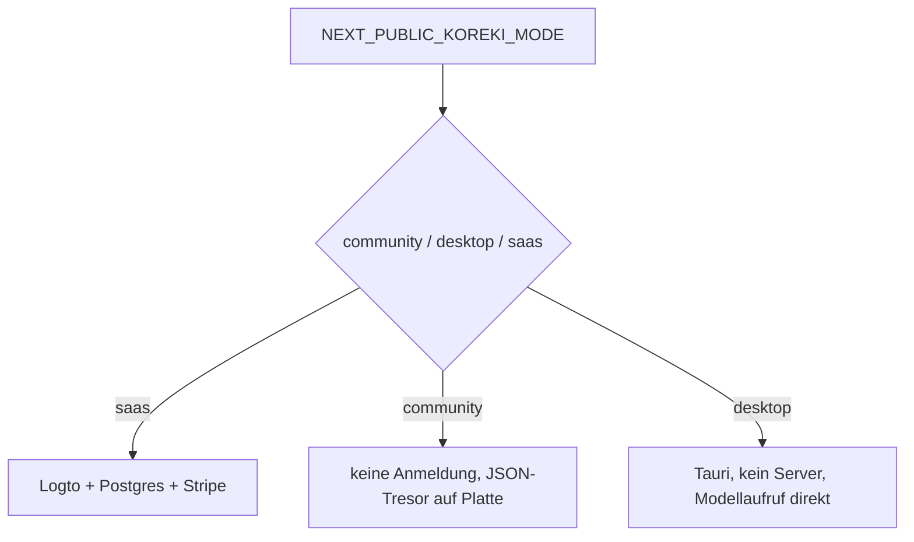

# Betrieb ohne externe Infrastruktur

> [!IMPORTANT]
> **Inhalt am 27.08.2026 gegen den Code geprüft und neu gefasst.** Die vorige Fassung vom 05.04.2026 beschrieb dies als unerledigte Idee („Warum wir es noch nicht umsetzen"). Das Ziel ist inzwischen erreicht — auf einem anderen Weg als dort vorgeschlagen. Siehe Abschnitt 5.

## 1. Executive Summary & Kontext
> [!NOTE]
> **Zusammenfassung:** Koreki läuft vollständig ohne Logto, ohne Stripe und ohne Datenbank. Das ist keine Entwickler-Attrappe, sondern der reguläre Betriebsweg der Community- und Desktop-Ausgabe.
> **Zielgruppe:** Entwicklung, QA, Selbstbetreiber.

Ursprünglich war dafür eine Mock-Ebene geplant: gefälschte Anmeldung, SQLite statt Postgres, übersprungene Stripe-Aufrufe. Gebaut wurde stattdessen ein echter Betriebsmodus, der dieselben Codepfade nutzt wie der gehostete Betrieb. Damit entfällt die Gefahr, dass „lokal alles grün" ist, während der echte Weg bricht — das war das Hauptargument gegen die Mock-Strategie und es hat sich als richtig erwiesen.

---

## 2. Architektur & Systemdesign



### Die drei Schalter

| Variable | Wirkung |
|---|---|
| `NEXT_PUBLIC_KOREKI_MODE` | `saas`, `community` oder `desktop` |
| `NEXT_PUBLIC_AUTH_TYPE` | `NONE` schaltet die Anmeldung ab (`src/lib/env-context.ts`) |
| `NEXT_PUBLIC_SINGLE_USER_MODE` | Einzelplatzbetrieb ohne Mandantentrennung |

Die Erkennung der Betriebsart ist gegen Fehlkonfiguration abgesichert: Läuft die Anwendung unter der Produktivdomain, gilt sie unabhängig von den Variablen als gehostet (`isLocalInstance` in `src/lib/env-context.ts`).

### Persistenz ohne Datenbank

Die Community-Ausgabe speichert bewusst ohne Datenbank. `docker-compose.community.yml` führt weder einen Datenbankdienst noch ein Volume.

An die Stelle der Datenbank tritt ein **JSON-Tresor** auf der Platte (`src/lib/services/json-vault.ts`, benutzt von `local-vault.ts`, `local-profile-service.ts`, `global-settings-service.ts`). Er bildet die Haltbarkeitsgarantien nach, die sonst die Datenbank mitbrächte — unter anderem wird eine beschädigte Datei in Quarantäne verschoben statt beim nächsten Schreiben überschrieben, damit ein sichtbarer Fehler entsteht und kein stiller Datenverlust.

Gespeichert werden dort Profile und Einstellungen. **Korrektursitzungen und Bewertungen werden auch hier nicht persistiert** — sie leben im Browser und gehen beim Schließen verloren, sofern die Lehrkraft sie nicht als `.koreki`-Datei sichert.

Wo Code auf eine Datenbank träfe, die es nicht gibt, ist der Fall ausdrücklich behandelt: `src/instrumentation.ts` überspringt die Aufbewahrungsroutine, `src/pages/api/health.ts` meldet den Zustand, statt Anfragen in eine Instanz ohne Datenbank zu leiten.

### Abrechnung

Im lokalen Betrieb entfällt die Guthabenlogik. Stripe wird nicht aufgerufen; die Modellaufrufe laufen über den Schlüssel des Betreibers.

---

## 3. Implementierung & Nutzung

```bash
docker compose -f docker-compose.community.yml up
```

Für den Desktop-Weg siehe `npm run dev:desktop` beziehungsweise `npm run build:desktop`.

---

## 4. Security & Compliance
> [!IMPORTANT]
> * **Datenverarbeitung:** Im lokalen Betrieb verlassen Schülerarbeiten den Rechner nur, wenn ein entfernter Anbieter konfiguriert ist. Mit Ollama bleibt alles lokal.
> * **Authentifizierung/Autorisierung:** Bei `AUTH_TYPE=NONE` gibt es keine. Der Zugang ist genau so weit geschützt wie der Rechner, auf dem die Anwendung läuft. Für den Mehrbenutzerbetrieb an einer Schule ist das zu wenig — dann ist die gehostete oder eine abgesicherte Variante zu wählen.
> * **Verantwortung:** Beim Selbstbetrieb liegt sie beim Betreiber, nicht beim Hersteller. Wer eigene Modelle oder Anweisungen einhängt, kann nach Art. 25 KI-VO selbst zum Anbieter werden.
> * **Audit-Logs:** Ohne Datenbank gibt es kein `PrivacyLog`. Das Protokoll der KI-Läufe entsteht trotzdem und wird über die Schaltfläche „Protokoll" als Datei ausgegeben.

---

## 5. Was aus der ursprünglichen Idee wurde

| Vorschlag vom 05.04.2026 | Stand 27.08.2026 |
|---|---|
| `NEXT_PUBLIC_MOCK_AUTH=true` für eine gefälschte Anmeldung | nie gebaut; stattdessen `NEXT_PUBLIC_AUTH_TYPE=NONE` als echter Modus |
| `MOCK_DATABASE=true` mit SQLite-Datei `dev.db` | nie gebaut; stattdessen JSON-Tresor auf der Platte |
| `MOCK_STRIPE=true` für übersprungene Abrechnung | nie gebaut; im lokalen Betrieb entfällt die Guthabenlogik |
| „Warum wir es noch nicht umsetzen" | überholt — das Ziel ist erreicht |

Keiner der drei `MOCK_`-Schalter existiert im Code. Wer danach sucht, sucht vergeblich.

---

## 6. Testing & Referenzen
* **Test-Coverage:** `tests/integration/IndustrialTenancy.test.ts` und `tests/integration/Multitenancy.test.ts` betreffen die Mandantentrennung. Ein Test, der den Betrieb ohne Datenbank im Ganzen abdeckt, ist nicht ersichtlich.
* **Verwandte Dokumente:** [Community Edition Persistence](./community-edition-persistence.md), [Koreki Desktop](./koreki-desktop.md), [Deployment Tiers](./deployment-tiers-comparison.md) — Inhalt dieser Dokumente ist nicht mitgeprüft.
