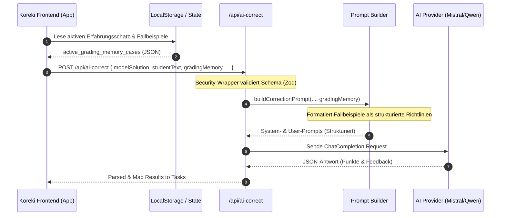

# Koreki Grading Memory (Erfahrungsschatz)

## 1. Executive Summary & Kontext
> [!NOTE]
> **Zusammenfassung:** Die *Grading Memory (Erfahrungsschatz)*-Funktion ermöglicht es Lehrkräften, konkrete, reale Bewertungs-Fallbeispiele (Schülerantwort + exakte Punktevergabe + Begründungstext) zu pflegen. Diese Beispiele werden als Few-Shot-Kontext in den KI-Prompt injiziert, um die Benotungs-Systematik der KI exakt an den persönlichen Bewertungsstil des Lehrers anzugleichen.
> **Zielgruppe:** Entwickler, Product Manager, QA Engineers.

In klassischen KI-Korrekturmodellen tendiert die KI zu generischen Bewertungen. Durch den *Erfahrungsschatz* wird dieses Problem gelöst: Anstatt allgemeine Prompts zu schreiben, gibt die Lehrkraft konkrete Beispiele vor („Bei dieser speziellen Formulierung ziehe ich 1 Punkt ab“). Dies führt zu einer drastischen Steigerung der Korrektur-Präzision und verringert manuellen Nachbesserungsaufwand um bis zu 80%.

---

## 2. Architektur & Systemdesign

### Datenfluss & Sequenz (Few-Shot Injection)
Der folgende Ablauf zeigt, wie ein aktiver Erfahrungsschatz geladen, in den Prompt injiziert und an das LLM (Mistral/Qwen) übermittelt wird:



### Datenbank-Modell (Prisma Schema)
Für SaaS- und Multi-User-Instanzen ist der Erfahrungsschatz über das Modell `GradingMemory` in PostgreSQL persistiert. In lokalen Desktop- oder Offline-Instanzen läuft das System autark über `LocalStorage` und `local-profile-service`.

```prisma
model User {
  id                    String          @id @default(cuid())
  activeGradingMemoryId String?
  gradingMemories       GradingMemory[]
}

model GradingMemory {
  id        String   @id @default(cuid())
  name      String
  cases     Json     // Array vom Typ GradingMemoryCase[]
  userId    String?
  user      User?    @relation(fields: [userId], references: [id], onDelete: Cascade)
  createdAt DateTime @default(now())

  @@unique([name, userId])
}
```

Die Struktur der einzelnen Fälle (`GradingMemoryCase`) ist wie folgt typisiert:
```typescript
export interface GradingMemoryCase {
    id: string;
    studentText: string;
    expectedCorrection: {
        pointsObtained: number;
        correctionNotes: string;
        feedback?: string;
    };
}
```

---

## 3. Implementierung & Nutzung

### Prompt-Generierung (`prompt-builder.ts`)
Die Fallbeispiele werden dynamisch am Ende des User-Prompts als konkrete Korrektur-Fallbeispiele angehängt:

```typescript
if (gradingMemory && Array.isArray(gradingMemory) && gradingMemory.length > 0) {
    let examplesText = '\n\n### KONKRETE KORREKTUR-FALLBEISPIELE (RICHTLINIEN):\n';
    examplesText += 'Nutze die folgenden Beispiele als exakte Vorlage für deine Benotungs-Systematik. Halte dich bei ähnlichen studentischen Antworten und Abweichungen strikt an dieses Bewertungsschema:\n\n';
    
    gradingMemory.forEach((item, index) => {
        examplesText += `BEISPIEL ${index + 1}:\n`;
        examplesText += `[Schülerantwort]\n"${item.studentText}"\n\n`;
        examplesText += `[Erwartete Bewertung]\n`;
        examplesText += `- Vergebene Punkte: ${item.expectedCorrection.pointsObtained}\n`;
        examplesText += `- Begründung (correctionNotes): "${item.expectedCorrection.correctionNotes}"\n`;
        if (item.expectedCorrection.feedback) {
            examplesText += `- Feedback: "${item.expectedCorrection.feedback}"\n`;
        }
        examplesText += '\n-------------------\n\n';
    });

    user += examplesText;
}
```

### On-The-Fly Kalibrierung (Loop-Closing Feedback Channel)
Ab Version 12 wurde eine direkte Feedbackschleife aus der laufenden Korrekturoberfläche (`BatchTaskAnalysisCard.tsx`) integriert:
1. **Zweck:** Weicht die Einschätzung der KI von der gewünschten pädagogischen Bewertung ab, kann die Lehrkraft die Punkte und das Feedback editieren und diesen Fall mit nur einem Klick (**„In Erfahrungsschatz übernehmen“**) direkt als neues Few-Shot-Beispiel anlernen.
2. **Stilistische Anonymisierung & PII-Scrubbing (Neu in v0.9.67):** Vor dem Anlernen eines Beispiels wird die Schülerantwort über den API-Endpunkt `/api/user/grading-memories/anonymize` stilistisch anonymisiert. Rhetorische Eigenheiten, Anekdoten und persönliche Schreibstile werden über einen KI-Zwischenschritt entfernt, während das fachliche Kernargument im Indikativ erhalten bleibt. Dies löst DSGVO/GDPR-Herausforderungen bezüglich der Speicherung von Schüleroriginaldaten im System vollständig. Lehrkräfte erhalten eine interaktive Vorab-Vergleichsansicht (modal), um die anonymisierte Version vor dem Sichern zu reviewen und anzupassen.
3. **Plattform-Weichenstellung (Drei-Wege-Persistenz):**
   - **SaaS Cloud:** Sichert den Fall sicher in der PostgreSQL-Datenbank über den Next.js-Endpunkt `/api/user/grading-memories/append`. Der Zugriff ist über Logto-Session-Claims (RBAC) gegen unbefugten Fremdzugriff geschützt.
   - **Community (Docker):** Erkennt über `isLocalInstance()` die self-hosted Umgebung und nutzt den `LocalGradingMemoryService`, um den Fall direkt in die Datei `grading_memories.json` im Docker-Volume zu schreiben.
   - **Desktop (Tauri):** Fängt über `isDesktopTarget()` den API-Call ab und schreibt den Fall direkt clientseitig in den `localStorage` der App unter `koreki_local_grading_memories` und triggert einen UI-Refresh.

### Import & Export Format (KEP-GM-1 Markdown)
Um Lehrkräften das Teilen von Erfahrungsschätzen zu ermöglichen, wurde ein Markdown-basierter Standard (**KEP-GM-1**) implementiert. Dies erlaubt den Im- und Export per einfacher Textdatei:

```markdown
# Erfahrungsschatz: FISIV2

## Fallbeispiel 1
**Schülerantwort:**
> "Ein USV-System schützt nur vor Stromausfällen."

**Erwartete Bewertung:**
- Punkte: 1
- Begründung: "Richtig, aber unvollständig. Es schützt auch vor Überspannungen und filtert Netzstörungen."
```

---

## 4. Security & Compliance
> [!IMPORTANT]
> **Datenschutz an Schulen (DSGVO/GDPR):** Da Schülerarbeiten verarbeitet werden, gelten höchste Compliance-Ansprüche.

*   **Stilistische Anonymisierung (DSGVO-Härtung):** Da handschriftliche oder individuelle Formulierungen urheberrechtlich oder datenschutzrechtlich problematisch sein können, wird jede Schülerantwort vor dem Speichern mittels KI abstrahiert. Rhetorische Eigenheiten, Anekdoten und persönliche Schreibstile werden entfernt, um jeglichen Bezug zur Person unumkehrbar aufzuheben.
*   **Personenbezogene Daten (PII):** Erfahrungsschätze enthalten standardmäßig **keine** Klarnamen oder sonstige Schüler-PII. Schülerantworten werden beim Hinzufügen zum Erfahrungsschatz anonymisiert (Referenzierung über IDs oder anonyme Avatare wie `CONCEPT_CONFUSION` [Verwechsler] oder `INCOMPLETE` [Unvollständige]).
*   **Zero-Ops / Offline-Kompatibilität:** Im lokalen Desktop-Modus und Community-Modus werden Erfahrungsschätze vollständig im `LocalStorage` bzw. der lokalen SQLite-Datenbank des Nutzers gespeichert. Es findet keine Übertragung an Koreki-Zentralserver statt.
*   **AVV-Verschlüsselung:** In der SaaS-Variante sind diese Datensätze durch die mit der Schule/Kommune geschlossene Auftragsdatenverarbeitung (AVV) geschützt und in isolierten Tenant-Datenbankstrukturen abgelegt.

---

## 5. Testing & Referenzen

*   **Verwandte Dokumente:**
    *   [AI Pedagogy Framework](./ai-pedagogy-framework.md) — Generelles Framework zur pädagogischen Ausrichtung
    *   [Correction Workflow](./correction-workflow.md) — Der detaillierte Korrekturablauf der KI
*   **Test-Coverage:**
    *   Validierungsschemata sind über Jest Unit-Tests in `tests/unit/` gegen die Zod-Schemata abgesichert.
    *   Die Markdown-Parser wurden mit dedizierten Unit-Tests (`markdown-grading-memory-parser.test.ts`) für fehlerfreie Konvertierung verifiziert.
*   **API-Routen:**
    *   `GET/POST /api/user/grading-memories` — Verwaltung der Erfahrungsschätze
    *   `POST /api/ai-correct` — Ausführung der Korrektur (akzeptiert optionales `gradingMemory`-Array)
