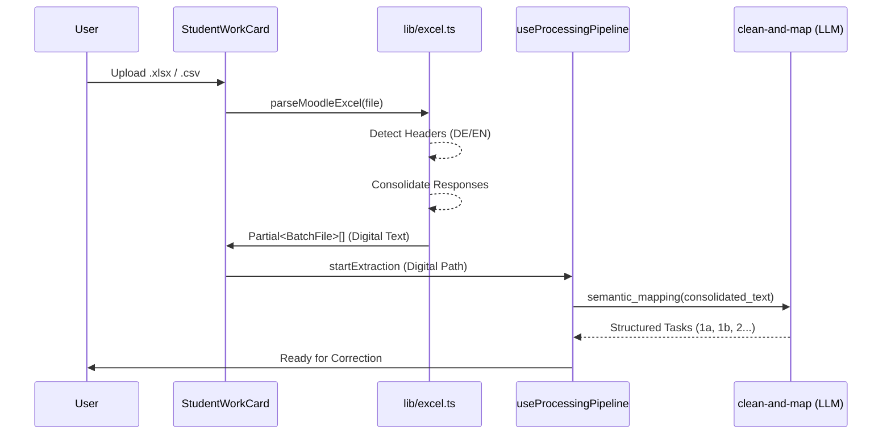

# Moodle Quiz Export Import

## 1. Executive Summary & Kontext
> [!NOTE]
> **Zusammenfassung:** Ermöglicht den direkten Import von Schülerantworten aus Moodle-Quiz-Exporten (XLSX). Dies eliminiert den Umweg über PDF-OCR und garantiert 100% Text-Präzision.
> **Zielgruppe:** Entwickler (Architektur), Lehrer (Nutzerführung).

Der Moodle-Import wurde eingeführt, um digitale Prüfungsformate nahtlos in den Koreki-Korrekturflow zu integrieren. Anstatt PDF-Scans mühsam per OCR zu verarbeiten, nutzt Koreki die strukturierten Daten aus Excel-Exporten.

---

## 2. Architektur & Systemdesign
> [!TIP]
> Der Prozess folgt der "Consolidation & Semantic Mapping" Strategie, um flexibel auf unterschiedliche Moodle-Layouts zu reagieren.



---

## 3. Implementierung & Nutzung
Der Parser in `src/lib/excel.ts` nutzt die `xlsx` Library und bietet ein robustes Pattern-Matching für Header:

* **Names**: `Nachname`, `Last name`, `Vorname`, `First name`.
* **Responses**: Alle Spalten, die mit `Response`, `Antwort`, `Frage` oder `F ` beginnen.

### Code-Beispiel (Heuristik)
```typescript
// Heuristik zur Unterscheidung von Text vs. Punkten
const looksLikePoint = (val: string) => isNumeric(val) && val.length < 5;
if (looksLikePoint(valStr)) return; // Ignoriere reine Punktzahlen
```

---

## 4. Security & Compliance
> [!IMPORTANT]
> **Industrial Anonymisierungs-Standard:** Moodle-Exporte enthalten PII (Namen). Diese werden in der UI automatisch durch Platzhalter ("Schüler #1") ersetzt.

* **Datenverarbeitung:** PII (Name, Vorname) wird als Identifier in `originalName` lokal gespeichert, aber nicht in der "Stapelverarbeitung" angezeigt. Die KI-Korrektur erfolgt auf anonymisierten Daten.
* **De-Anonymisierung:** Die Klarnamen werden erst beim Export (Lehrer-Excel oder Feedback-PDF) durch die `getExportName`-Logik wieder eingesetzt.
* **Audit-Logs:** Import-Aktionen werden im lokalen Session-Log (Logger) vermerkt.

---

## 5. Testing & Referenzen

* **Unit-Tests:** `tests/unit/lib/moodle-import.test.ts`
* **Verwandte Dokumente:** [Batch Processing Lifecycle](./batch-processing-lifecycle.md)
* **Status:** Industrial Grade Stage 3 (Local First).
