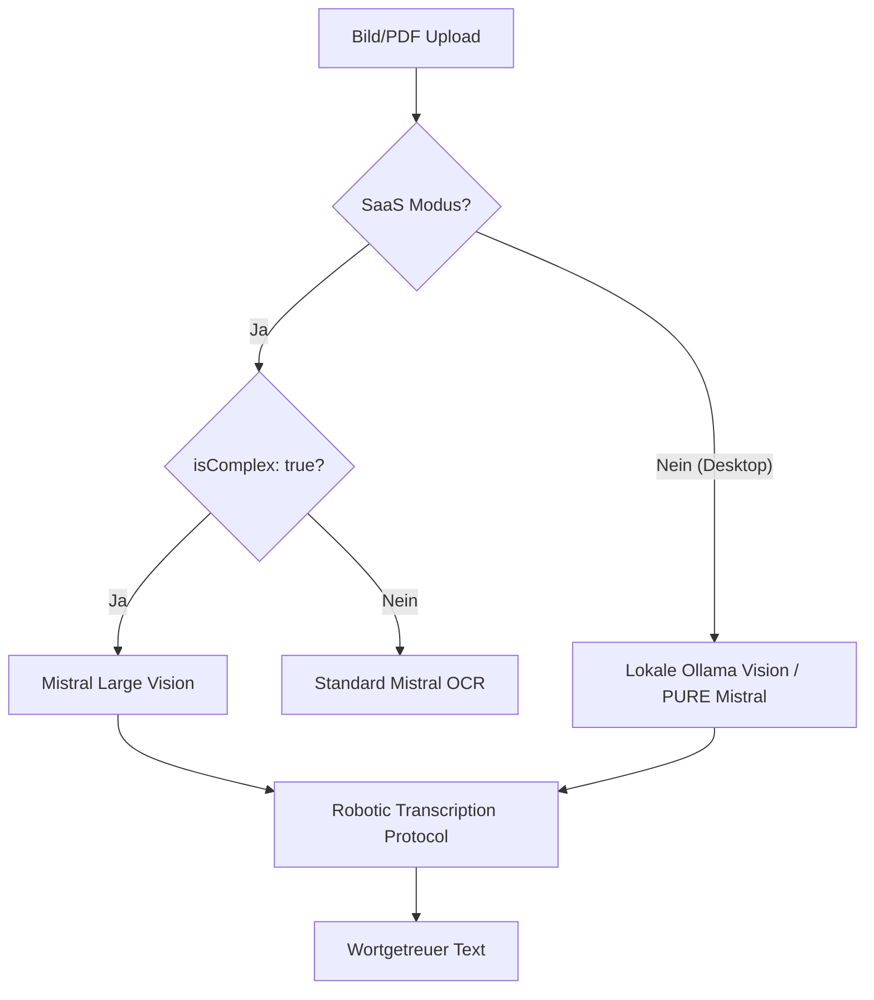

# Industrial OCR Integrity Standards

## 1. Executive Summary & Kontext
> [!NOTE]
> **Zusammenfassung:** Dieses Dokument definiert die technischen Standards zur Vermeidung von Datenverlust (Auslassung von Wörtern) und Halluzinationen (unberechtigte Formatierungen) im OCR-Prozess.
> **Zielgruppe:** Entwickler, AI-Engineers und Qualitätsmanagement.

In pädagogischen Kontexten ist die absolute Texttreue (Verbatim) essenziell. Herkömmliche OCR-Modelle neigen dazu, Texte zu "bereinigen" oder Labels wie "Vorteil:" zu löschen, da sie diese als Metadaten interpretieren. Dieser Standard unterbindet dieses Verhalten für **alle pädagogischen Dokumenttypen (Schülerlösungen und Musterlösungen)** durch das **Robotic Writing Head** Protokoll.

---

## 2. Architektur & Systemdesign

### Vision Siding Flow
Um die höchste Präzision zu erreichen, nutzt Koreki im SaaS-Modus eine Siding-Logik, die Standard-OCR umgeht, wenn pädagogische Integrität gefordert ist.



### Provider-Level Capability Enforcement
Koreki implementiert eine strikte architektonische Barriere im `mistral-provider.ts` Base-Layer. Dies stellt sicher, dass aktionsspezifische Fähigkeiten (z. B. `vision` oder `ocr`) immer das physisch notwendige KI-Modell (z. B. "Mistral Large" für Vision) erzwingen, selbst wenn der Nutzer global ein anderes Modell (z. B. "Mistral Small" für günstige Textkorrektur) eingestellt hat.
Dies schützt die Orchestrator-Schicht vor ungültigen Modell-zu-Fähigkeit Mappings.

### System Role Split
Ein kritischer Teil der Architektur ist die Trennung der Nachrichten-Rollen. Flaggschiff-Modelle wie Mistral Large folgen Instruktionen signifikant besser, wenn diese in einer dedizierten `system`-Rolle gesendet werden.

### Architektonische Rationale: Modulare Pipeline vs. Monolith (SOLID Principles)
Obwohl in Hochpräzisions-Szenarien (SaaS-Siding) für alle Schritte das identische Modell (**Mistral Large**) verwendet wird, hält Koreki strikt an der Aufteilung in drei Phasen fest. Diese Architektur folgt direkt den **SOLID-Prinzipien**:

1. **Texterkennung (OCR/Vision):** Rein physikalische Transkription ("Robotic Writing Head").
2. **Layout-Analyse (Cleaning):** Strukturierung des Rohtextes in JSON-Tasks.
3. **Pädagogische Korrektur:** Inhaltlicher Abgleich gegen die Musterlösung.

**Anwendung der SOLID-Prinzipien:**
*   **Single Responsibility Principle (SRP):** Jede Phase hat eine klar definierte, isolierte Aufgabe. Ein Modell, das nur transkribieren muss, ist in dieser Phase fehlerresistenter als ein Modell, das gleichzeitig korrigieren soll.
*   **Interface Segregation (ISP):** Die Pipeline-Schritte kommunizieren über saubere Schnittstellen (z.B. Raw Text -> JSON Layout). Dies erlaubt es uns, einzelne Phasen (z.B. die Analyse) mit spezifischen Härtungen (4000 Tokens) zu versehen, ohne die anderen Phasen zu beeinflussen.
*   **Vermeidung von Monolithen:** Kein "Black-Box" Verhalten, bei dem ein Modell alles gleichzeitig "erraten" muss. Dies führt zu einer signifikant höheren Verbatim-Integrität.

---

## 3. Das "Optical Sensor" Protokoll (V15)
Das Protokoll (implementiert in `prompt-builder.ts`) nutzt **Positive Framing** statt negativer Instruktionen. Statt dem Modell zu sagen, was es NICHT tun soll, wird ausschließlich definiert, was es tun SOLL.

### Kern-Paradigma: "Gültige Tinte"
Das Modell erhält eine positive Definition von "gültiger Tinte" (= Tinte, die frei von überlagernden Markierungen ist) und transkribiert ausschließlich diese. Dies ersetzt die gescheiterten negativen Instruktionen ("Ignoriere Streichungen"), die das Modell auf durchgestrichenen Text **primt** statt ihn zu unterdrücken.

### Kern-Regeln:
1. **SENSOR-ROLLE**: Das Modell ist ein optischer Sensor ohne Eigenintelligenz.
2. **GÜLTIGKEITS-FILTER**: Nur Tinte ohne überlagernde Markierungen wird transkribiert.
3. **TWO-PHASE SCAN**: Erst identifizieren (gültige Bereiche), dann transkribieren.
4. **FEHLER-REPLIKATION**: Rechtschreibfehler werden exakt übernommen.
5. **FORMATIERUNGS-VERBOT**: Kein Markdown, kein Fettdruck, keine Kursivschrift.
6. **KEINE WISSENS-INJEKTION**: Das Modell ergänzt niemals Wörter aus seinem Fachwissen.

---

## 4. Implementierung & Parameter (VRE Architecture)

Koreki nutzt die **Variable Rule Execution (VRE)**, um Sampling-Parameter pro Task-Typ zu steuern.

### VRE Settings Matrix:
| Task-Typ | Temperature | Top-P | Zielsetzung |
| :--- | :--- | :--- | :--- |
| **Vision/OCR** | `0.0` | `1.0` | Maximale Determinisme (Greedy), Halluzinations-Sperre. |
| **Clean & Analyze**| `0.0` | `1.0` | Verbatim-Extraktion der Musterlösung. |
| **Clean & Map** | `0.0` | `0.1` | Struktur-Logik mit minimaler Flexibilität. |
| **Correction** | `0.7` | `1.0` | Pädagogische Wärme & Kulanz. |

---

## 5. Industrial Batch Standards: Sequential Integrity

Zur Vermeidung von Rate-Limit-Konflikten (insbesondere bei SaaS Free Tiers) und zur Maximierung der Transparenz folgt Koreki dem **Sequential Integrity** Prinzip.

### Regel:
* **Batch-Concurrency: 1**: Alle KI-gestützten Operationen in der Batch-Queue werden streng sequenziell abgearbeitet.
* **Rationale**: Da die Latenz der KI-Inferenz (10-20 Sek.) die Netzwerklatenz dominiert, bietet Parallelisierung im Batch-Modus nur geringe Zeitersparnis, erhöht aber das Risiko von 429-Fehlern und Gateway-Timeouts massiv. 

> [!IMPORTANT]
> **Mistral API Safety:** Bei `temperature: 0.0` wird `top_p` automatisch auf `1.0` (Standard) gesetzt, um API-Konflikte (422 Errors) bei überlappenden Sampling-Constraint-Manipulationen zu verhindern.

### Code-Beispiel (System Role Split)
```typescript
// Implementiert in mistral-provider.ts & ollama-logic.ts
messages = [
    { role: 'system', content: roboticPrompt },
    { role: 'user', content: [{ type: 'image_url', image_url: { url: base64Image } }] }
];
```

---

## 6. Bekannte Systemgrenzen der Vision-Erkennung (Stand: 2026-04-16)

> [!WARNING]
> Die folgenden Limitierungen sind **architektonisch bedingt** und können nicht durch Prompt-Engineering gelöst werden. Sie erfordern entweder ein überlegenes Modell oder vorgelagerte Bild-Verarbeitung.

### Limitation 1: Durchgestrichener Text (Strikethrough Hallucination)
**Problem:** Vision-Modelle extrahieren visuelle Features (Buchstabenmuster) auf einer tieferen Schicht, BEVOR sie Prompt-Instruktionen anwenden. Wenn der Schüler Text durchstreicht, erkennt das Modell die Buchstaben unter den Linien und transkribiert sie – unabhängig von der Prompt-Anweisung.

**Experimente durchgeführt (V11–V15):**
- V11: Negative Instruktion ("Ignoriere Streichungen") → Gescheitert
- V12: Aggressive Negation ("ZENSUR-BALKEN") → Gescheitert
- V13: Positive Definition ("Nur gültige Tinte") → Reduziert, nicht eliminiert
- V14: Two-Phase Scan → Reduziert, nicht eliminiert
- V15: Positive Framing + Two-Phase → Reduziert, nicht eliminiert

**Root Cause:** Das visuelle Feature-Encoding passiert vor der Sprachverarbeitung. Das Modell "sieht" den Text bevor es die Regeln "liest".

**Mitigation:** OCR-Verifikations-Screen. Der Lehrer prüft und korrigiert den erkannten Text manuell.

**Potenzielle Future-Lösung:** Bild-Vorverarbeitung (Image Masking) – Tintendichte-Analyse und Maskierung dichter Bereiche. Wurde evaluiert und aufgrund des hohen False-Positive-Risikos (Aufwand: 7/10) zurückgestellt.

### Limitation 2: Confident Misreadings (Handschrift)
**Problem:** Das Modell liest kursive Handschrift falsch (z.B. "Festplatte" → "Fahrtroute"), ist sich dabei aber **sicher** und setzt keinen Unsicherheits-Marker.

**Root Cause:** Die visuellen Merkmale von Buchstaben in Kursivschrift sind mehrdeutig. Das Modell wählt die statistisch wahrscheinlichste Wort-Interpretation und hat keinen Mechanismus zur Selbst-Überprüfung.

**Architektonische Entscheidung:** Der `(?)`-Marker wird NICHT in der Vision-Schicht gesetzt, sondern ausschließlich in der `clean-and-map` Phase. Dies folgt dem **Single Responsibility Principle (SRP)**: Vision = reiner Sensor, Mapping = intelligente Analyse mit Konfidenz-Bewertung.

**Mitigation:** OCR-Verifikations-Screen + Confidence-Brake in der Korrektur-Phase.

### Limitation 3: Mistral OCR API (Standard-Erkennung)
**Problem:** Die Mistral OCR API (`/v1/ocr`) ist ein rein deterministischer Extraktor und akzeptiert keine generativen Parameter (`temperature`, `top_p`). Das Senden dieser Parameter führt zu einem 422 Error.

**Lösung:** Parameter werden nur an den Chat-Endpunkt (`/v1/chat/completions`) gesendet. Die OCR-Route ist parameter-frei.

### Limitation 4: Circled Digit OCR Misreadings (Eingekreiste Aufgabennummern)
**Problem:** Handschriftlich eingekreiste Ziffern oder Buchstaben (z. B. eine eingekreiste "2" (②)) werden von Vision-Modellen häufig als falsche Unicode-Sonderzeichen (wie `③` oder `④`) transkribiert. Das nachgelagerte Mapping ordnet diese fälschlicherweise den falschen Aufgaben zu.

**Root Cause:** Unicode-Kreiszeichen sind im Trainingsdatensatz der Vision-Modelle unterrepräsentiert und visuell schwer von anderen Kreiszahlen zu unterscheiden, wenn der Kreis die Ziffer schneidet.

**Lösung:** Im Vision-System-Prompt wird explizit verboten, Unicode-Kreissymbole zu verwenden. Stattdessen wird erzwungen, eingekreiste Zeichen als Standard-Zeichen mit Klammer zu transkribieren (z. B. `2)` statt `②`). Da der Mapper normale Nummerierungen wie `2)` bereits nativ verarbeitet, wird die Zuordnungszuverlässigkeit maximiert.

---

## 7. Security & Compliance
> [!IMPORTANT]
> Da wir die Vision-API nutzen, verlassen die Bilddaten im SaaS-Modus kurzzeitig die Koreki-Infrastruktur Richtung Mistral AI (EU-Region). 

* **Datenverarbeitung:** Es werden keine PII (Personenbezogenen Daten) durch Koreki gespeichert; die Bilder werden im RAM verarbeitet und nach der Extraktion verworfen.
* **Audit-Logs:** Jeder OCR-Zugriff wird im Tier-1 Billing-System protokolliert.

---

## 8. Testing & Referenzen
* **Verwandte Dokumente:** [Deployment Tiers Comparison](./deployment-tiers-comparison.md), [AI Pedagogy Framework](./ai-pedagogy-framework.md), [Specialized Prompt Routing](./specialized-prompt-routing.md)
* **Test-Methodik:** Manueller "Abgleich-Test" gegen den Mistral Chat zur Verifizierung der Prompt-Parität.
* **ADR Link**: V15 Expert Prompt Redesign (2026-04-16)
