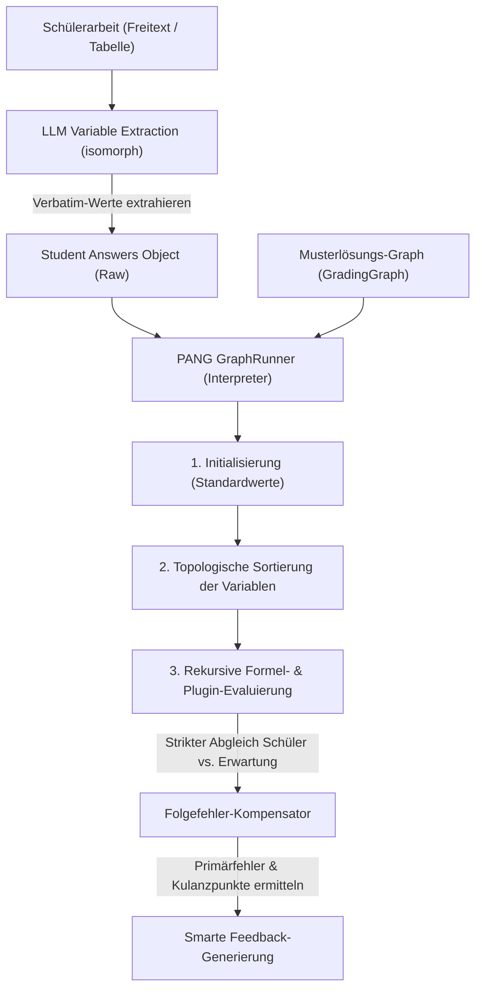

# PANG Engine & Grading Graph Architecture

## 1. Executive Summary & Kontext
> [!NOTE]
> **Zusammenfassung:** Die PANG Engine (**P**ath-based **A**nd **N**ested **G**rading Engine) ist ein modularer, mathematisch-logischer Korrektur-Interpreter zur hochpräzisen Folgefehler-Kompensation (Consecutive Error Compensation) in Schülerarbeiten. Sie ermöglicht didaktisch korrekte Teilpunkte-Bewertungen bei mathematischen Berechnungen, Tabellen und Kettenaufgaben.
> **Zielgruppe:** Core-Entwickler, QA-Ingenieure und Product Manager zur Einordnung der mathematischen Graph-Evaluation.

Die PANG Engine löst das Problem, dass herkömmliche Sprachmodelle bei der Bewertung von Zahlenwerten in MINT-Fächern (z. B. Subnetting, RAID-Kapazitäten, physikalische Formeln) unzuverlässig sind und Folgefehler fehlerhafter Zwischenschritte oft fälschlicherweise als Primärfehler bestrafen. Mithilfe eines deterministischen mathematischen Bewertungsgraphen (`GradingGraph`) und isomorpher LLM-gestützter Variablenextraktion führt Koreki eine faire, didaktisch einwandfreie Korrektur durch.

---

## 2. Architektur & Systemdesign

Die Korrektur läuft in zwei aufeinander aufbauenden Phasen ab, die isomorph sowohl auf dem Server (Next.js API-Route) als auch offline auf dem Client (Tauri-Desktop) ausgeführt werden können:



### Die zwei Kern-Phasen:
1. **Verbatim & Intent Extraction:** Ein spezialisiertes, schlankes LLM-Prompting extrahiert die tatsächlichen Werte, die der Schüler verwendet oder errechnet hat (ohne diese zu korrigieren). Fällt das LLM aus oder wirft der API-Aufruf Fehler, fängt das System dies sicher ab, und nicht angegebene Werte werden deterministisch als Omissionen (0 Punkte, primary_error) deklariert, um fehlerhafte heuristische Zuordnungen auszuschließen.
2. **Deterministic Evaluation (PANG Interpreter):** Ein zustandsfreier Interpreter läuft durch den topologisch sortierten Graphen. Berechnet der Schüler einen Zwischenschritt falsch, wird sein fehlerhafter Wert in alle Folgeformeln eingesetzt. Ergibt sich daraus ein folgerichtiges Ergebnis, erhält der Schüler für die nachfolgenden Schritte volle Kulanzpunkte (Folgefehler-Kompensation).

### 2.1 Härtung der Variablenextraktion (MINT- & Binär-Normalisierung)
Da der mathematische Bewertungsgraph zur Vermeidung von Einheiten-Konflikten in Formelketten deterministisch mit physikalischen SI-Basiseinheiten (z. B. Ohm [$\Omega$], Ampere [$A$], Volt [$V$], Watt [$W$]) rechnet oder bestimmte Datenmengen-Ziel-Einheiten erwartet, die Schüler jedoch flexibel mit oder ohne Vorsatzzeichen und in unterschiedlichen Einheiten rechnen dürfen, greift in Phase 1 eine spezialisierte **Präfix-Härtung** im System-Prompt der LLM-Variablenextraktion (`system.md` Rule 10):

* **Deterministische Präfix-Normalisierung (Dezimal & Binär):** Das LLM extrahiert Einheiten-Präfixe nicht mehr rein syntaktisch, sondern übersetzt Schülerwerte mit Vorsatzzeichen vor der Übergabe an den Graphen deterministisch in die mathematische SI-Basiseinheit oder die vom Graphen erwartete Ziel-Einheit:
  * **Physikalische Größen (Dezimalpräfixe):** z. B. `4 kΩ` ➔ `4000`, `2,5 kΩ` ➔ `2500`, `1,846 mA` ➔ `0.001846`.
  * **Digitale Datenmengen (Binärpräfixe, Faktor 1024):** z. B. `0.03125 GiB` für eine Variable, die `MiB` erwartet, wird deterministisch auf Basis der Zielvariable in `32` normalisiert ($0,03125 \times 1024 = 32$).
* **Strikte Bewertung von Einheiten-Fehlern:** Schreibt ein Schüler einen mathematischen/physikalischen Widerspruch auf (z. B. `I = 12 V / 6500 Ω = 0,001846 mA` statt `1.846 mA` oder `0.001846 A`), wird dieser Skalierungsfehler nicht korrigiert. Der Wert wird mit der falschen Skalierung an die Engine übergeben, was zu einem Fehler in dieser Aufgabe führt. Nur wenn der Schüler eine physikalisch andere, aber korrekte Einheit aufgeschrieben hat (z. B. `0,001846 A`), wird diese in die erwartete Einheit umgerechnet.

---

## 3. Implementierung & Nutzung

### 3.1 Graphen-Struktur & Variablen-Typen
Ein `GradingGraph` besteht aus einer Liste von Variablen (`variables`), die entweder als `input` (vom Benutzer einzugebender Wert) oder als `formula` (dynamisch zu berechnen) deklariert werden:

```typescript
export interface GraphVariable {
    id: string;              // Eindeutige ID (z. B. 'subnetA_mask')
    type: 'input' | 'formula';
    defaultValue?: any;      // Musterlösungswert (z. B. 24 oder '255.255.255.0')
    expression?: string;     // Formelausdruck bei Typ 'formula' (z. B. 'network.calculateMask(subnetA_hosts)')
    validationType?: 'exact' | 'numeric' | 'contains';
    maxPoints?: number;      // Bepunktung dieser Teilaufgabe
}
```

### 3.2 Algebraischer Formel-Parser & Dynamic Math Sandboxing
Die PANG Engine unterstützt die voll-dynamische Auswertung komplexer mathematischer, physikalischer und logischer Formeln (z. B. für Drehstrommotoren `sqrt(S^2 - P^2)` oder Strangwerte `U_L / sqrt(3)`). Sie nutzt dafür eine sichere, sandboxed mathematische Parser-Engine (`expr-eval`).

#### Dynamische Formelevaluierung (`plugins.ts`):
Der Parser liest mathematische Zeichenketten ein, setzt die Werte der referenzierten Graphenvariablen aus dem aktuellen Kontext ein und wertet das Ergebnis sicher aus. Er unterstützt standardmäßig:
*   Standardoperatoren (`+`, `-`, `*`, `/`, `^`, `%`) und Klammern.
*   Mathematische Kernfunktionen (`sqrt`, `abs`, `sin`, `cos`, `tan`, `acos`, `asin`, `atan`, `min`, `max`, `ceil`, `floor`, `log2`) und Konstanten (`pi`, `e`).
*   Ternäre Bedingungen (`condition ? true : false`) für komplexe RAID-Kapazitätsprüfungen.
*   Zusätzliche globale Domänenfunktionen für IP-Umrechnungen (`ipToLong` und `longToIp`).

#### Plugin Manifest & LLM Introspection (SOLID)
Um Sprachmodellen (wie Mistral oder Qwen) beizubringen, wie sie die bereitgestellten Plugin-Funktionen im `expression`-Feld korrekt kombinieren, existiert ein `PLUGIN_MANIFEST`.
Gemäß dem **Single Responsibility Principle (SRP)** und **Open/Closed Principle (OCP)** aus SOLID wird dieses Manifest direkt in der Domänen-Datei (`plugins.ts`) neben der Implementierung verankert und vom Graphen-Generator (`graph-generator.ts`) nur noch dynamisch importiert.

> [!WARNING]
> **Prompt-Sicherheit im Manifest:**
> Sprachmodelle neigen bei MINT-Aufgaben zu Halluzinationen (z. B. Übergabe einer Broadcast-Adresse anstatt einer Netz-ID an `calculateNetId`). Die `description`-Felder im Manifest müssen daher idiotensicher und restriktiv formuliert sein (z. B. *"Erwartet zwingend die VORHERIGE NETZ-ID ... und NIEMALS eine Broadcast-Adresse!"*).

#### Abwärtskompatibilität für Domänen-Plugins:
Um bestehende Graphen-Presets weiterhin fehlerfrei auszuführen, registriert das System alle konventionellen Plugin-Funktionen (`networkPlugin`, `raidPlugin`) beim App-Start automatisch im Parser. Vorkommen von Punkten (wie `network.calculateMask(...)`) werden transparent auf die registrierten Funktionen (z. B. `network_calculateMask`) umgemappt:

```typescript
import { Parser } from 'expr-eval';

const parser = new Parser();

// Dynamisch registrierte Plugin-Funktionen mit korrekter 'this'-Bindung
for (const [domainName, domainFunctions] of Object.entries(plugins)) {
  for (const [functionName, fn] of Object.entries(domainFunctions)) {
    parser.functions[`${domainName}_${functionName}`] = (fn as any).bind(domainFunctions);
  }
}

// Registrierung der IP-Helfer und Logarithmus-Standardfunktionen
parser.functions.log2 = (x: number) => Math.log2(x);
parser.functions.ceil = (x: number) => Math.ceil(x);
parser.functions.floor = (x: number) => Math.floor(x);
parser.functions.ipToLong = ipToLong;
parser.functions.longToIp = longToIp;

export function evaluateExpression(expression: string, context: Record<string, any>): any {
  // Mapping für Abwärtskompatibilität der alten Dot-Syntax
  const sanitizedExpression = expression
    .replace(/network\./g, 'network_')
    .replace(/raid\./g, 'raid_')
    .replace(/math\./g, 'math_');

  return parser.evaluate(sanitizedExpression, context);
}
```

### 3.3 Unterstützung alternativer Lösungswege (z. B. Subnetz-Rotationen)
In MINT- und IT-Aufgaben gibt es häufig mehrere gleichermaßen korrekte Lösungen (z. B. wenn zwei VLSM-Subnetze dieselbe Hostanzahl benötigen und somit in beliebiger Reihenfolge adressiert werden können). Die PANG Engine bietet hierfür zwei hochgradig elegante, integrierte Mechanismen:

#### A) Array-basierte alternative Defaultwerte für Inputs
Für `input`-Variablen kann im Feld `defaultValue` ein Array aller mathematisch zulässigen Alternativen angegeben werden:
```json
{
  "id": "subnetA_netid",
  "type": "input",
  "defaultValue": ["192.168.1.0", "192.168.1.32"],
  "validationType": "exact",
  "maxPoints": 1
}
```
Die PANG Engine (`GraphRunner.checkMatch`) erkennt Arrays automatisch und markiert die studentische Antwort als korrekt (`correct`), wenn sie mit **einem beliebigen** Element des Arrays übereinstimmt.

#### B) Ternäre Formel-Abhängigkeiten zur Fehler-Kompensation & Betrugsschutz
Um zu verhindern, dass ein Schüler dieselbe IP doppelt verwendet (was bei unabhängigen Arrays fälschlicherweise Punkte gäbe), wird das zweite Subnetz als `formula`-Variable deklariert. Diese berechnet ihren Erwartungswert mittels eines ternären Operators dynamisch auf Basis des tatsächlich gewählten Wertes des ersten Subnetzes:
```json
{
  "id": "subnetB_netid",
  "type": "formula",
  "expression": "subnetA_netid == '192.168.1.0' ? '192.168.1.32' : '192.168.1.0'",
  "validationType": "exact",
  "maxPoints": 1
}
```
##### Korrektur-Ablauf:
* **Choice A (Standard):** Der Schüler wählt Subnetz A = `.0` und Subnetz B = `.32`.
  * Subnetz A wird korrekt bewertet.
  * Das System evaluiert `expectedValue` für Subnetz B basierend auf dem Standardwert (`.0` ➔ `.32`). Der Schüler erhält volle Punkte (`correct`).
* **Choice B (Swapped):** Der Schüler wählt Subnetz A = `.32` und Subnetz B = `.0`.
  * Subnetz A wird korrekt bewertet (da `.32` im Array).
  * Für Subnetz B berechnet die PANG Engine den Erwartungswert basierend auf der tatsächlichen Eingabe des Schülers (`.32` ➔ `.0`). Der Schüler erhält volle Punkte (`consecutive_correct` / Folgefehler-Kompensation).
* **Choice C (Doppelbelegung / Fehler):** Der Schüler wählt Subnetz A = `.0` und Subnetz B = `.0`.
  * Subnetz A wird korrekt bewertet.
  * Für Subnetz B erwartet das System aufgrund der Eingabe `.0` zwingend den Wert `.32`. Der Eintrag `.0` schlägt fehl. Der Schüler erhält **0 Punkte** für Subnetz B.


### 3.4 Hybrid-Grading-Architektur (Punkte-Delegation)
> [!TIP]
> **Kernidee:** Die mathematische Analyse (Richtig/Falsch/Folgefehler) wird strikt deterministisch von PANG ermittelt, während die finale didaktische Punktevergabe und semantische Bewertung an das flexiblere LLM delegiert werden.

Um die didaktische Starrheit bei der Korrektur von Freitexten zu reduzieren, unterstützt die PANG Engine ein differenziertes **Hybrid-Grading**. Dies wird über das optionale Feld `disablePoints?: boolean` im `GradingGraph`-Schema gesteuert:

#### A) Differentiated Defaults (Differenzierte Standards)
*   **Strenge Punktevergabe (`disablePoints = false`):** Bei komplexen IT-Systemskills (wie `vlsm` / `skill-calc-vlsm` oder `skill-calc-raid`) sind mathematische Fehler unverzeihlich und müssen absolut präzise bestraft werden. Hier bestimmt PANG die Punkte starr und überschreibt jegliche LLM-Punktevergabe.
*   **Hybrid-Grading (`disablePoints = true`):** Bei allgemeinen mathematischen/naturwissenschaftlichen Aufgaben (z. B. Physikrechnungen) soll die KI kulant und didaktisch flexibel reagieren. PANG ermittelt nur die Fehler und Folgefehler-Kompensationen, während das LLM die finalen Punkte didaktisch tolerant auf Basis des Modells und der PANG-Engine-Auswertung vergibt.

#### B) UI & UX-Integration im Graph-Designer
Im interaktiven `GradingGraphModal.tsx` wird diese Einstellung transparent und komfortabel gesteuert:
*   **Globaler Modus-Wähler:** Ein Dropdown-Feld **`Bewertung:`** befindet sich prominent im KI-Assistenten-Header und lässt den Lehrer den Modus manuell überschreiben (`✨ Hybrid-Grading (Didaktisch tolerant)` vs. `🔒 Strenge Punkte (Mathematisch starr)`).
*   **Punkte-Ausblendung im Simulator:** Ist Hybrid-Grading aktiv, werden alle Punkte-Badges (`+1 P`) im Simulator ausgeblendet. Stattdessen wird dem Lehrer eine didaktisch wertvolle Variablen-Statistik angezeigt (z. B. `Variablen: 2 / 3 korrekt`), um Missverständnisse über PANG-seitige Bepunktungen auszuschließen.
*   **Relative Gewichtung:** Ein Hinweis im Detail-Inspektor der Variablen weist darauf hin, dass Punkte-Einträge bei aktivem Hybrid-Grading als relative Gewichtung und Empfehlung für das LLM dienen.

### 3.5 WICHTIG: Das "Folgefehler-Paradoxon" (Anti-Pattern)
> [!WARNING]
> **Architectural Decision (2026-05-30): Verbot von automatischer Punkte-Hygiene!**
> Früher besaß die PANG-Engine einen "Smart Post-Processing Hygienization"-Algorithmus. Dieser verteilte automatisch Punkte auf Input-Variablen, falls alle Inputs 0 Punkte hatten, um zu verhindern, dass Schüler trotz falschem Input durch fehlerfreies Weiterrechnen 100% der Aufgabe erreichen (das sogenannte "Folgefehler-Paradoxon").
> **Diese Routine wurde restlos entfernt und darf nicht wieder eingebaut werden!** 
> Sie verletzte die pädagogische Autonomie der Lehrkraft: Wenn eine Lehrkraft (wie z.B. bei VLSM-Tabellen) explizit 0 Punkte für das bloße Ablesen von Startwerten vergibt, muss das System diese Entscheidung respektieren, selbst wenn es zu Folgefehler-Kompensationen auf Basis dieser 0-Punkte-Inputs kommt. Das System hat sich der Didaktik unterzuordnen, nicht umgekehrt.

### 3.6 Automatisierte mathematische Validierung & CoT-Verfeinerung
Um die Ausfallsicherheit bei der automatischen Graph-Generierung durch Sprachmodelle zu maximieren, verfügt Koreki über ein mehrstufiges, modusspezifisches Validierungssystem.

#### A) Chain-of-Thought (CoT) Prompting
Für die Graphenerstellung wird die KI angewiesen, zwingend vor dem eigentlichen JSON-Graphen einen Gedanken-Block (`<thought>...</thought>`) zu generieren. 
* **Mathematische Simulation:** Das LLM deklariert darin alle geplanten Variablen und rechnet die mathematischen Formeln schrittweise mit den Standardwerten (`defaultValue`) der Inputs durch.
* **Musterlösungs-Abgleich:** Das berechnete Endergebnis wird mit den Soll-Werten der Musterlösung verglichen, um Inkonsistenzen noch vor der JSON-Erstellung abzufangen und zu korrigieren.

#### B) Backend Dry-Run Validierung
Sobald die API den Graphen erhält und parst, wird eine automatisierte Simulation durchgeführt (`validateGraphDeterminism` in [graph-generator.ts](../../src/lib/grading/graph-generator.ts)):
1. **Mock-Inputs:** Die Simulation extrahiert alle `defaultValue`s der `input`-Variablen als fehlerfreie Schülerantworten.
2. **Auswertung:** Der `GraphRunner` berechnet alle `formula`-Ausdrücke sequenziell.
3. **Integritäts-Check:** Schlägt eine Formel fehl (z.B. Syntaxfehler, Division-by-Zero, unbekannte Variablen-ID) oder weicht das Ergebnis vom didaktisch erwarteten Wert ab, wird die Validierung abgebrochen und ein detailreicher Fehlerbericht generiert.

#### C) Auto-Correction Loop (Modus-gesteuert)
Schlägt der Dry-Run fehl, startet das Backend einen automatisierten Korrekturlauf:
* **Desktop / Community (Lokal / Eigener API-Key):** Das System erlaubt **bis zu 3 automatische Retries** im Hintergrund. Der Fehlerbericht wird in einem verfeinerten Prompt an das LLM übergeben, um die Formeln selbsttätig zu reparieren.
* **SaaS-Modus:** Um Betriebskosten und API-Token zu minimieren, wird die Auto-Korrektur im Cloud-Betrieb strikt auf **maximal 1 Retry** limitiert. Schlägt auch dieser fehl, wird der Graph mit entsprechenden Warn-Flags an das Frontend ausgeliefert.

#### D) Echtzeit-Feedback & Fehlervisualisierung im UI
Im [GradingGraphModal.tsx](../../src/components/batch/GradingGraphModal.tsx) werden die Ergebnisse des Dry-Runs transparent dargestellt:
* **🛡️ Verifiziert-Banner:** Ein grünes Banner signalisiert der Lehrkraft, dass der Graph mathematisch geprüft und 100% konsistent auswertbar ist.
* **⚠️ Fehler-Highlights im Editor:** Weist eine Formel Fehler auf (z.B. durch nachträgliche manuelle Bearbeitung im Editor), leuchtet der betroffene Knoten zart rot auf, erhält ein prominentes "FEHLER"-Badge und zeigt die exakte Fehlermeldung direkt als Codebox auf der Knotenkarte an.

### 3.7 Robuste Fehlerfortpflanzung bei ausgelassenen Schritten (Omission-Kompensation)
Um zu verhindern, dass die mathematische Folgefehler-Kette abreißt, wenn ein Schüler einen Zwischenschritt in seiner freien Ausarbeitung komplett auslässt (Omission), ist die PANG-Engine mit einer dynamischen Omission-Kompensation ausgestattet:
* **Dynamische Formel-Evaluation:** Wenn ein Schülerwert nicht angegeben ist (`studentValue === undefined`), greift der `GraphRunner` zur Fortpflanzung des Fehlers im `computedContext` nicht mehr blind auf den Erwartungswert der Musterlösung (`expectedValue`) zurück. Stattdessen nutzt er den bereits ermittelten Folgefehler-Wert (`computedValueBasedOnErrors`), falls dieser existiert.
* **Didaktischer Effekt:** Der rote Faden des Folgefehlers bleibt über beliebig viele ausgelassene Zwischenschritte hinweg absolut intakt, wodurch ungerechte Mehrfach-Abzüge zuverlässig verhindert werden.

---


## 4. Security & Compliance (Industrial Grade)
> [!IMPORTANT]
> Datensparsamkeit und Schutz geistigen Eigentums sind zentrale Säulen der Koreki-Sicherheitsarchitektur.

* **Datenschutz (DSGVO):** Der LLM-basierte Extraktionsschritt verarbeitet ausschließlich mathematisch-fachliche Teilantworten der Schüler. Es werden keinerlei personenbezogene Daten (PII) an externe API-Schnittstellen übertragen.
* **Isomorphe Offline-Sicherheit:** Auf Tauri-Desktop-Systemen erfolgt die gesamte Extraktion und Evaluation zu 100 % lokal (via lokalem Ollama-Modell oder lokaler Heuristiken). Es gibt keinen Loopback-Netzwerkverkehr.
* **Write-Protection für System-Presets:** Um versehentliche Überschreibungen globaler Standardkriterien zu verhindern, sind System-Profile schreibgeschützt. Versucht ein Anwender, einen Custom Graph in einem System-Preset zu speichern, provisioniert das System vollautomatisch ein persönliches Custom-Profil (`"Mein Skill-Profil"`), klont die Presets und aktiviert den neuen Graph darin.

---

## 5. Testing & Referenzen

* **Unit Tests (Layer 1):** Absicherung aller mathematischen, sequenziellen und verschachtelten Berechnungsfälle in [GraphRunner.test.ts](../../tests/unit/lib/GraphRunner.test.ts).
* **Integration Tests (Layer 2):** Überprüfung der synchronisierten Speicherung, Aktivierung und visuellen Zuordnung in [ModelSolutionCard.integration.test.tsx](../../tests/integration/ModelSolutionCard.integration.test.tsx).
