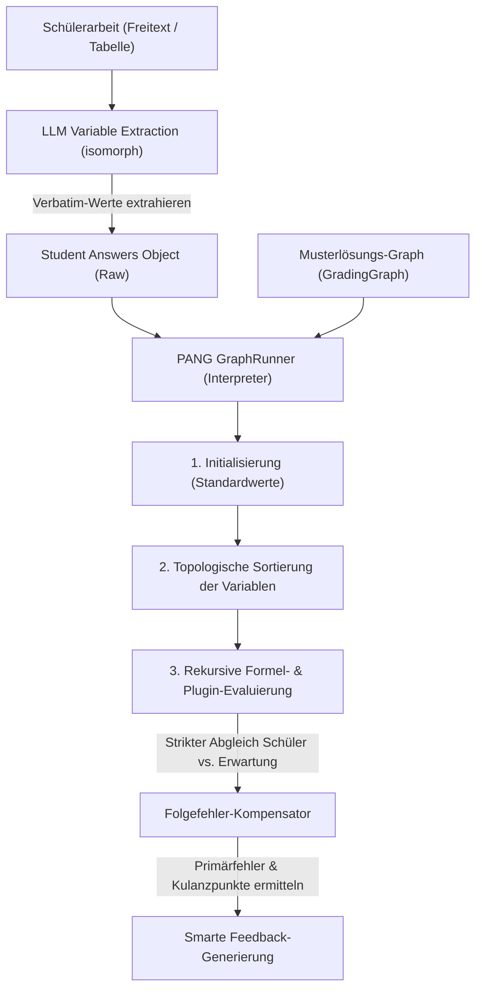

# PANG Engine & Grading Graph Architecture

## 1. Executive Summary & Kontext
> [!NOTE]
> **Zusammenfassung:** Die PANG Engine (**P**ath-based **A**nd **N**ested **G**rading Engine) ist ein modularer, mathematisch-logischer Korrektur-Interpreter zur hochpräzisen Folgefehler-Kompensation (Consecutive Error Compensation) in Schülerarbeiten. Sie ermöglicht didaktisch korrekte Teilpunkte-Bewertungen bei mathematischen Berechnungen, Tabellen und Kettenaufgaben.
> **Zielgruppe:** Core-Entwickler, QA-Ingenieure und Product Manager zur Einordnung der mathematischen Graph-Evaluation.

Die PANG Engine löst das Problem, dass herkömmliche Sprachmodelle bei der Bewertung von Zahlenwerten in MINT-Fächern (z. B. Subnetting, RAID-Kapazitäten, physikalische Formeln) unzuverlässig sind und Folgefehler fehlerhafter Zwischenschritte oft fälschlicherweise als Primärfehler bestrafen. Mithilfe eines deterministischen mathematischen Bewertungsgraphen (`GradingGraph`) und isomorpher LLM-gestützter Variablenextraktion führt Koreki eine faire, didaktisch einwandfreie Korrektur durch.

---

## 2. Architektur & Systemdesign

Die Korrektur läuft in zwei aufeinander aufbauenden Phasen ab, die isomorph sowohl auf dem Server (Next.js API-Route) als auch offline auf dem Client (Tauri-Desktop) ausgeführt werden können:



### Die zwei Kern-Phasen:
1. **Verbatim & Intent Extraction:** Ein spezialisiertes, schlankes LLM-Prompting extrahiert die tatsächlichen Werte, die der Schüler verwendet oder errechnet hat (ohne diese zu korrigieren). Fällt das LLM aus, greift ein robustes Regex-Heuristik-Parsing (mit Unterstützung für tabellarische Daten und Formel-Extraktionen wie `(3-1) * 4 TB = 8 TB`) als Fallback.
2. **Deterministic Evaluation (PANG Interpreter):** Ein zustandsfreier Interpreter läuft durch den topologisch sortierten Graphen. Berechnet der Schüler einen Zwischenschritt falsch, wird sein fehlerhafter Wert in alle Folgeformeln eingesetzt. Ergibt sich daraus ein folgerichtiges Ergebnis, erhält der Schüler für die nachfolgenden Schritte volle Kulanzpunkte (Folgefehler-Kompensation).

---

## 3. Implementierung & Nutzung

### 3.1 Graphen-Struktur & Variablen-Typen
Ein `GradingGraph` besteht aus einer Liste von Variablen (`variables`), die entweder als `input` (vom Benutzer einzugebender Wert) oder als `formula` (dynamisch zu berechnen) deklariert werden:

```typescript
export interface GraphVariable {
    id: string;              // Eindeutige ID (z. B. 'subnetA_mask')
    type: 'input' | 'formula';
    defaultValue?: any;      // Musterlösungswert (z. B. 24 oder '255.255.255.0')
    expression?: string;     // Formelausdruck bei Typ 'formula' (z. B. 'network.calculateMask(subnetA_hosts)')
    validationType?: 'exact' | 'numeric' | 'contains';
    maxPoints?: number;      // Bepunktung dieser Teilaufgabe
}
```

### 3.2 Algebraischer Formel-Parser & Dynamic Math Sandboxing
Die PANG Engine unterstützt die voll-dynamische Auswertung komplexer mathematischer, physikalischer und logischer Formeln (z. B. für Drehstrommotoren `sqrt(S^2 - P^2)` oder Strangwerte `U_L / sqrt(3)`). Sie nutzt dafür eine sichere, sandboxed mathematische Parser-Engine (`expr-eval`).

#### Dynamische Formelevaluierung (`plugins.ts`):
Der Parser liest mathematische Zeichenketten ein, setzt die Werte der referenzierten Graphenvariablen aus dem aktuellen Kontext ein und wertet das Ergebnis sicher aus. Er unterstützt standardmäßig:
*   Standardoperatoren (`+`, `-`, `*`, `/`, `^`, `%`) und Klammern.
*   Mathematische Kernfunktionen (`sqrt`, `abs`, `sin`, `cos`, `tan`, `acos`, `asin`, `atan`, `min`, `max`, `ceil`, `floor`, `log2`) und Konstanten (`pi`, `e`).
*   Ternäre Bedingungen (`condition ? true : false`) für komplexe RAID-Kapazitätsprüfungen.
*   Zusätzliche globale Domänenfunktionen für IP-Umrechnungen (`ipToLong` und `longToIp`).

#### Abwärtskompatibilität für Domänen-Plugins:
Um bestehende Graphen-Presets weiterhin fehlerfrei auszuführen, registriert das System alle konventionellen Plugin-Funktionen (`networkPlugin`, `raidPlugin`) beim App-Start automatisch im Parser. Vorkommen von Punkten (wie `network.calculateMask(...)`) werden transparent auf die registrierten Funktionen (z. B. `network_calculateMask`) umgemappt:

```typescript
import { Parser } from 'expr-eval';

const parser = new Parser();

// Dynamisch registrierte Plugin-Funktionen mit korrekter 'this'-Bindung
for (const [domainName, domainFunctions] of Object.entries(plugins)) {
  for (const [functionName, fn] of Object.entries(domainFunctions)) {
    parser.functions[`${domainName}_${functionName}`] = (fn as any).bind(domainFunctions);
  }
}

// Registrierung der IP-Helfer und Logarithmus-Standardfunktionen
parser.functions.log2 = (x: number) => Math.log2(x);
parser.functions.ceil = (x: number) => Math.ceil(x);
parser.functions.floor = (x: number) => Math.floor(x);
parser.functions.ipToLong = ipToLong;
parser.functions.longToIp = longToIp;

export function evaluateExpression(expression: string, context: Record<string, any>): any {
  // Mapping für Abwärtskompatibilität der alten Dot-Syntax
  const sanitizedExpression = expression
    .replace(/network\./g, 'network_')
    .replace(/raid\./g, 'raid_')
    .replace(/math\./g, 'math_');

  return parser.evaluate(sanitizedExpression, context);
}
```

### 3.3 Unterstützung alternativer Lösungswege (z. B. Subnetz-Rotationen)
In MINT- und IT-Aufgaben gibt es häufig mehrere gleichermaßen korrekte Lösungen (z. B. wenn zwei VLSM-Subnetze dieselbe Hostanzahl benötigen und somit in beliebiger Reihenfolge adressiert werden können). Die PANG Engine bietet hierfür zwei hochgradig elegante, integrierte Mechanismen:

#### A) Array-basierte alternative Defaultwerte für Inputs
Für `input`-Variablen kann im Feld `defaultValue` ein Array aller mathematisch zulässigen Alternativen angegeben werden:
```json
{
  "id": "subnetA_netid",
  "type": "input",
  "defaultValue": ["192.168.1.0", "192.168.1.32"],
  "validationType": "exact",
  "maxPoints": 1
}
```
Die PANG Engine (`GraphRunner.checkMatch`) erkennt Arrays automatisch und markiert die studentische Antwort als korrekt (`correct`), wenn sie mit **einem beliebigen** Element des Arrays übereinstimmt.

#### B) Ternäre Formel-Abhängigkeiten zur Fehler-Kompensation & Betrugsschutz
Um zu verhindern, dass ein Schüler dieselbe IP doppelt verwendet (was bei unabhängigen Arrays fälschlicherweise Punkte gäbe), wird das zweite Subnetz als `formula`-Variable deklariert. Diese berechnet ihren Erwartungswert mittels eines ternären Operators dynamisch auf Basis des tatsächlich gewählten Wertes des ersten Subnetzes:
```json
{
  "id": "subnetB_netid",
  "type": "formula",
  "expression": "subnetA_netid == '192.168.1.0' ? '192.168.1.32' : '192.168.1.0'",
  "validationType": "exact",
  "maxPoints": 1
}
```
##### Korrektur-Ablauf:
* **Choice A (Standard):** Der Schüler wählt Subnetz A = `.0` und Subnetz B = `.32`.
  * Subnetz A wird korrekt bewertet.
  * Das System evaluiert `expectedValue` für Subnetz B basierend auf dem Standardwert (`.0` ➔ `.32`). Der Schüler erhält volle Punkte (`correct`).
* **Choice B (Swapped):** Der Schüler wählt Subnetz A = `.32` und Subnetz B = `.0`.
  * Subnetz A wird korrekt bewertet (da `.32` im Array).
  * Für Subnetz B berechnet die PANG Engine den Erwartungswert basierend auf der tatsächlichen Eingabe des Schülers (`.32` ➔ `.0`). Der Schüler erhält volle Punkte (`consecutive_correct` / Folgefehler-Kompensation).
* **Choice C (Doppelbelegung / Fehler):** Der Schüler wählt Subnetz A = `.0` und Subnetz B = `.0`.
  * Subnetz A wird korrekt bewertet.
  * Für Subnetz B erwartet das System aufgrund der Eingabe `.0` zwingend den Wert `.32`. Der Eintrag `.0` schlägt fehl. Der Schüler erhält **0 Punkte** für Subnetz B.


### 3.4 Hybrid-Grading-Architektur (Punkte-Delegation)
> [!TIP]
> **Kernidee:** Die mathematische Analyse (Richtig/Falsch/Folgefehler) wird strikt deterministisch von PANG ermittelt, während die finale didaktische Punktevergabe und semantische Bewertung an das flexiblere LLM delegiert werden.

Um die didaktische Starrheit bei der Korrektur von Freitexten zu reduzieren, unterstützt die PANG Engine ein differenziertes **Hybrid-Grading**. Dies wird über das optionale Feld `disablePoints?: boolean` im `GradingGraph`-Schema gesteuert:

#### A) Differentiated Defaults (Differenzierte Standards)
*   **Strenge Punktevergabe (`disablePoints = false`):** Bei komplexen IT-Systemskills (wie `vlsm` / `skill-calc-vlsm` oder `skill-calc-raid`) sind mathematische Fehler unverzeihlich und müssen absolut präzise bestraft werden. Hier bestimmt PANG die Punkte starr und überschreibt jegliche LLM-Punktevergabe.
*   **Hybrid-Grading (`disablePoints = true`):** Bei allgemeinen mathematischen/naturwissenschaftlichen Aufgaben (z. B. Physikrechnungen) soll die KI kulant und didaktisch flexibel reagieren. PANG ermittelt nur die Fehler und Folgefehler-Kompensationen, während das LLM die finalen Punkte didaktisch tolerant auf Basis des Modells und der PANG-Engine-Auswertung vergibt.

#### B) UI & UX-Integration im Graph-Designer
Im interaktiven `GradingGraphModal.tsx` wird diese Einstellung transparent und komfortabel gesteuert:
*   **Globaler Modus-Wähler:** Ein Dropdown-Feld **`Bewertung:`** befindet sich prominent im KI-Assistenten-Header und lässt den Lehrer den Modus manuell überschreiben (`✨ Hybrid-Grading (Didaktisch tolerant)` vs. `🔒 Strenge Punkte (Mathematisch starr)`).
*   **Punkte-Ausblendung im Simulator:** Ist Hybrid-Grading aktiv, werden alle Punkte-Badges (`+1 P`) im Simulator ausgeblendet. Stattdessen wird dem Lehrer eine didaktisch wertvolle Variablen-Statistik angezeigt (z. B. `Variablen: 2 / 3 korrekt`), um Missverständnisse über PANG-seitige Bepunktungen auszuschließen.
*   **Relative Gewichtung:** Ein Hinweis im Detail-Inspektor der Variablen weist darauf hin, dass Punkte-Einträge bei aktivem Hybrid-Grading als relative Gewichtung und Empfehlung für das LLM dienen.

---


## 4. Security & Compliance (Industrial Grade)
> [!IMPORTANT]
> Datensparsamkeit und Schutz geistigen Eigentums sind zentrale Säulen der Koreki-Sicherheitsarchitektur.

* **Datenschutz (DSGVO):** Der LLM-basierte Extraktionsschritt verarbeitet ausschließlich mathematisch-fachliche Teilantworten der Schüler. Es werden keinerlei personenbezogene Daten (PII) an externe API-Schnittstellen übertragen.
* **Isomorphe Offline-Sicherheit:** Auf Tauri-Desktop-Systemen erfolgt die gesamte Extraktion und Evaluation zu 100 % lokal (via lokalem Ollama-Modell oder lokaler Heuristiken). Es gibt keinen Loopback-Netzwerkverkehr.
* **Write-Protection für System-Presets:** Um versehentliche Überschreibungen globaler Standardkriterien zu verhindern, sind System-Profile schreibgeschützt. Versucht ein Anwender, einen Custom Graph in einem System-Preset zu speichern, provisioniert das System vollautomatisch ein persönliches Custom-Profil (`"Mein Skill-Profil"`), klont die Presets und aktiviert den neuen Graph darin.

---

## 5. Testing & Referenzen

* **Zugehöriger Walkthrough:** [KI Graph Skill Creator — Walkthrough](../../C:/Users/AndreasHeid/.gemini/antigravity/brain/4d861975-3411-49a1-a66b-e78b73efe27b/walkthrough.md)
* **Unit Tests (Layer 1):** Absicherung aller mathematischen, sequenziellen und verschachtelten Berechnungsfälle in [GraphRunner.test.ts](file:///c:/Users/AndreasHeid/Documents/Antigravity/koreki/tests/unit/lib/GraphRunner.test.ts).
* **Integration Tests (Layer 2):** Überprüfung der synchronisierten Speicherung, Aktivierung und visuellen Zuordnung in [ModelSolutionCard.integration.test.tsx](file:///c:/Users/AndreasHeid/Documents/Antigravity/koreki/tests/integration/ModelSolutionCard.integration.test.tsx).
