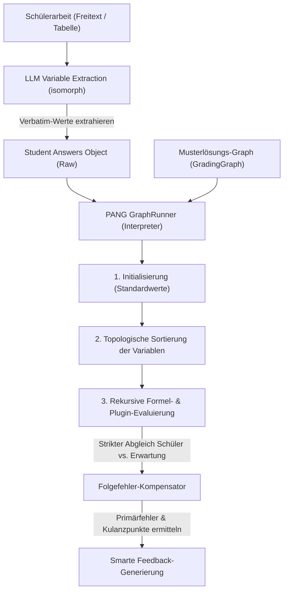

# PANG Engine & Grading Graph Architecture

## 1. Executive Summary & Kontext
> [!NOTE]
> **Zusammenfassung:** Die PANG Engine (**P**ath-based **A**nd **N**ested **G**rading Engine) ist ein modularer, mathematisch-logischer Korrektur-Interpreter zur hochpräzisen Folgefehler-Kompensation (Consecutive Error Compensation) in Schülerarbeiten. Sie ermöglicht didaktisch korrekte Teilpunkte-Bewertungen bei mathematischen Berechnungen, Tabellen und Kettenaufgaben.
> **Zielgruppe:** Core-Entwickler, QA-Ingenieure und Product Manager zur Einordnung der mathematischen Graph-Evaluation.

Die PANG Engine löst das Problem, dass herkömmliche Sprachmodelle bei der Bewertung von Zahlenwerten in MINT-Fächern (z. B. Subnetting, RAID-Kapazitäten, physikalische Formeln) unzuverlässig sind und Folgefehler fehlerhafter Zwischenschritte oft fälschlicherweise als Primärfehler bestrafen. Mithilfe eines deterministischen mathematischen Bewertungsgraphen (`GradingGraph`) und isomorpher LLM-gestützter Variablenextraktion führt Koreki eine faire, didaktisch einwandfreie Korrektur durch.

---

## 2. Architektur & Systemdesign

Die Korrektur läuft in zwei aufeinander aufbauenden Phasen ab, die isomorph sowohl auf dem Server (Next.js API-Route) als auch offline auf dem Client (Tauri-Desktop) ausgeführt werden können:



### Die zwei Kern-Phasen:
1. **Verbatim & Intent Extraction:** Ein spezialisiertes, schlankes LLM-Prompting extrahiert die tatsächlichen Werte, die der Schüler verwendet oder errechnet hat (ohne diese zu korrigieren). Fällt das LLM aus, greift ein robustes Regex-Heuristik-Parsing (mit Unterstützung für tabellarische Daten und Formel-Extraktionen wie `(3-1) * 4 TB = 8 TB`) als Fallback.
2. **Deterministic Evaluation (PANG Interpreter):** Ein zustandsfreier Interpreter läuft durch den topologisch sortierten Graphen. Berechnet der Schüler einen Zwischenschritt falsch, wird sein fehlerhafter Wert in alle Folgeformeln eingesetzt. Ergibt sich daraus ein folgerichtiges Ergebnis, erhält der Schüler für die nachfolgenden Schritte volle Kulanzpunkte (Folgefehler-Kompensation).

---

## 3. Implementierung & Nutzung

### 3.1 Graphen-Struktur & Variablen-Typen
Ein `GradingGraph` besteht aus einer Liste von Variablen (`variables`), die entweder als `input` (vom Benutzer einzugebender Wert) oder als `formula` (dynamisch zu berechnen) deklariert werden:

```typescript
export interface GraphVariable {
    id: string;              // Eindeutige ID (z. B. 'subnetA_mask')
    type: 'input' | 'formula';
    defaultValue?: any;      // Musterlösungswert (z. B. 24 oder '255.255.255.0')
    expression?: string;     // Formelausdruck bei Typ 'formula' (z. B. 'network.calculateMask(subnetA_hosts)')
    validationType?: 'exact' | 'numeric' | 'contains';
    maxPoints?: number;      // Bepunktung dieser Teilaufgabe
}
```

### 3.2 Verschachtelte Formeln & Rekursiver Interpreter
Die PANG Engine unterstützt tief verschachtelte Funktionsaufrufe über registrierte Rechen-Plugins (z. B. `math` und `network`):
`math.multiply(math.subtract(anzahl_platten, 1), kapazitaet_pro_platte)`

#### Intelligenter Argument-Parser (`plugins.ts`):
Um verschachtelte Funktionsaufrufe fehlerfrei zu evaluieren, verwendet der Interpreter ein klammer-sensitives Argument-Splitting, das Kommas innerhalb von Unterklammern ignoriert:

```typescript
export function splitArguments(rawArgs: string): string[] {
    const args: string[] = [];
    let current = '';
    let parenDepth = 0;

    for (let i = 0; i < rawArgs.length; i++) {
        const char = rawArgs[i];
        if (char === '(') parenDepth++;
        if (char === ')') parenDepth--;

        if (char === ',' && parenDepth === 0) {
            args.push(current.trim());
            current = '';
        } else {
            current += char;
        }
    }
    if (current.trim()) {
        args.push(current.trim());
    }
    return args;
}
```

#### Rekursive Auswertung (`evaluateExpression`):
Entspricht ein Funktionsargument selbst dem Muster `domain.function(...)`, wird es rekursiv aufgelöst, bevor die übergeordnete Funktion ausgeführt wird. Das garantiert absolute Flexibilität bei komplexen Berechnungen.

---

## 4. Security & Compliance (Industrial Grade)
> [!IMPORTANT]
> Datensparsamkeit und Schutz geistigen Eigentums sind zentrale Säulen der Koreki-Sicherheitsarchitektur.

* **Datenschutz (DSGVO):** Der LLM-basierte Extraktionsschritt verarbeitet ausschließlich mathematisch-fachliche Teilantworten der Schüler. Es werden keinerlei personenbezogene Daten (PII) an externe API-Schnittstellen übertragen.
* **Isomorphe Offline-Sicherheit:** Auf Tauri-Desktop-Systemen erfolgt die gesamte Extraktion und Evaluation zu 100 % lokal (via lokalem Ollama-Modell oder lokaler Heuristiken). Es gibt keinen Loopback-Netzwerkverkehr.
* **Write-Protection für System-Presets:** Um versehentliche Überschreibungen globaler Standardkriterien zu verhindern, sind System-Profile schreibgeschützt. Versucht ein Anwender, einen Custom Graph in einem System-Preset zu speichern, provisioniert das System vollautomatisch ein persönliches Custom-Profil (`"Mein Skill-Profil"`), klont die Presets und aktiviert den neuen Graph darin.

---

## 5. Testing & Referenzen

* **Zugehöriger Walkthrough:** [KI Graph Skill Creator — Walkthrough](../../C:/Users/AndreasHeid/.gemini/antigravity/brain/4d861975-3411-49a1-a66b-e78b73efe27b/walkthrough.md)
* **Unit Tests (Layer 1):** Absicherung aller mathematischen, sequenziellen und verschachtelten Berechnungsfälle in [GraphRunner.test.ts](file:///c:/Users/AndreasHeid/Documents/Antigravity/koreki/tests/unit/lib/GraphRunner.test.ts).
* **Integration Tests (Layer 2):** Überprüfung der synchronisierten Speicherung, Aktivierung und visuellen Zuordnung in [ModelSolutionCard.integration.test.tsx](file:///c:/Users/AndreasHeid/Documents/Antigravity/koreki/tests/integration/ModelSolutionCard.integration.test.tsx).
