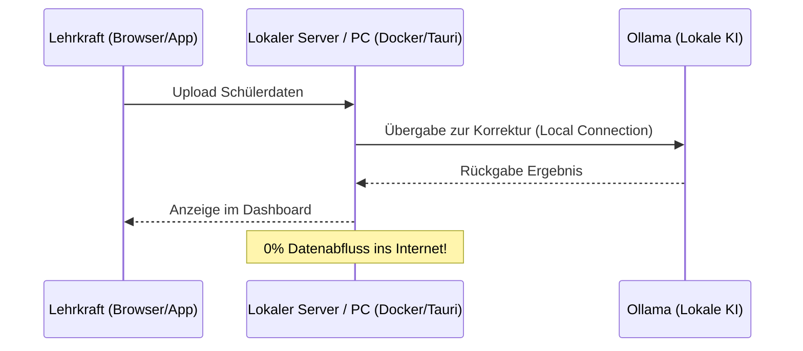
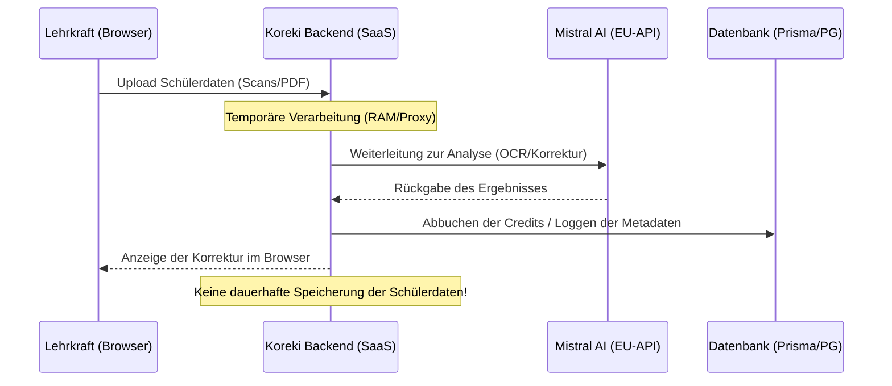
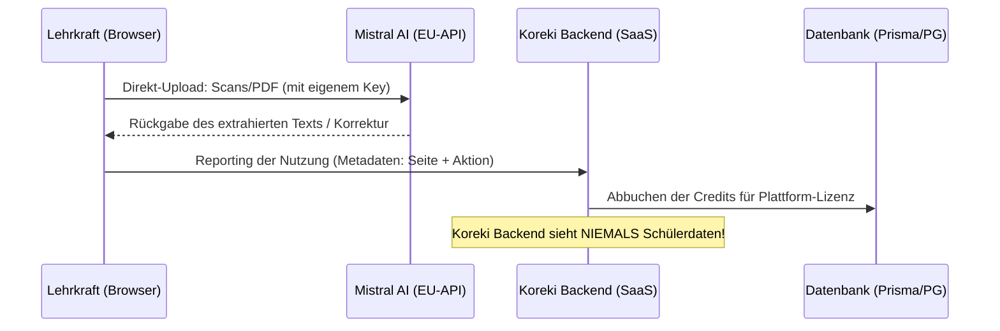

# Informationsfluss & Datenschutz (Data Flow)

## 1. Executive Summary & Kontext

In diesem Dokument wird erläutert, wie Daten in Koreki fließen, welche Parteien beteiligt sind und wo welche Daten verarbeitet bzw. gespeichert werden. Koreki wurde mit dem Fokus auf Datensparsamkeit entwickelt.

## 1. Zentrale Akteure

- **Nutzer (Lehrkraft)**: Bedient die Web-Anwendung im Browser.
- **Koreki-Plattform (SaaS)**: Das Backend für Benutzerverwaltung, Abrechnung (Credits) und Lizenzprüfung.
- **Mistral AI (KI-Provider)**: Ein europäisches Unternehmen (Sondersitz in Frankreich), das die KI-Modelle für OCR, Text-Bereinigung und pädagogische Korrekturen bereitstellt (DSGVO-konform).
- **Logto**: Managed-Auth-Provider für die sichere Anmeldung (nur SaaS/Cloud).
- **Lokale Instanz (Community/Desktop)**: Ihre eigene Hardware/Server, auf der Koreki läuft.

---

## 2. Der COMMUNITY / DESKTOP Modus (Maximale Autarkie)

In diesem Modus (insbesondere in Kombination mit **Ollama**) verlassen Schülerdaten niemals Ihre eigene Infrastruktur.

### Datenfluss (Lokal / Air-Gapped möglich)

**Besonderheit**: Wenn Koreki im Community-Modus mit einem lokalen Ollama-Server betrieben wird, findet **keinerlei Kommunikation** mit externen KI-Providern oder Koreki-Servern statt. Dies ist die empfohlene Konfiguration für maximalen Datenschutz.

---

## 3. Der STANDARD-Modus (Default)

Im Standard-Modus fungiert das Koreki-Backend als sicherer Proxy zwischen dem Browser und der Mistral-API. Dies vereinfacht die Nutzung, da keine eigenen API-Keys benötigt werden.

### Datenfluss (Standard)

**Besonderheit**: Schülerdaten (Texte, Bilder) werden im Backend **nicht dauerhaft gespeichert**. Sie befinden sich lediglich während der Request-Laufzeit im Arbeitsspeicher des Proxy-Servers.

---

## 4. Der PURE-Modus (Maximale Privatsphäre)

### Datenfluss (Pure)

**Vorteile**:
- **Zero-Knowledge**: Das Koreki-SaaS-Backend sieht niemals die Inhalte der Schülerarbeiten.
- **Direktverbindung**: Maximale Kontrolle über den Datenfluss.

---

## 4. Datenverbleib (Übersicht)

| Datentyp | Beschreibung | Verbleib / Speicherung |
| :--- | :--- | :--- |
| **Nutzerdaten** | Name, E-Mail (Logto-ID), Credit-Guthaben, API-Limit-Statistik. | Dauerhaft in der **Koreki-Datenbank**. |
| **Schülerdaten (Inhalt)** | Scans (Bilder), extrahierte Texte, KI-Feedback, Notenvorschläge. | **Nur im Browser des Nutzers** (Local State) & temporär bei **Mistral AI** (EU-Server). |
| **Schülerdaten (Upload)** | Die Original-PDFs/Bilder für das Dokumenten-Splitting. | **Rein lokal im Browser**. Diese verlassen den Browser nie (weder zu Koreki noch zu Mistral). |
| **Zahlungsdaten** | Stripe-Transaktionen (falls genutzt). | Stripe (Externer Provider). |

---

## 5. Wichtige Datenschutz-Garantien

1. **Keine Speicherung von Schülerdaten im Backend**: Es gibt aktuell keine Bestrebung, Texte oder Dokumente der Schüler serverseitig in einer Datenbank zu persistieren.
2. **Lokale Verarbeitung**: Viele Schritte (wie das PDF-Splitting via PDF.js oder das Schwärzen von Namen) geschehen zu 100% lokal im Browser des Nutzers.
3. **Mistral AI**: Durch die Nutzung von Mistral AI (Frankreich) bleiben Daten innerhalb der europäischen Rechtsordnung (DSGVO).

> [!TIP]
> Für Schulen und Institutionen mit besonders hohen Anforderungen empfehlen wir den **PURE-Modus**, da hier der Inhaltsfluss vollständig am Koreki-SaaS vorbeigeführt wird.

---

## 6. Technische Verifizierung (Code-Belege)

Für maximale Transparenz wurden die Implementierungen im Code gegen diese Dokumentation geprüft:

<b>Beleg: Keine Speicherung im Standard-Modus</b>

Die Datei [ai-correct.ts](file:///c:/Users/AndreasHeid/Documents/Antigravity/koreki/src/pages/api/ai-correct.ts) zeigt, dass Daten nur validiert und an Mistral weitergeleitet werden. 
Die Abrechnungs-Logik in [billing-utils.ts](file:///c:/Users/AndreasHeid/Documents/Antigravity/koreki/src/lib/billing-utils.ts) führt ausschließlich Inkremente auf Token-Counter und Credit-Salden aus. Es gibt keine Datenbank-Operationen (`create`), die Schülertexte oder Bilder persistieren.

<b>Beleg: Browser-Direktverbindung im Pure-Modus</b>

In [ai-logic.ts](file:///c:/Users/AndreasHeid/Documents/Antigravity/koreki/src/lib/ai-logic.ts) (Funktionen `performOCRRequest` und `performAIRequest`) ist hart codiert, dass bei `appMode === 'PURE'` ein direkter `fetch` auf `api.mistral.ai` erfolgt, anstatt die eigene Backend-Route aufzurufen.

<b>Beleg: Daten-Isolation bei der Abrechnung</b>

Die Route [pure-deduct.ts](file:///c:/Users/AndreasHeid/Documents/Antigravity/koreki/src/pages/api/billing/pure-deduct.ts) nimmt im PURE-Modus lediglich Metadaten entgegen (`pageCount`, `action`). Inhaltsdaten (Texte/Bilder) tauchen in der Request-Struktur dieser API nicht auf.

---

## X. Security & Compliance (Mandatory for Industrial Grade)
> [!IMPORTANT]
> Koreki folgt dem **Industrial Security Standard** mit 9 definierten Säulen. Eine Übersicht aller Schutzmaßnahmen finden Sie im dedizierten Dokument: [Security Pillars: The Industrial Defense Standard](./security-pillars.md).

* **Datenverarbeitung:** Inhaltsbezogene Datenflüsse werden durch **Pillar 9 (Network Isolation)** im Desktop-Modus vollständig von der SaaS-Infrastruktur entkoppelt.
* **Authentifizierung/Autorisierung:** Gesteuert durch **Pillar 8 (DB-Authoritative RBAC)**.
* **Audit-Logs:** Sicherheitsrelevante Ereignisse werden via **Pillar 2 (Technical Audit Logging)** erfasst.

---

## Y. Testing & Referenzen
> [!WARNING]
> Verlinke hier zwingend auf zugehörige GitHub PRs, Tasks oder Architektur-Entscheidungen (ADR).

* **Verwandte Dokumente:** TBD
* **Test-Coverage:** TBD
* **Externe Referenzen:** TBD
