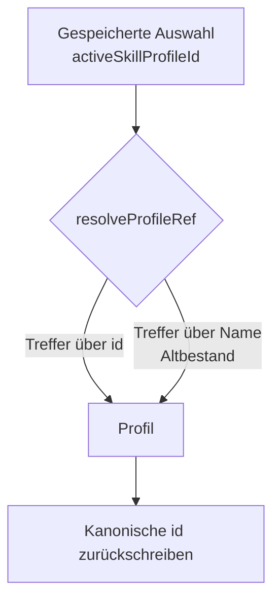

# Identität und Namensregeln der Profil-Familien

## 1. Executive Summary & Kontext
> [!NOTE]
> **Zusammenfassung:** Koreki kennt vier Familien wiederverwendbarer Konfigurationen. Sie werden über eine **Kennung** adressiert, nicht über ihren Namen — und ein Name darf pro Nutzer und Familie nur einmal vergeben sein. Beide Regeln gelten identisch in SaaS, Community und Desktop.
> **Zielgruppe:** Entwickler, die an Profil-Modalen, Persistenz oder den zugehörigen API-Routen arbeiten.

Die vier Familien:

| Familie | Modell | Ablage-Schlüssel | UI |
| :--- | :--- | :--- | :--- |
| Experten-Profile | `PromptProfile` | `profiles_<hash>.json` / `koreki_local_profiles` | Prompt-Einstellungen |
| KI-Profile | `AiProfile` | `ai_profiles_<hash>.json` / `koreki_local_ai_profiles` | Intelligenz-Modal |
| Skill-Sets | `SkillProfile` | `skill_profiles_<hash>.json` / `koreki_local_skill_profiles` | Skills Center |
| Erfahrungsschatz | `GradingMemory` | `grading_memories_<hash>.json` / `koreki_local_grading_memories` | Erfahrungsschatz-Modal |

Historisch hing die Identität am **Namen**: Gespeichert wurde per Namensvergleich, ausgewählt ebenfalls. Das hatte zwei praktische Folgen, die sich im Betrieb gezeigt haben — zwei gleichnamige Einträge waren in der Liste nicht unterscheidbar und gleichzeitig markiert, und ein Speichern traf den ersten Namenstreffer statt den bearbeiteten Datensatz.

---

## 2. Architektur & Systemdesign

### Regel 1 — Identität ist die Kennung

Die Kennung (`id`) adressiert einen Datensatz. Der Name ist ein Anzeigefeld und darf sich jederzeit ändern, ohne dass eine gespeicherte Auswahl bricht.



`resolveProfileRef` ([profile-naming.ts](../../src/lib/services/profile-naming.ts)) ist eine **Migrationsbrücke**: In `activeSkillProfileId` und Verwandten steckt gemischter Altbestand — eine `cuid()`, ein Profilname oder der früher fest verdrahtete String `system-mint-standard`. Aufrufer schreiben die aufgelöste Kennung zurück, der Bestand heilt sich also mit jeder Sitzung selbst.

### Feste Kennungen für System-Vorlagen

Dieselbe Vorlage existiert in drei Ablagen: als Registry-Eintrag (Desktop), als Registry-Eintrag hinter der API (Community) und als Datenbankzeile (SaaS). Eine von Prisma vergebene `cuid()` wäre in jeder Umgebung eine andere — es gäbe keine modusübergreifend stabile Kennung. Deshalb tragen System-Vorlagen **Slugs**:

* Skill-Sets: `system-mint-standard`, `system-grundschule-mathematik`, … ([standard-skills-profiles.ts](../../src/lib/ai/standard-skills-profiles.ts))
* Experten-Profile: `id-standard`, `id-informatik`, … (Frontmatter der Markdown-Dateien in `src/prompts/expert-profiles/`)
* KI-Profile: `system-standard`, `system-math` (Konstanten, nicht in der Datenbank)

> [!WARNING]
> Slugs dürfen **nie** geändert werden. Gespeicherte Auswahlen bestehender Nutzer verweisen darauf. `syncSystemProfiles` schreibt sie als Primärschlüssel und entfernt namensgleiche Altzeilen mit abweichender Kennung — sonst stünde jede Vorlage doppelt in der Liste.

### Regel 2 — Namen sind eindeutig je Nutzer und Familie

Die Regel stammt nicht aus der Anwendungsschicht, sondern aus dem Datenmodell: Alle vier Prisma-Modelle tragen `@@unique([name, userId])`. Die dateibasierte Ablage (Community) und der `localStorage` (Desktop) kennen keinen solchen Zwang und müssen selbst prüfen.

Was als „derselbe Name" gilt, entscheidet **ausschließlich** `isSameName` — ohne Rücksicht auf Groß-/Kleinschreibung und Randleerzeichen:

```typescript
export const isSameName = (a?: string, b?: string): boolean =>
    (a || '').trim().toLowerCase() === (b || '').trim().toLowerCase();
```

> [!IMPORTANT]
> Rückfrage und Schreibpfad müssen dieselbe Funktion benutzen. Fielen sie auseinander — Rückfrage unempfindlich, Schreibpfad exakt —, verspräche die Oberfläche ein Überschreiben und legte doch eine Dublette an. Genau das war der Fall, als „FISI" neben „fisi" gespeichert wurde, und zwar in jedem der drei Modi unterschiedlich.

---

## 3. Implementierung & Nutzung

### Verhalten je Vorgang

| Vorgang | Verhalten | Durchgesetzt in |
| :--- | :--- | :--- |
| **Umbenennen** auf vergebenen Namen | Abgelehnt, `409` mit Klartext | DB-Dienste, `Local*Service`, Desktop-Hooks |
| **Anlegen** unter vergebenem Namen | Rückfrage „Bestehenden Eintrag überschreiben?"; bei Zustimmung wird der bestehende Datensatz getroffen | Hooks (alle drei Modi) |
| **Anlegen** unter Namen einer System-Vorlage | Abgelehnt mit Hinweis | Hooks |
| **Speichern** eines bestehenden Eintrags | Über die Kennung; der Name bleibt unangetastet | API + Ablagen |

### API-Vertrag

`POST` trägt die Kennung optional:

```typescript
// Bearbeiten: eindeutig über die Kennung, Name unangetastet
await apiClient.post('/api/user/skill-profiles', {
    id: selectedProfileId,
    name: selectedProfileData.name,
    activeSkillIds,
    customSkills
});

// Neuanlegen: keine Kennung — nur dann entscheidet der Name,
// und die Oberfläche hat vorher gefragt.
await apiClient.post('/api/user/skill-profiles', { name, activeSkillIds, customSkills });
```

Umbenennen läuft **immer** über `PATCH { id, newName }`, nie über `POST`.

### Fehlerabbildung

`toProfileHttpError` übersetzt die fachlichen Fehler beider Ablagen in HTTP-Antworten: Namenskollision → `409`, unbekannter Eintrag → `404`, alles Übrige → `500` mit unspezifischer Meldung. Eingeschlossen ist Prismas `P2002` — das Wettlauf-Fenster zwischen Vorabprüfung und Schreibvorgang darf den Nutzer nicht als „Interner Serverfehler" erreichen.

---

## 4. Security & Compliance

* **Datenverarbeitung:** Profile enthalten pädagogische Konfiguration, keine personenbezogenen Daten von Schülern. Der Erfahrungsschatz kann Schülertexte enthalten — er wird vor dem Ablegen anonymisiert (siehe [Grading Memory](./grading-memory.md)).
* **Autorisierung:** Jeder Zugriff über eine Kennung prüft die Eigentümerschaft, bevor geschrieben wird; fremde Kennungen enden in `403`. System-Vorlagen sind schreibgeschützt, Ausnahme: Rolle `ADMIN` in SaaS.
* **Fehlermeldungen:** Nur fachliche Fehler werden im Klartext zurückgegeben. Dateipfade und Datenbank-Interna bleiben im Log — `toProfileHttpError` lässt sie nicht durch.
* **Audit-Logs:** Profiländerungen werden nicht gesondert protokolliert; sie verarbeiten keine Schülerdaten.

---

## 5. Testing & Referenzen

* **Verwandte Dokumente:** [Community Edition Persistence](./community-edition-persistence.md) · [Grading Memory](./grading-memory.md) · [Modulare Bewertungs-Skills](../concepts/modular-grading-skills.md) · [ADR 001 — Entkoppelte KI-Parameter-Profile](../adr/001-decoupled-ai-parameter-profiles.md)
* **Test-Coverage:**
  * `tests/unit/services/local-profile-services.test.ts` — Namenskollision je Familie, Schreibweisen, HTTP-Abbildung
  * `tests/unit/services/prompt-profile-service.test.ts` — Registry-Kennung beim Sync, Entfernen von Altzeilen
  * `tests/unit/standard-skills.test.ts` — Stabilität und Eindeutigkeit der Slugs
  * `tests/unit/hooks/useSkillProfiles.test.ts`, `useAiProfiles.test.ts`, `usePromptProfiles.test.ts` — Auswahl über die Kennung, Auflösung von Altbestand, Anlegen unter vergebenem Namen
  * `tests/integration/grading-memory-identity.test.ts` — Speichern über die Kennung, fremde Kennung, `409` beim Umbenennen
* **Offen:** Die Oberfläche unterscheidet gleichnamige Einträge inzwischen zuverlässig; ein Aufräum-Lauf für Bestände, in denen vor dieser Änderung bereits Dubletten entstanden sind, existiert bewusst nicht — betroffene Einträge lassen sich in der Oberfläche umbenennen oder löschen.
