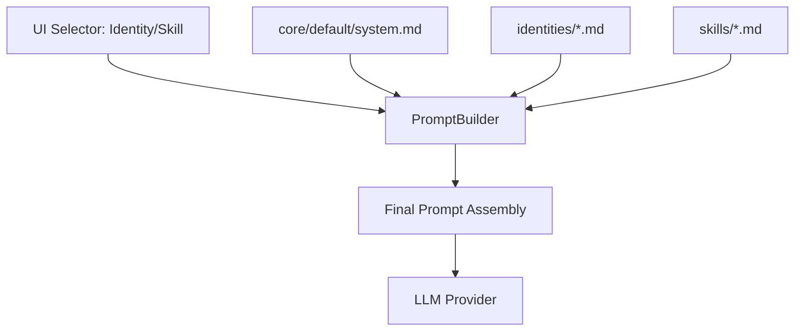

# Prompt Architecture V2: Modular Identity & Skill Library

## 1. Executive Summary & Kontext
> [!NOTE]
> **Zusammenfassung:** Dieses Dokument beschreibt den Übergang von hart im Code definierten AI-Profilen und Skills zu einem modularen Dateisystem im `src/prompts` Verzeichnis. 
> **Zielgruppe:** @principal_architect, @ui_expert, @product_manager

Bisher waren die pädagogischen Experten-Profile und die modularen Korrektur-Skills über TypeScript-Konstanten (`standard-profiles.ts`, `standard-skills.ts`) definiert. Dies erschwerte die Wartung durch Nicht-Entwickler und widersprach der Koreki-Philosophie der klaren Trennung von Prozess-Logik und pädagogischem Content. Die V2-Architektur vereinheitlicht alle Textbausteine unter dem Dach von Markdown (`.md`) mit YAML-Frontmatter.

---

## 2. Architektur & Systemdesign

Das neue System trennt messerscharf zwischen der **Engine** (wie wird verarbeitet) und dem **Content** (was wird instruiert).

### 2.1 Ordnerstruktur
```text
src/prompts/
├── core/                        # Die "Engine" (Logik-Rahmen)
│   ├── default/                 # Basis-Prompts (Correction, Vision, OCR)
│   └── specialized/             # Modell-spezifische Overrides (Gemma, Qwen)
├── identities/                  # Die pädagogischen Personen/Profile (Wer)
└── skills/                      # Die modularen Korrektur-Regeln (Was)
```

### 2.2 Datenfluss (Runtime Injection)


---

## 3. Implementierung & Nutzung

### 3.1 Dateiformat (KPC - Koreki Prompt Catalog)
Jede Datei in `identities/` oder `skills/` nutzt YAML-Frontmatter für Metadaten.

```markdown
---
id: "skill-consecutive-errors"
name: "Folgefehler-Tracking"
category: "math-science"
description: "Pädagogisch kulante Bewertung von Folgefehlern."
---
FOLGEFEHLER-REGEL (MATHEMATISCH-LOGISCH):
- Wenn der Schüler in einem Rechenschritt einen Rechen- oder Übertragungsfehler macht (Primärfehler), ziehe für DIESEN Schritt Punkte gemäß der Vorgabe ab.
- Wenn der Schüler alle darauffolgenden Rechenschritte basierend auf diesem falschen Zwischenergebnis mathematisch, methodisch und logisch absolut korrekt durchführt, darfst du für diese Folgeschritte KEINE weiteren Punkte abziehen!
```

### 3.2 Der PromptRegistry Loader
Ein zentraler Service liest diese Dateien ein und stellt sie typsicher zur Verfügung. Im **PURE Mode** (Desktop) werden diese Dateien über Webpack-Assets direkt in das Client-Bundle kompiliert, um volle Offline-Fähigkeit zu gewährleisten.

---

## 4. Security & Compliance (Mandatory for Industrial Grade)
> [!IMPORTANT]
> Die Umstellung verbessert die Security, da Prompt-Injection-Gefahren durch eine klare Trennung von System-Anweisungen und variablen Inhalten (User-Input) besser kontrolliert werden können.

* **Datenverarbeitung:** Es werden keine personenbezogenen Daten in den Prompts gespeichert. Alle Identitäten sind rein funktionale pädagogische Profile.
* **Authentifizierung/Autorisierung:** System-Identitäten sind schreibgeschützt. User-spezifische Erweiterungen erfolgen über die Datenbank und werden zur Laufzeit mit der Library gemergt.
* **Audit-Logs:** Änderungen an der Prompt-Library werden über Git-History lückenlos protokolliert.

---

## 5. Testing & Referenzen
* **Abwärtskompatibilität:** Bestehende User-Einstellungen (IDs in DB/LocalStorage) müssen auf die neuen IDs im Frontmatter gemappt werden.
* **Validierung:** Ein neuer Unit-Test stellt sicher, dass alle `.md` Dateien im Katalog valides Frontmatter besitzen und keine kritischen Platzhalter fehlen.
* **Referenzen:** [OpenClaw Architecture Concepts](https://github.com/openclaw/openclaw)
