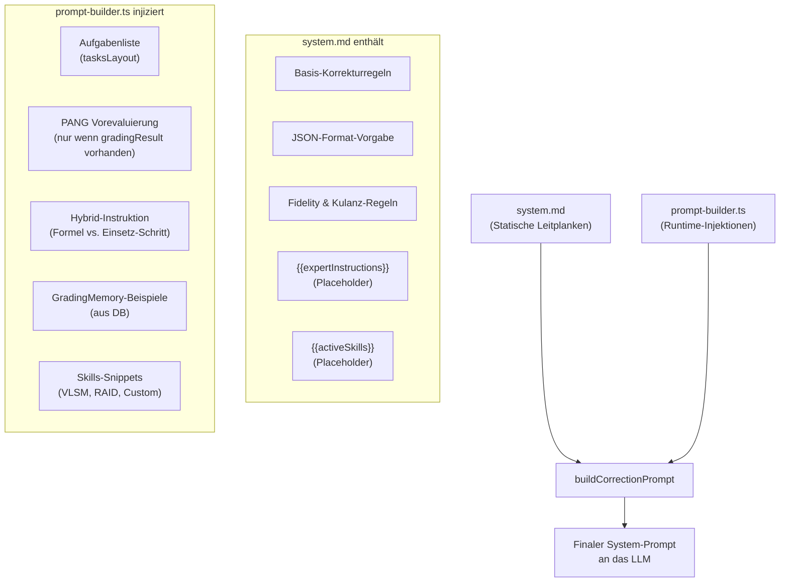

# Prompt-Architektur: Template + Runtime-Injection

## 1. Executive Summary & Kontext

> [!NOTE]
> **Zusammenfassung:** Koreki trennt KI-Prompts in zwei Schichten: statische Markdown-Templates (`system.md`) für unveränderliche Leitplanken und einen dynamischen Prompt-Builder (`prompt-builder.ts`) für kontextabhängige Runtime-Injektionen (PANG-Ergebnisse, Skills, Aufgabenstruktur, GradingMemory).
> **Zielgruppe:** Entwickler, die Prompts tunen oder neue Features in den Korrektur-Flow integrieren.

Diese Trennung ist eine bewusste Architekturentscheidung, keine technische Schuld. Sie folgt dem Prinzip: **Was sich zur Compile-Zeit nicht kennt, gehört nicht in eine statische Datei.**

---

## 2. Architektur & Systemdesign



### Warum diese Trennung?

| Kriterium | `system.md` | `prompt-builder.ts` |
|---|---|---|
| **Inhalt** | Leitplanken, die für **jede** Korrektur gelten | Kontext, der zur **Laufzeit** entsteht |
| **Beispiele** | Kulanz-Regeln, Namensformat, JSON-Schema | PANG-Ergebnisse, Aufgabenliste, Skills |
| **Editierbar ohne Build** | ✅ Ja (Markdown-Datei) | ❌ Nein (TypeScript) |
| **Modell-spezifisch** | ✅ Ja (Gemma) | ➖ Indirekt (via Guards) |

---

## 3. Implementierung & Nutzung

### Was gehört in `system.md`?

Alles, was **immer** gilt, unabhängig vom Aufgaben-Kontext:

- Pädagogische Grundregeln (Kulanz, Fidelity, keine mentale Reparatur)
- JSON-Format-Vorgabe und Namenskonventionen
- Leitplanken zu Mengenbeschränkungen und Unsicherheiten
- Placeholder `{{expertInstructions}}` und `{{activeSkills}}`

**Modellvarianten & Hybrid-Guards:** 
- **Qwen3.6:** Vollständig de-kloniert! Da moderne Qwen-Modelle (Qwen 2.5/3.6) standardmäßiges Markdown perfekt beherrschen, nutzt Qwen nun zu 100% die hochoptimierten Standard-Default-Prompts. Qwens spezielle Härtungen (z. B. für Seitenwechsel oder [GESTRICHEN]-Marker) wurden fest in die Default-Dateien gemergt, wovon nun alle Modelle profitieren.
- **Gemma4:** Nutzt zu 100% die Default-System-Prompts (für perfekte Feature-Parität), erweitert diese aber zur Laufzeit dynamisch um modellspezifische Formatierungs-Hacks (`guard.md` aus dem specialized Ordner).
- **Mistral-Small:** Wurde vollständig in `default` konsolidiert, um Divergenzen zu vermeiden.

### Was gehört in `prompt-builder.ts`?

Alles, was **zur Laufzeit** entschieden wird:

```typescript
// 1. Aufgabenliste — kommt aus tasksLayout, nicht vorhersehbar
system += `\n\nStruktur:\n${layoutText}`;

// 2. PANG-Block — NUR wenn t.gradingResult existiert
if (t.gradingResult) {
    vorevaluierungBlock += `### MATHEMATISCH-DETERMINISTISCHE VOREVALUIERUNG...`;
    // Hybrid-Instruktion (Formel vs. Einsetz-Schritt) — nur im disablePoints-Modus
}

// 3. Skills — NUR wenn activeSkillIds gesetzt sind
if (activeSkillIds && activeSkillIds.length > 0) {
    skillsSection = `### AKTIVIERTE BEWERTUNGS-SKILLS...`;
}

// 4. GradingMemory — NUR wenn Calibration-Daten vorhanden
if (gradingMemory && gradingMemory.length > 0) {
    examplesText = `### WICHTIGER PÄDAGOGISCHER ERFAHRUNGSSCHATZ...`;
}
```

### Die PANG Hybrid-Instruktion (kritischer Pfad)

> [!IMPORTANT]
> Dieser Block erscheint im Prompt **nur wenn** `task.gradingResult` gesetzt ist UND `disablePointsActive === true` (Hybrid-Modus). Er steuert, wie das LLM mit PANG-Ergebnissen umgeht.

**`disablePointsActive` Entscheidungslogik (`shouldDisablePoints`):**

```typescript
// Rigide PANG-Kontrolle (LLM darf nicht abweichen):
taskType === 'vlsm' || 'skill-calc-vlsm' || 'skill-calc-raid' → false

// Hybrid (LLM entscheidet, PANG ist Empfehlung):
alle custom PANG-Graphs → true
```

**Wichtige Präzisierung (seit 2026-05-29):** Die Hybrid-Instruktion für den Formel-Schritt unterscheidet explizit zwischen:

- ✅ **Formel-Punkt berechtigt:** Abstrakte Variablennotation, z.B. `(n-1) × k`
- ❌ **Nur Einsetz-Schritt:** Eingesetzte Zahlenwerte, z.B. `(4-1) × 4 TB`

Grund: Das LLM neigte dazu, "semantische Toleranz" zu weit zu interpretieren und Formel-Punkte auch für rein numerische Ausdrücke zu vergeben.

---

## 4. Security & Compliance

- **Datenverarbeitung:** Der Prompt-Builder verarbeitet `studentText` und `tasksLayout` — beides kann Schüler-PII enthalten. Er wird ausschließlich server-seitig ausgeführt (kein direktes Browser-Rendering).
- **GradingMemory-Bleed-Protection:** Die Injection enthält explizite Anti-Halluzinations-Guards (keine Übertragung von spezifischen Werten aus Fallbeispielen auf neue Schüler).
- **Audit:** Keine eigene Protokollierung im Builder; das übergeordnete `ai-correct.ts` loggt via `logger`.

---

## 5. Testing & Referenzen

> [!WARNING]
> Änderungen an der Hybrid-Instruktion in `prompt-builder.ts` müssen manuell gegen reale Schülerantworten getestet werden — automatisierte Tests prüfen nur die Prompt-Struktur, nicht die LLM-Reaktion.

- **Primäre Datei:** [`src/lib/ai/prompt-builder.ts`](../src/lib/ai/prompt-builder.ts)
- **Basis-Templates:** [`src/prompts/core/default/correction/system.md`](../src/prompts/core/default/correction/system.md)
- **Modell-Varianten:** `src/prompts/core/specialized/` (Gemma) (Mistral-Small und Qwen3.6 wurden vollständig konsolidiert)
- **Verwandte Docs:** [`docs/technical/`](./README.md)
- **Bekannte Edge Cases:**
  - Formel- vs. Einsetz-Schritt-Ambiguität (behoben 2026-05-29)
  - GradingMemory-Bleed bei identischen Aufgaben-Strukturen
