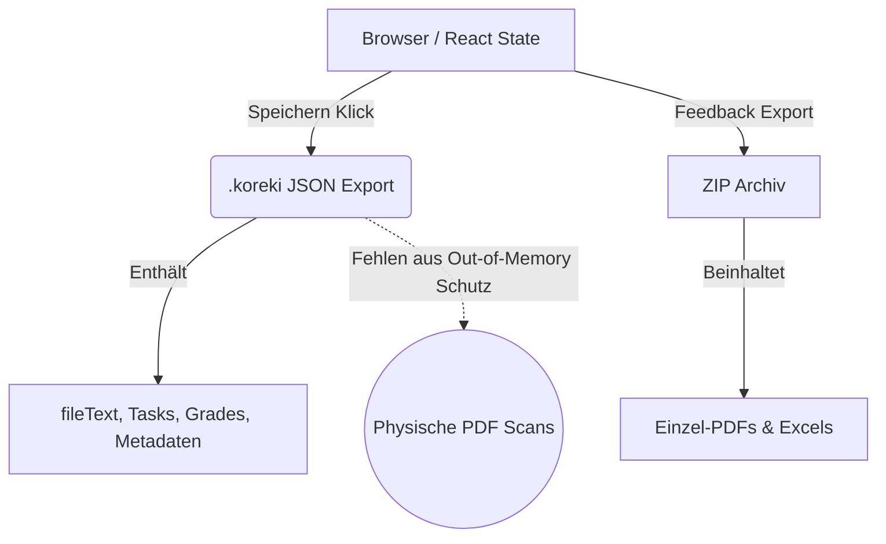

# Koreki Storage, Export & Import Architecture

## 1. Executive Summary & Kontext
> [!NOTE]
> **Zusammenfassung:** Dieses Dokument beschreibt, wie Koreki den Anwendungsstatus (Session State) verwaltet, wie die Sicherung in `.koreki`-Dateien funktioniert und wie wir Namenskonflikte bei gebündelten ZIP-Exporten (PDF/Excel) intelligent auflösen.
> **Zielgruppe:** Entwickler, Security Officer, Principal Architect.

Koreki wird als Thin-Client betrieben, um den strengsten Datenschutzvorgaben (Layer 2 Privacy) gerecht zu werden. Sensible Schülerdaten und extrahierte Texte verbleiben im React/DOM Statement des Browsers. Persistiert wird lokal über JSON-Exports (`.koreki`), wobei aus Speichergründen physische PDFs weggelassen werden. Das bedingt komplexe Relink-Mechanismen und einen konfliktfreien Export-Router.

---

## 2. Architektur & Systemdesign (Optional)
> [!TIP]
> Die Datenflüsse beim Im- und Export trennen Metadaten strikt von Binary-Blobs.



Das Kernkonzept basiert darauf, dass es keine persistente serverseitige Speicherung sensibler Inhaltsdaten in der Datenbank gibt:
*   **Model Solution & Tasks Layout:** Die vom Lehrer definierten Musterlösungen.
*   **BatchFiles (Schülerarbeiten):** Das Array aller verarbeiteten Arbeiten inklusive AI-Zensuren.

---

## 3. Implementierung & Nutzung

### Die "Relink" Mechanik (Nachladen von PDFs)
Wird eine `.koreki` Sitzung importiert, stehen alle Texte sofort zur Verfügung. Physische Scans müssen jedoch über die Funktion `handleRelinkFiles` "nachgeladen" werden.
Das System sucht im lokalen Ordner zwingend nach dem `originalName`:

```typescript
const searchStr = item.originalName || item.splitInfo?.sourceFileName || item.splitInfo?.originalName;
const match = newFiles.find(f => f.name.includes(searchStr));
```

### Export Router & Filename Collisions
Beim Erstellen von ZIP-Archiven (`JSZip`) bei zusammenhängenden Scans (die in der UI gesplittet wurden), erben alle Split-Items denselben `originalName`. Dies führte in der Vergangenheit zu Konflikten.
Ein Router in `app.tsx` regelt ab dem 06.04.2026 intelligent das Matching:

```typescript
const getExportName = (f: BatchFile) => {
    // 1. Zwingender Fallback auf den UI-Namen für gesplittete Dateien
    if (f.splitInfo) return f.name;
    
    // 2. Nutzung des Dateinamens bei generischen Nicht-Splits ("Schüler #1")
    if (/^Schüler #\d+$/.test(f.name) && f.originalName) return f.originalName;
    
    // 3. Fallback
    return f.name || f.originalName || 'Unbekannt'; 
};
```

### Die Unified Export Bridge (`downloadFile`)
Das System nutzt ab Version 2.0 eine zentrale `downloadFile` Abstraktion in `file-utils.ts`, um Umgebungs-spezifische Export-Hürden zu eliminieren:
* **Im Browser:** Erzeugt einen Blob und triggert einen simulierten Klick auf ein temporär im DOM eingehängtes `<a>` Element.
* **Im Desktop (Tauri):** Nutzt einen nativen Rust-Invoke (`save_file_native`), um den OS-Speicherdialog anzuzeigen und die Datei direkt zu schreiben.


---

## 4. Security & Compliance (Mandatory for Industrial Grade)
> [!IMPORTANT]
> Dieses Storage-Setup bildet das Fundament für Korekis Edge-Computing Privacy (Layer 2).

* **Datenverarbeitung:** Das gesamte Session-Konzept existiert primär, um die Zwischenspeicherung von Schüler-PII (Personally Identifiable Information) in Dritt-Datenbanken komplett zu unterbinden.
* **Authentifizierung/Autorisierung:** Der Export von Dokumenten (PDF, Excel, .koreki) unterliegt dem regulären Auth-Lifecycle. Sobald die Session endet, wird der flüchtige DOM-State geleert und die Daten sind für Angreifer unerreichbar.
* **Audit-Logs:** Wird in einer Organisation gearbeitet, protokolliert der Audit-Service den Start von Session-Importen grobmaschig, jedoch ohne Inhaltsdaten der `.koreki`-Dateien zu speichern.

---

## 5. Testing & Referenzen
> [!WARNING]
> Änderungen an der `BatchFile` Struktur oder der ZIP-Export-Mechanik müssen den vollen Regression-Suite-Lauf bestehen, da hier Datenverluste im Dateisystembetrieb drohen.

* **Verwandte Dokumente:** Datenschutz in [privacy-data-flow.md](./privacy-data-flow.md), Architektur in [architecture.md](./architecture.md)
* **Test-Coverage:** Die Namens-Routing-Logik (`getExportName`) sichert direkte Exports; Die `handleRelinkFiles` Unit-Tests in `tests/unit/hooks/useFileProcessor.test.ts` decken den Dateiverknüpfungsprozess ab. In `tests/unit/logic_pdf.test.ts` sind Tests für die PDF-Generierung definiert.
