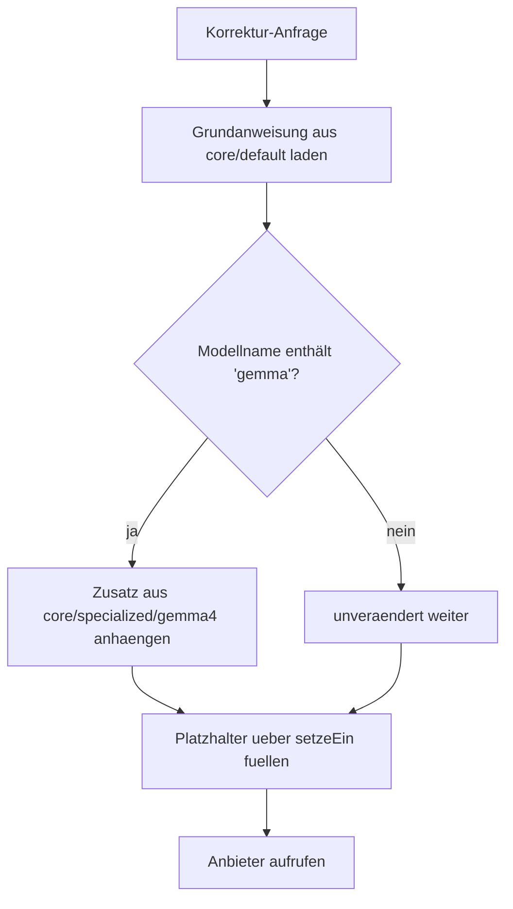

# Modellspezifische Prompt-Zusätze

> [!IMPORTANT]
> **Inhalt am 27.08.2026 vollständig gegen den Code geprüft und korrigiert.** Die vorige Fassung stammte vom 16.04.2026 und beschrieb an drei Stellen etwas anderes, als der Code tut — siehe Abschnitt 6.

## 1. Executive Summary & Kontext
> [!NOTE]
> **Zusammenfassung:** Koreki spricht Modelle verschiedener Anbieter mit derselben Grundanweisung an. Wo ein Modell eine zusätzliche Schranke braucht, bekommt es einen **Zusatz**, der an die Grundanweisung angehängt wird — statt einer eigenen Kopie der ganzen Anweisung. So wirkt eine Anpassung für ein Modell nicht auf alle anderen.
> **Zielgruppe:** Entwicklung, QA.

Koreki arbeitet mit Mistral, mit OpenAI-kompatiblen Endpunkten und mit lokalen Ollama-Modellen. Die Modelle unterscheiden sich darin, wie zuverlässig sie das geforderte JSON-Format einhalten und wie sie mit Formatierungszeichen umgehen. Eine Anweisung, die alle Eigenheiten aller Modelle abdeckt, wäre für jedes einzelne schlechter als eine gezielte.

---

## 2. Architektur & Systemdesign

Das Muster ist **Grundanweisung + Zusatz** (nicht Grundanweisung + Ersatz):



### Ablage

| Zweck | Ort |
|---|---|
| Grundanweisungen | `src/prompts/core/default/<schritt>/system.md` und `user.md` |
| Modellzusätze | `src/prompts/core/specialized/<modellfamilie>/<schritt>/guard.md` |
| Zusammensetzung | `src/lib/ai/prompt-builder.ts` |

Die Schritte unter `core/default/` sind: `correction`, `analyze-and-clean`, `analyze-and-map`, `vision`, `anonymize`, `variable-extraction`, `calc-trace-generation`. Für gerechnete Aufgaben liegen Zusatzbausteine unter `correction/math-engine/`.

### Was es tatsächlich an Zusätzen gibt

Genau **eine** Modellfamilie hat Zusätze, und zwar drei Dateien:

```
src/prompts/core/specialized/gemma4/correction/guard.md
src/prompts/core/specialized/gemma4/analyze-and-clean/guard.md
src/prompts/core/specialized/gemma4/analyze-and-map/guard.md
```

Für Mistral, Qwen oder andere Modelle existieren **keine** Zusätze. Sie laufen mit der unveränderten Grundanweisung.

---

## 3. Implementierung & Nutzung

Die Auswahl ist eine Zeichenketten-Prüfung auf den Modellnamen, an drei Stellen in `prompt-builder.ts` — je einmal für Korrektur, Aufbereitung und Zuordnung:

```typescript
if (model?.toLowerCase().includes('gemma')) {
    system = system + "\n\n" + gemma4CorrectionGuard;
}
```

Der Zusatz wird also an die Grundanweisung **angehängt**, nicht gegen sie ausgetauscht.

> [!WARNING]
> Die Prüfung greift auf jeden Modellnamen, der `gemma` enthält — unabhängig von der Version. Ein künftiges `gemma5` bekäme die für Gemma 4 gedachten Schranken mit.

### Was die Gemma-Zusätze bewirken

1. **Saubere Bezeichner:** Punktangaben wie `(3 P)` sollen nicht in Aufgabennamen auftauchen.
2. **Kein Formatierungsrauschen:** Unterdrückung von Backticks und Markdown, damit die JSON-Auswertung nicht stolpert.

### Platzhalter

Werte werden in Vorlagen ausschließlich über `setzeEin` aus `src/lib/prompt-placeholder.ts` eingesetzt, erzwungen durch `tests/unit/prompt-placeholder-governance.test.ts`. `String.replace` ist an dieser Stelle verboten: In seinem Ersatztext haben `$&`, `` $` ``, `$'` und `$$` Sonderbedeutung, wodurch Schülertext den Aufbau der Anweisung beeinflussen könnte.

---

## 4. Sampling-Parameter

Temperatur und Top-P hängen **nicht** an der Art der Anweisung, sondern am KI-Profil, das die Lehrkraft ausgewählt hat. Voreinstellungen laut `prisma/schema.prisma`:

| Feld | Vorgabe |
|---|---|
| `temperature` | 0.2 |
| `topP` | 0.8 |
| `visionTemperature` | 0.0 |

Eine einzige Ausnahme ist im Code fest verdrahtet: Der Schüler-Simulator arbeitet mit Temperatur 0.7 und Top-P 0.9, um absichtlich unterschiedliche Antworten zu erzeugen (`prompt-builder.ts`). Diese Werte gelten **nicht** für die Bewertung.

Hinweise und Warnschwellen zur Temperaturwahl stehen in `src/lib/ai/temperature-guidance.ts`.

---

## 5. Security & Compliance
> [!IMPORTANT]
> * **Datenverarbeitung:** Die Auswahl des Zusatzes verarbeitet keine personenbezogenen Daten. Sie entscheidet allein, welche Anweisung mitgeschickt wird.
> * **Zugriff:** keine eigene Zugriffskontrolle; die Zusammensetzung läuft innerhalb der jeweiligen Anfrage.
> * **Prompt Injection:** Der Schutz liegt nicht im Routing, sondern in der Platzhalter-Einsetzung (Abschnitt 3) und der Einfassung des Schülertextes in `<task_to_evaluate>`-Marken.

---

## 6. Was an der vorigen Fassung falsch war

Festgehalten, weil dieselben Angaben in andere Dokumente gewandert sein könnten:

| Behauptung (Fassung vom 16.04.2026) | Tatsächlich |
|---|---|
| Ablage unter `src/prompts/default/` und `src/prompts/specialized/` | liegt unter `src/prompts/core/…` |
| Spezialisierte Vorlagen seien vollständige Klone mit eigener `system.md` und `user.md` | es sind einzelne `guard.md`, die **angehängt** werden |
| Es gebe eine Mistral-Small-Spezialisierung mit „OCR Fidelity" und `(?)`-Markern | existiert nicht; es gibt ausschließlich `gemma4` |
| Eine Funktion `resolveTemplate(action, model)` wähle die Vorlage aus | existiert nicht; es sind drei Zeichenketten-Prüfungen an den jeweiligen Stellen |
| Sampling sei an den Anweisungstyp gebunden, Bewertung mit Temperatur 0.7 | Sampling kommt aus dem KI-Profil, Vorgabe 0.2; die 0.7 gehören zum Schüler-Simulator |

---

## 7. Testing & Referenzen
* **Test-Coverage:** `tests/unit/prompt-placeholder-governance.test.ts` erzwingt die Platzhalter-Regel. Für die Auswahl des Modellzusatzes selbst gibt es **keinen** eigenen Test — eine Umbenennung der Modellfamilie fiele nicht auf.
* **Verwandte Dokumente:** [Architecture](./architecture.md), [Ollama Hardening](./ollama-integration-hardening.md), [Prompt-Architektur](./prompt-architecture-v2.md) — Inhalt dieser Dokumente ist nicht mitgeprüft.
