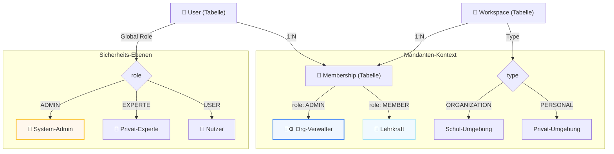

# Koreki: Mandanten- & Rollenkonzept (Industrial Standard)

## 1. Executive Summary & Kontext

Dieses Dokument beschreibt die Architektur der Multi-Tenancy Umgebung von Koreki. Es dient als Grundlage für die Datensicherheit, Abrechnungs-Integrität und Rollen-Governance.

---

## 🏛️ 1. Das Exklusiv-Prinzip (Tenancy Model)
Koreki verwendet ein **Exklusiv-Zuweisung-Modell**. Ein Benutzer ist entweder als Privatperson oder als Mitglied einer Organisation (Schule/Institut) aktiv.

- **Priorität**: `ORGANIZATION` > `PERSONAL`. 
- Sobald ein Nutzer einem Institut zugewiesen ist, werden alle Aktionen (Credit-Verbrauch, Asset-Uploads) über das Institut abgerechnet. 🏢
- Die manuelle Umschaltung zwischen Workspaces ist für Endnutzer deaktiviert, um Abrechnungsfehler und Datenlecks zu vermeiden. 🔒

---

## 🎭 2. Rollen & Berechtigungsmatrix
Wir unterscheiden zwischen **System-Rollen** (Plattform-Ebene) und **Mandanten-Rollen** (Workspace-Ebene). Jede Rolle kann in verschiedenen Modi operieren.

| Rolle | Icon | Ebene | Beschreibung | Modi | Credits kaufen | Prompts editieren | Admin-Board | Org-Verwalt-Board |
| :--- | :--- | :--- | :--- | :--- | :---: | :---: | :---: | :---: |
| **System-Admin** | 👑 | Plattform | Projektinhaber | `STANDARD` | Ja | Ja | Ja | Ja |
| **Org-Verwalter** | 🏢⚙️ | Institut | Schulleiter / IT-Admin | `STANDARD`, `PURE` | Ja | Ja | Nein | Ja |
| **Lehrkraft** | 🏫 | Institut | Lehrer / Kollegium | `STANDARD`, `PURE` | Nein | Ja (Auto) | Nein | Nein |
| **Privat-Experte** | 💎 | Privat | Premium B2C Nutzer | `STANDARD`, `PURE` | Ja | Ja | Nein | Nein |
| **Nutzer** | 👤 | Privat | Standard B2C Nutzer | `STANDARD`, `PURE` | Ja | Nein | Nein | Nein |

### Besondere Logiken:
- **Auto-Expert ✨**: Mitglieder von Instituten (`ORGANIZATION`) erhalten automatisch den Experten-Status (`canEditPrompts`), ohne dafür Credits bezahlen zu müssen (nur in deren Institut).
- **Org-Verwalter-Schutz 🛡️**: Nur Nutzer mit der Rolle `ADMIN` innerhalb einer Organisation können den Stripe-Checkout für dieses Institut auslösen und das Verwalterboard sehen.
- **Koreki-Admin-Veto 👑**: Der System-Admin steht über allen Regeln und kann jeden Nutzer in jedem Workspace verwalten.

---

## ⚙️ 3. Die Betriebsmodi (STANDARD vs. PURE)
Koreki bietet zwei grundlegende Arten der KI-Anbindung an, um maximale Flexibilität und Datenschutz zu gewährleisten.

### 3.1 Modus: STANDARD (Managed Excellence) 🚀
- **Beschreibung**: Der Nutzer nutzt das von Koreki bereitgestellte KI-Guthaben (Credits).
- **Compliance (Zwingend)**: Ein Zugriff auf die KI-Funktionen ist **nur mit akzeptiertem/hochgeladenem AVV** möglich.
- **Sperre**: Ist kein AVV hinterlegt, zeigt die App automatisch das AVV-Onboarding und sperrt alle KI-Buttons (Compliance-Gatekeeper).
- **Zielgruppe**: Schulen und Institute, die eine schlüsselfertige, rechtssichere Lösung suchen.

### 3.2 Modus: PURE (BYOK - Bring Your Own Key) 💎
- **Beschreibung**: Der Nutzer hinterlegt seinen eigenen API-Key (z.B. Mistral AI) in den Einstellungen.
- **Compliance**: Ein AVV mit Koreki ist **nicht erforderlich**, da die Datenverarbeitung direkt über den eigenen Key des Nutzers erfolgt. Die rechtliche Verantwortung für den Key liegt beim Nutzer.
- **Budget**: Es werden keine Koreki-Credits verbraucht. Der Nutzer rechnet direkt mit dem KI-Provider ab.

---

## 💳 4. Billing & Guthaben-Logik
Die Abrechnung von Korrekturen und OCR folgt strikt dem aktiven Mandanten:

1. **Institut-Mitglieder**: Credits werden vom **Workspace-Guthaben der Organisation** abgezogen. Das Privatguthaben des Nutzers bleibt unberührt.
2. **Privatnutzer**: Credits werden vom **Workspace-Guthaben des Nutzers** (Privat-Workspace) abgezogen.

---

## 🔒 5. Datensicherheit & Isolation
Die Datensicherheit in Koreki folgt dem Prinzip der **maximalen Flüchtigkeit** und **individuellen Expertise-Souveränität**.

### 5.1 RAM-only Transit Isolation 🧼✨
Koreki speichert **KEINE** hochgeladenen Dokumente, Scans oder KI-Konversationen permanent in einer Datenbank oder einem Dateisystem (S3).
- **Transit**: Dateien existieren nur für die Dauer der KI-Anfrage im Arbeitsspeicher (RAM) des Servers.
- **Privacy**: Nach Rückgabe der Analyse an den Browser des Nutzers werden alle Spuren am Server physisch gelöscht.
- **No-Log Policy**: Es werden keine Inhalts-Logs der KI-Anfragen erstellt.

---

## 🛠️ 6. Verwaltung durch den Admin
Der System-Admin kann in der Admin-Zentrale:
- Nutzer Instituten zuweisen oder die Zuweisung auf "Privat" zurücksetzen.
- Nutzer innerhalb eines Instituts zum **Org-Verwalter** befördern. 🕹️
- Direktes Guthaben (Credits) auf Workspaces buchen.
- Systemweite Prompts verwalten, die für alle Nutzer sichtbar sind.
- Einladungs-Codes (`inviteCode`) für Institute generieren und verwalten. ✨

---

## 🔑 7. Self-Service Onboarding (Join-Keys)
Um die Skalierbarkeit zu gewährleisten, nutzt Koreki ein **Einladungs-Code-System**:

1. **Generierung**: Der System-Admin generiert für eine Organisation einen einzigartigen Code (z.B. `JOIN-ABC123`).
2. **Beitritt**: Nutzer geben diesen Code in ihren Einstellungen ein.
3. **Automatisierte Tenancy-Logik**:
    - Das System findet den zugehörigen Workspace.
    - Alle bisherigen `ORGANIZATION`-Mitgliedschaften des Nutzers werden **physisch gelöscht**.
    - Eine neue Mitgliedschaft im Ziel-Workspace wird angelegt.
    - Der `lastActiveProfileId` Context des Nutzers wird sofort auf das Institut umgestellt.
    - Der Nutzer wird automatisch in den **Modus "STANDARD"** gehoben. 🚀✨
    - Der Nutzer erhält Zugriff auf das Budget der Schule.

---

## 🛠️ 9. Technische Rollen-Architektur (Datenbank-Perspektive)
Dieses Diagramm zeigt, wie die technischen Felder in der PostgreSQL-Datenbank (`Prisma`) zusammengesetzt werden, um die fünf Rollen der Matrix zu bilden.

### 📋 Rollen-Mapping (Datenbank-Werte)

In der Datenbank werden ausschließlich standardisierte Begriffe verwendet. Die Domänen-Begriffe (Matrix) werden in der API und UI "gemappt".

| Rolle (Matrix) | `User.role` (Sys) | Logto Role (Global) | `Membership.role` (Org) | `Workspace.type` |
| :--- | :--- | :--- | :--- | :--- |
| **System-Admin** | `ADMIN` | `Admin` | *(Unrelevant)* | *(Unrelevant)* |
| **Org-Verwalter** | `USER` | `None` | `ADMIN` | `ORGANIZATION` |
| **Lehrkraft** | `USER` | `None` | `MEMBER` | `ORGANIZATION` |
| **Privat-Experte** | `EXPERTE` | `None` | `OWNER` | `PERSONAL` |
| **Nutzer** | `USER` | `None` | `OWNER` | `PERSONAL` |

### 🔒 Security-Enforcement & Sync (Pillar 8)
*   **Logto Sync**: Die globale Rolle `Admin` in Logto wird bei jedem Login (via `/api/user`) DB-authoritativ auf `User.role = 'ADMIN'` synchronisiert. Dies ist die einzige Quelle der Wahrheit für Plattform-Admins.
*   **Mandanten-Trennung**: Der Zugriff auf Organisationen wird ausschließlich über die `Membership` Tabelle gesteuert. Ein Nutzer mit `Membership.role = 'ADMIN'` hat **keine** globalen Rechte, sondern ist auf seinen Mandanten beschränkt.
*   **Security Wrapper**: Der `withSecurity` Wrapper schützt alle API-Routen und unterscheidet strikt zwischen `requireAdmin: 'SYS'` (Plattform) und `requireAdmin: 'ORG'` (Mandant).

---

*Dokumentation Stand: 07. April 2026 (V7)*
*Sicherheits-Status: PILLAR 8 (DB-AUTHORITATIVE RBAC) VERIFIED* 🏮🛡️⚖️🏮🏛️🛡️✅⚙️🚀
